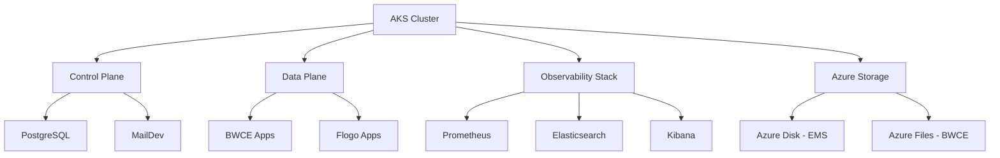
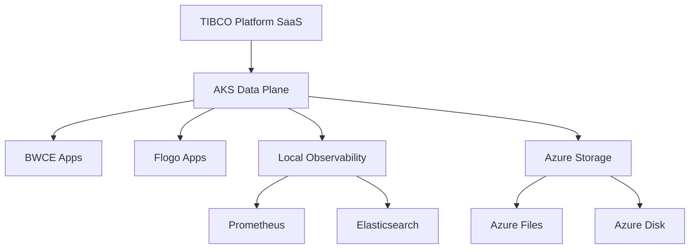
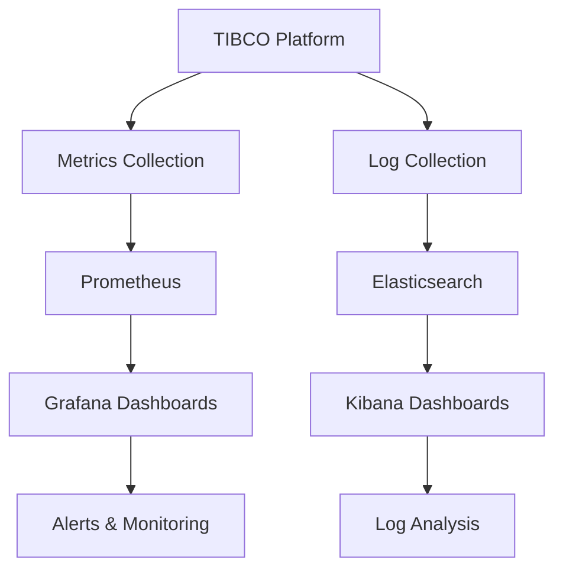

# TIBCO Platform on Azure Kubernetes Service (AKS) Workshop

This repository provides comprehensive guides and resources for deploying **TIBCO Platform** on **Azure Kubernetes Service (AKS)** clusters. It covers multiple deployment scenarios from basic AKS cluster setup to full Control Plane and Data Plane deployments with observability.

## 🎯 What This Repository Helps You Setup

### 1. **TIBCO Platform Control Plane (CP) + Data Plane (DP) on Same AKS Cluster**
Deploy a complete TIBCO Platform environment with both Control Plane and Data Plane on a single AKS cluster for evaluation and workshop purposes.

### 2. **TIBCO Platform SaaS Control Plane + AKS Data Plane**
Connect an AKS-based Data Plane to an existing TIBCO Platform SaaS Control Plane for hybrid cloud deployments.

### 3. **Observability Setup for CP/DP**
Configure comprehensive monitoring and logging using Prometheus and Elastic Stack (ECK) for both Control Plane and Data Plane deployments.

## 📚 Documentation Structure

### 🏗️ Complete Setup Guides

#### [📖 How to Set Up AKS Cluster with Control Plane and Data Plane](./howto/how-to-cp-and-dp-aks-setup-guide.md)
**Comprehensive guide for complete TIBCO Platform deployment**
- 🎯 **Scope**: AKS cluster creation + Control Plane + Data Plane on same cluster
- 🔧 **Features**: 
  - Azure environment preparation and AKS cluster creation
  - PostgreSQL and MailDev setup for Control Plane
  - Storage classes (Azure Disk and Azure Files) configuration
  - Wildcard DNS and certificate management with Azure DNS
  - Complete Control Plane and Data Plane deployment
  - Admin user setup and initial password retrieval
- 📋 **Use Case**: Workshop environments, evaluation setups, complete standalone deployments
- ⏱️ **Duration**: 3-4 hours for complete setup

#### [📖 How to Set Up AKS Cluster for Data Plane Only](./howto/how-to-dp-aks-setup-guide.md)
**Streamlined guide for Data Plane-only deployments**
- 🎯 **Scope**: AKS cluster creation + Data Plane only (connects to SaaS Control Plane)
- 🔧 **Features**:
  - Simplified AKS cluster setup
  - Data Plane specific configurations
  - Connection to existing TIBCO Platform SaaS Control Plane
  - Capability provisioning (BWCE, Flogo)
- 📋 **Use Case**: Connecting to SaaS Control Plane, edge deployments, regional data planes
- ⏱️ **Duration**: 1-2 hours

### 🔍 Observability Setup

#### [📖 How to Install Observability for Data Plane](./howto/how-to-dp-aks-observability.md)
**Complete observability stack setup for TIBCO Platform**
- 🎯 **Scope**: Elastic ECK + Prometheus + Grafana for monitoring and logging
- 🔧 **Features**:
  - Elastic Cloud on Kubernetes (ECK) operator installation
  - Elasticsearch, Kibana, and APM Server configuration
  - Prometheus and Grafana deployment
  - TIBCO Platform metrics and logs integration
  - Performance monitoring and alerting
- 📋 **Use Case**: Production monitoring, troubleshooting, performance analysis
- ⏱️ **Duration**: 1-2 hours

### 🌐 DNS and Networking

#### [📖 How to Add DNS Records for AKS Ingress](./howto/how-to-add-dns-records-aks-azure.md)
**DNS management for TIBCO Platform services**
- 🎯 **Scope**: Azure DNS configuration for AKS ingress routing
- 🔧 **Features**:
  - Wildcard DNS strategy for TIBCO Platform
  - Azure CLI and Portal methods for DNS record creation
  - External DNS automation setup
  - Certificate and DNS alignment best practices
- 📋 **Use Case**: Custom domain setup, SSL certificate management, service discovery
- ⏱️ **Duration**: 30-60 minutes

### 📋 Prerequisites and Planning

#### [📖 Customer Prerequisites Checklist](./howto/prerequisites-checklist-for-customer.md)
**Comprehensive pre-installation requirements checklist**
- 🎯 **Scope**: Complete prerequisites for Control Plane and Data Plane installation
- 🔧 **Features**:
  - AKS cluster requirements and specifications
  - PostgreSQL 16 database specifications
  - Azure Storage requirements (Disk and Files)
  - Networking and DNS requirements
  - Certificate and security requirements
  - Ingress controller compatibility matrix (Traefik recommended, NGINX deprecated)
  - Browser requirements and supported versions
  - Control Tower Data Plane specifications
  - Kubernetes secrets requirements
  - Naming conventions and restrictions
- 📋 **Use Case**: Pre-installation planning, customer readiness assessment, infrastructure preparation
- ⏱️ **Preparation Time**: 3-5 business days
- 🎁 **Benefits**: Reduces deployment delays, ensures all requirements met before installation day

### ⚙️ Configuration and Scripts

#### [📄 Environment Variables Script](./scripts/aks-env-variables.sh)
**Centralized environment configuration**
- 🎯 **Scope**: All required environment variables for TIBCO Platform deployment on AKS
- 🔧 **Features**:
  - Azure subscription and AKS cluster variables
  - TIBCO Platform specific configurations
  - DNS and certificate settings
  - Container registry and Helm chart configurations
  - Network and storage configurations
- 📋 **Use Case**: Quick environment setup, variable standardization, deployment automation

## 🎯 Deployment Scenarios

### Scenario 1: Complete TIBCO Platform on AKS


**Use this for:**
- ✅ Workshop and evaluation environments
- ✅ Complete standalone TIBCO Platform deployments
- ✅ Development and testing environments
- ✅ Proof of concepts and demos

**Follow:** [Complete Setup Guide](./howto/how-to-cp-and-dp-aks-setup-guide.md)

### Scenario 2: AKS Data Plane Connected to SaaS Control Plane


**Use this for:**
- ✅ Hybrid cloud deployments
- ✅ Edge computing scenarios
- ✅ Regional data plane deployments
- ✅ Connecting to existing SaaS Control Plane

**Follow:** [Data Plane Only Guide](./howto/how-to-dp-aks-setup-guide.md)

### Scenario 3: Enhanced Observability Setup


**Use this for:**
- ✅ Production monitoring requirements
- ✅ Troubleshooting and debugging
- ✅ Performance optimization
- ✅ Compliance and audit logging

**Follow:** [Observability Setup Guide](./howto/how-to-dp-aks-observability.md)

## 🚀 Quick Start

### Prerequisites
Before you begin, ensure you have:
- Azure subscription with appropriate permissions
- Azure CLI installed and configured
- kubectl installed
- Helm 3.17.0+ installed
- Access to TIBCO container registry

### Step 1: Choose Your Scenario
1. **Full Platform Deployment**: Follow the [Complete Setup Guide](./howto/how-to-cp-and-dp-aks-setup-guide.md)
2. **Data Plane Only**: Follow the [Data Plane Guide](./howto/how-to-dp-aks-setup-guide.md)

### Step 2: Review Prerequisites
Review the [Prerequisites Checklist](./howto/prerequisites-checklist-for-customer.md) to ensure all requirements are met.

### Step 3: Configure Environment
Use the [Environment Variables Script](./scripts/aks-env-variables.sh) to set up your environment variables.

### Step 4: Deploy
Follow the chosen guide step-by-step for deployment.

## 📦 Repository Contents

```
workshop-tp-aks/
├── README.md                           # This file
├── LICENSE                             # MIT License
├── .gitignore                          # Git ignore rules
├── howto/                              # How-to guides
│   ├── how-to-cp-and-dp-aks-setup-guide.md
│   ├── how-to-dp-aks-setup-guide.md
│   ├── how-to-dp-aks-observability.md
│   ├── how-to-add-dns-records-aks-azure.md
│   └── prerequisites-checklist-for-customer.md
├── scripts/                            # Utility scripts
│   ├── aks-env-variables.sh
│   ├── generate-certificates.sh
│   └── setup-aks-cluster.sh
└── docs/                               # Additional documentation
    ├── architecture-diagrams/
    ├── troubleshooting/
    └── best-practices/
```

## 🔑 Key Features

### Azure-Specific Optimizations
- **Azure Disk Storage**: Premium_LRS for EMS workloads
- **Azure Files Storage**: For BWCE shared storage
- **Azure DNS Integration**: Automated DNS record management
- **Azure Load Balancer**: Automatic ingress configuration
- **Azure Monitor Integration**: Native monitoring capabilities

### Ingress Controllers
- **Traefik 3.3.4** (Recommended): Modern, cloud-native ingress controller
- **NGINX 4.12.1** (Deprecated from v1.10.0): Legacy support
- **Kong 2.33.3**: For user app endpoints (BWCE and Flogo only)

### Security Features
- TLS/SSL certificate management
- Kubernetes secrets for sensitive data
- Network policies for traffic control
- RBAC configurations
- Azure managed identities support

## 🛠️ Tools and Technologies

### Required Tools
- **Azure CLI**: 2.50.0+
- **kubectl**: Latest stable version
- **Helm**: 3.17.0+
- **openssl**: For certificate generation
- **jq**: JSON processing

### TIBCO Platform Components
- **Control Plane**: v1.14.0+
- **Data Plane**: Compatible with CP version
- **PostgreSQL**: v16 (required)
- **Capabilities**: BWCE, Flogo, EMS, Developer Hub

## 📊 Platform Requirements

### Minimum AKS Cluster Specifications

#### Control Plane Cluster
- **Node Count**: 3+ worker nodes
- **Node Size**: Standard_D8s_v3 or higher
- **Total Resources**: 24+ CPU cores, 96+ GB RAM
- **Kubernetes Version**: 1.32+ (CNCF certified)
- **Storage**: Azure Disk (Premium_LRS) + Azure Files

#### Data Plane Cluster
- **Node Count**: 2+ worker nodes
- **Node Size**: Standard_D4s_v3 or higher
- **Total Resources**: Based on workload
- **Kubernetes Version**: 1.32+ (CNCF certified)
- **Storage**: Azure Files + Azure Disk

## 🎓 Learning Path

### Beginner Path (Evaluation/Workshop)
1. Review [Prerequisites Checklist](./howto/prerequisites-checklist-for-customer.md)
2. Follow [Complete Setup Guide](./howto/how-to-cp-and-dp-aks-setup-guide.md)
3. Deploy sample applications
4. Explore Control Plane UI

### Intermediate Path (Development)
1. Review prerequisites
2. Set up separate AKS clusters for CP and DP
3. Configure [Observability](./howto/how-to-dp-aks-observability.md)
4. Implement [DNS automation](./howto/how-to-add-dns-records-aks-azure.md)

### Advanced Path (Production)
1. Design multi-region architecture
2. Implement high availability configurations
3. Set up disaster recovery
4. Configure advanced monitoring and alerting
5. Implement CI/CD pipelines

## 🆘 Troubleshooting

### Common Issues and Solutions

#### AKS Cluster Issues
- **Node not ready**: Check node pools and scaling settings
- **Insufficient resources**: Scale up node pools or use larger VM sizes
- **Network connectivity**: Verify VNet configuration and NSG rules

#### Storage Issues
- **PVC pending**: Verify storage class configuration
- **Azure Files mount failures**: Check storage account and permissions
- **Performance issues**: Consider Premium_LRS for better IOPS

#### Ingress Issues
- **DNS not resolving**: Verify Azure DNS records and External DNS
- **SSL certificate errors**: Check certificate validity and secret configuration
- **Load balancer not created**: Verify ingress annotations and service configuration

### Getting Help
1. Check the [Official TIBCO Documentation](https://docs.tibco.com/pub/platform-cp/1.14.0/doc/html/Default.htm)
2. Review GitHub issues in [tp-helm-charts repository](https://github.com/TIBCOSoftware/tp-helm-charts)
3. Contact TIBCO Support for production issues

## 🤝 Contributing

Contributions are welcome! Please:
1. Fork the repository
2. Create a feature branch
3. Make your changes
4. Submit a pull request

## 🔗 Additional Resources

### Official Documentation
- [TIBCO Platform Control Plane Documentation](https://docs.tibco.com/pub/platform-cp/1.14.0/doc/html/Default.htm)
- [TIBCO Helm Charts Repository](https://github.com/TIBCOSoftware/tp-helm-charts)
- [AKS Workshop in tp-helm-charts](https://github.com/TIBCOSoftware/tp-helm-charts/tree/main/docs/workshop/aks)

### Azure Resources
- [Azure Kubernetes Service Documentation](https://docs.microsoft.com/en-us/azure/aks/)
- [Azure DNS Documentation](https://docs.microsoft.com/en-us/azure/dns/)
- [Azure Storage Documentation](https://docs.microsoft.com/en-us/azure/storage/)

### Related Workshops
- [TIBCO Platform on ARO Workshop](https://github.com/tibco-bnl/workshop-tp-aro)
- [TIBCO Platform on EKS Workshop](https://github.com/TIBCOSoftware/tp-helm-charts/tree/main/docs/workshop/eks)

## 📝 License

This project is licensed under the MIT License - see the [LICENSE](LICENSE) file for details.

## ⚠️ Disclaimer

> **Important**: This workshop is intended for evaluation, development, and workshop purposes only. For production deployments, please consult with TIBCO Professional Services and follow the official TIBCO Platform deployment guidelines.

## 📅 Version History

- **v1.0.0** (January 2026): Initial release
  - Complete AKS deployment guides
  - Prerequisites checklist
  - Observability setup
  - DNS configuration guides

---

**Maintained by**: TIBCO-BNL Team

**Last Updated**: January 22, 2026
