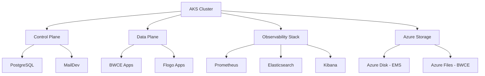
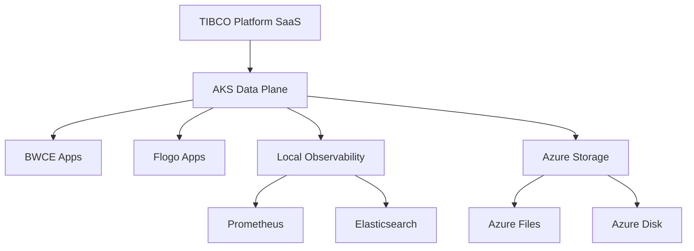
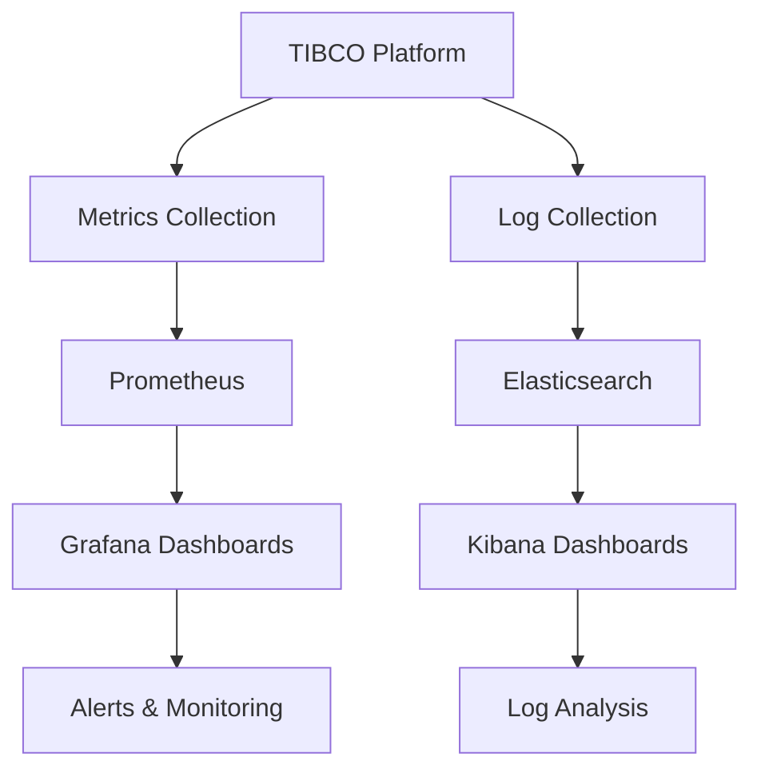

# TIBCO Platform on Azure Kubernetes Service (AKS) Workshop

> **Current Release:** [v1.15.0](./releases/v1.15.0) | **TIBCO Platform CP Version:** 1.15.0  
> 📋 **Release History:** See `releases` folder for all versions  
> 🔄 **Upgrading from 1.14.0?** See the [1.15.0 Release Notes](./releases/v1.15.0#upgrade-path)

This repository provides comprehensive guides and resources for deploying **TIBCO Platform** on **Azure Kubernetes Service (AKS)** clusters. It covers multiple deployment scenarios from basic AKS cluster setup to full Control Plane and Data Plane deployments with observability.

## 🎯 Version Selection

**⚠️ Important:** TIBCO Platform version 1.15.0 includes breaking changes from 1.14.0. Choose the appropriate documentation for your deployment:

### 🌟 Version 1.15.0 (Current - Recommended for New Deployments)
- ✅ **Latest Features**: Enhanced security, improved network policies, unified chart deployment
- ✅ **New Capabilities**: Event processing, updated Developer Hub 1.15.14
- ✅ **Better Observability**: Improved monitoring and logging stack
- 📘 [Setup Guide: CP + DP (v1.15)](./howto/v1.15/how-to-cp-and-dp-aks-setup-guide)
- 📘 [Setup Guide: DP Only  (v1.15)](./howto/v1.15/how-to-dp-aks-setup-guide)
- 📋 [Release Notes (v1.15.0)](./releases/v1.15.0)

### 📦 Version 1.14.0 (Previous Release)
- ✅ **Proven Stability**: Production-tested and widely deployed
- ✅ **Complete Documentation**: Comprehensive battle-tested guides
- 📘 [Setup Guide: CP + DP (v1.14)](./howto/v1.14/how-to-cp-and-dp-aks-setup-guide)
- 📘 [Setup Guide: DP Only (v1.14)](./howto/v1.14/how-to-dp-aks-setup-guide)
- 📋 [Release Notes (v1.14.0)](./releases/v1.14.0)

### 🔄 Upgrading from v1.14.0 to v1.15.0
TIBCO provides an automated upgrade script. See the [Upgrade Path section](./releases/v1.15.0#upgrade-path) in the v1.15.0 release notes.

---

## 🎯 What This Repository Helps You Setup

### 1. **TIBCO Platform Control Plane (CP) + Data Plane (DP) on Same AKS Cluster**
Deploy a complete TIBCO Platform environment with both Control Plane and Data Plane on a single AKS cluster for evaluation and workshop purposes.

### 2. **TIBCO Platform SaaS Control Plane + AKS Data Plane**
Connect an AKS-based Data Plane to an existing TIBCO Platform SaaS Control Plane for hybrid cloud deployments.

### 3. **Observability Setup for CP/DP**
Configure comprehensive monitoring and logging using Prometheus and Elastic Stack (ECK) for both Control Plane and Data Plane deployments.

## 📚 Documentation Structure

### 🏗️ Version-Specific Setup Guides

#### Version 1.15.0 (Current Release)
**[📖 How to Set Up AKS Cluster with Control Plane and Data Plane (v1.15)](./howto/v1.15/how-to-cp-and-dp-aks-setup-guide)**
- 🎯 **Scope**: Complete TIBCO Platform 1.15.0 deployment on AKS
- 🔧 **New Features**: Enhanced secrets management, improved network policies, unified chart deployment
- ⏱️ **Duration**: 3-4 hours

**[📖 How to Set Up AKS Cluster for Data Plane Only (v1.15)](./howto/v1.15/how-to-dp-aks-setup-guide)**
- 🎯 **Scope**: Data Plane 1.15.0 deployment connecting to SaaS Control Plane
- 🔧 **Features**: Simplified deployment with updated infrastructure charts
- ⏱️ **Duration**: 1-2 hours

#### Version 1.14.0 (Previous Release)
**[📖 How to Set Up AKS Cluster with Control Plane and Data Plane (v1.14)](./howto/v1.14/how-to-cp-and-dp-aks-setup-guide)**
- 🎯 **Scope**: Complete TIBCO Platform 1.14.0 deployment on AKS
- 📋 **Features**: Azure environment preparation, PostgreSQL, DNS, certificates, CP + DP deployment
- ⏱️ **Duration**: 3-4 hours

**[📖 How to Set Up AKS Cluster for Data Plane Only (v1.14)](./howto/v1.14/how-to-dp-aks-setup-guide)**
- 🎯 **Scope**: Data Plane 1.14.0 deployment connecting to SaaS Control Plane
- 📋 **Features**: Simplified AKS setup, DP configurations, capability provisioning
- ⏱️ **Duration**: 1-2 hours

### 🔍 Shared Documentation (Compatible with Both Versions)
#### [📖 How to Install Observability for Data Plane](./howto/how-to-dp-aks-observability)
**Complete observability stack setup for TIBCO Platform**
- 🎯 **Scope**: Elastic ECK + Prometheus + Grafana for monitoring and logging
- 🔧 **Features**:
  - Elastic Cloud on Kubernetes (ECK) operator installation
  - Elasticsearch, Kibana, and APM Server configuration
  - Prometheus and Grafana deployment
  - TIBCO Platform metrics and logs integration
  - Performance monitoring and alerting
- 📋 **Use Case**: Production monitoring, troubleshooting, performance analysis
- ⏱️ **Duration**: 1-2 hours

### 🔧 Post-Deployment Capability Configuration

#### [📖 How to Upload Driver Supplements to BW6 Capability](./howto/how-to-upload-bw6-driver-supplements)
**Supplementing Oracle and EMS drivers for TIBCO BusinessWorks 6 (Containers)**
- 🎯 **Scope**: Upload Oracle Database and EMS client library drivers to BW6 capability
- 🔧 **Features**:
  - Oracle Database driver preparation and packaging
  - EMS client libraries preparation and packaging
  - Step-by-step upload process via Control Plane UI
  - Troubleshooting common upload issues
  - Verification and testing procedures
- 📋 **Use Case**: Oracle database integration, EMS messaging integration, driver supplementation
- ⏱️ **Duration**: 15-30 minutes per driver
- 🎁 **Benefits**: Enables Oracle and EMS connectivity for BW6 applications

### 🌐 DNS and Networking

#### [📖 How to Add DNS Records for AKS Ingress](./howto/how-to-add-dns-records-aks-azure)
**DNS management for TIBCO Platform services**
- 🎯 **Scope**: Azure DNS configuration for AKS ingress routing
- 🔧 **Features**:
  - Wildcard DNS strategy for TIBCO Platform
  - Azure CLI and Portal methods for DNS record creation
  - External DNS automation setup
  - Certificate and DNS alignment best practices
- 📋 **Use Case**: Custom domain setup, SSL certificate management, service discovery
- ⏱️ **Duration**: 30-60 minutes

### 📋 Prerequisites and Planning

#### [📖 Customer Prerequisites Checklist](./howto/prerequisites-checklist-for-customer)
**Comprehensive pre-installation requirements checklist**
- 🎯 **Scope**: Complete prerequisites for Control Plane and Data Plane installation
- 🔧 **Features**:
  - AKS cluster requirements and specifications
  - PostgreSQL 16 database specifications
  - Azure Storage requirements (Disk and Files)
  - Networking and DNS requirements
  - Certificate and security requirements
  - Ingress controller compatibility matrix (Traefik recommended, NGINX deprecated)
  - Browser requirements and supported versions
  - Control Tower Data Plane specifications
  - Kubernetes secrets requirements
  - Naming conventions and restrictions
- 📋 **Use Case**: Pre-installation planning, customer readiness assessment, infrastructure preparation
- ⏱️ **Preparation Time**: 3-5 business days
- 🎁 **Benefits**: Reduces deployment delays, ensures all requirements met before installation day

#### [📖 Firewall Requirements and Network Connectivity for AKS](https://tibco-bnl.github.io/workshop-tp-aks/docs/firewall-requirements-aks.html)
**Complete firewall and network requirements for TIBCO Platform deployment on Azure Kubernetes Service**
- 🎯 **Scope**: All external endpoints required for TIBCO Platform on AKS
- 🔧 **Features**:
  - Container registry endpoints (TIBCO JFrog, Docker Hub, GitHub, etc.)
  - Helm chart repository URLs
  - Azure cloud provider endpoints (ARM, Azure AD, CSI drivers)
  - Monitoring and observability service endpoints
  - Network Security Group (NSG) rules for Azure
  - Azure Firewall application rules (copy-paste ready)
  - Proxy configuration examples with NO_PROXY settings
  - TIBCO Flogo Go Module Proxy requirements (proxy.golang.org)
  - DNS requirements and connectivity testing commands
- 📋 **Use Case**: Enterprise deployments, air-gapped environments, firewall rule requests, proxy configuration
- ⏱️ **Review Time**: 30-60 minutes
- 🎁 **Benefits**: Streamlines firewall approval process, prevents connectivity issues during deployment

#### [📖 Firewall Requirements and Network Connectivity for EKS](https://tibco-bnl.github.io/workshop-tp-aks/docs/firewall-requirements-eks.html)
**Complete firewall and network requirements for TIBCO Platform deployment on Amazon Elastic Kubernetes Service**
- 🎯 **Scope**: All external endpoints required for TIBCO Platform on EKS
- 🔧 **Features**:
  - AWS-specific endpoints (EKS, ECR, EC2, STS, IAM)
  - VPC endpoints for cost optimization
  - AWS Network Firewall and Security Group configurations
  - Container registry and Helm repository endpoints
  - Proxy configuration for enterprise environments
  - TIBCO Flogo Go Module Proxy requirements
  - Troubleshooting and validation commands
- 📋 **Use Case**: AWS deployments, hybrid cloud setups, VPC-isolated environments
- ⏱️ **Review Time**: 30-60 minutes
- 🎁 **Benefits**: Comprehensive AWS firewall guide, VPC endpoint recommendations

### ⚙️ Configuration and Scripts

#### [📄 Environment Variables Script](./scripts/aks-env-variables.sh)
**Centralized environment configuration**
- 🎯 **Scope**: All required environment variables for TIBCO Platform deployment on AKS
- 🔧 **Features**:
  - Azure subscription and AKS cluster variables
  - TIBCO Platform specific configurations
  - DNS and certificate settings
  - Container registry and Helm chart configurations
  - Network and storage configurations
- 📋 **Use Case**: Quick environment setup, variable standardization, deployment automation

## 🎯 Deployment Scenarios

### Scenario 1: Complete TIBCO Platform on AKS

```mermaid
graph TD
    A[AKS Cluster] --> B[Control Plane]
    A --> C[Data Plane]
    B --> D[PostgreSQL]
    B --> E[MailDev]
    C --> F[BWCE Apps]
    C --> G[Flogo Apps]
    A --> H[Observability Stack]
    H --> I[Prometheus]
    H --> J[Elasticsearch]
    H --> K[Kibana]
    A --> L[Azure Storage]
    L --> M[Azure Disk - EMS]
    L --> N[Azure Files - BWCE]
```

**Use this for:**
- ✅ Workshop and evaluation environments
- ✅ Complete standalone TIBCO Platform deployments
- ✅ Development and testing environments
- ✅ Proof of concepts and demos

**Follow:** [Complete Setup Guide](./howto/how-to-cp-and-dp-aks-setup-guide)

### Scenario 2: AKS Data Plane Connected to SaaS Control Plane

```mermaid
graph TD
    A[TIBCO Platform SaaS] --> B[AKS Data Plane]
    B --> C[BWCE Apps]
    B --> D[Flogo Apps]
    B --> E[Local Observability]
    E --> F[Prometheus]
    E --> G[Elasticsearch]
    B --> H[Azure Storage]
    H --> I[Azure Files]
    H --> J[Azure Disk]
```

**Use this for:**
- ✅ Hybrid cloud deployments
- ✅ Edge computing scenarios
- ✅ Regional data plane deployments
- ✅ Connecting to existing SaaS Control Plane

**Follow:** [Data Plane Only Guide](./howto/how-to-dp-aks-setup-guide)

### Scenario 3: Enhanced Observability Setup

```mermaid
graph TD
    A[TIBCO Platform] --> B[Metrics Collection]
    A --> C[Log Collection]
    B --> D[Prometheus]
    C --> E[Elasticsearch]
    D --> F[Grafana Dashboards]
    E --> G[Kibana Dashboards]
    F --> H[Alerts & Monitoring]
    G --> I[Log Analysis]
```

**Use this for:**
- ✅ Production monitoring requirements
- ✅ Troubleshooting and debugging
- ✅ Performance optimization
- ✅ Compliance and audit logging

**Follow:** [Observability Setup Guide](./howto/how-to-dp-aks-observability)

## 🚀 Quick Start

### Prerequisites
Before you begin, ensure you have:
- Azure subscription with appropriate permissions
- Azure CLI installed and configured
- kubectl installed
- Helm 3.17.0+ installed
- Access to TIBCO container registry

### Step 1: Choose Your Scenario
1. **Full Platform Deployment**: Follow the [Complete Setup Guide](./howto/how-to-cp-and-dp-aks-setup-guide)
2. **Data Plane Only**: Follow the [Data Plane Guide](./howto/how-to-dp-aks-setup-guide)

### Step 2: Review Prerequisites
Review the [Prerequisites Checklist](./howto/prerequisites-checklist-for-customer) to ensure all requirements are met.

### Step 3: Configure Environment
Use the [Environment Variables Script](./scripts/aks-env-variables.sh) to set up your environment variables.

### Step 4: Deploy
Follow the chosen guide step-by-step for deployment.

## 📦 Repository Contents

```
workshop-tp-aks/
├── README.md                           # This file
├── LICENSE                             # MIT License
├── .gitignore                          # Git ignore rules
├── howto/                              # How-to guides
│   ├── how-to-cp-and-dp-aks-setup-guide.md
│   ├── how-to-dp-aks-setup-guide.md
│   ├── how-to-dp-aks-observability.md
│   ├── how-to-add-dns-records-aks-azure.md
│   └── prerequisites-checklist-for-customer.md
├── scripts/                            # Utility scripts
│   ├── aks-env-variables.sh
│   ├── generate-certificates.sh
│   └── setup-aks-cluster.sh
└── docs/                               # Additional documentation
    ├── architecture-diagrams/
    ├── troubleshooting/
    └── best-practices/
```

## 🔑 Key Features

### Azure-Specific Optimizations
- **Azure Disk Storage**: Premium_LRS for EMS workloads
- **Azure Files Storage**: For BWCE shared storage
- **Azure DNS Integration**: Automated DNS record management
- **Azure Load Balancer**: Automatic ingress configuration
- **Azure Monitor Integration**: Native monitoring capabilities

### Ingress Controllers
- **Traefik 3.3.4** (Recommended): Modern, cloud-native ingress controller
- **NGINX 4.12.1** (Deprecated from v1.10.0): Legacy support
- **Kong 2.33.3**: For user app endpoints (BWCE and Flogo only)

### Security Features
- TLS/SSL certificate management
- Kubernetes secrets for sensitive data
- Network policies for traffic control
- RBAC configurations
- Azure managed identities support

## 🛠️ Tools and Technologies

### Required Tools
- **Azure CLI**: 2.50.0+
- **kubectl**: Latest stable version
- **Helm**: 3.17.0+
- **openssl**: For certificate generation
- **jq**: JSON processing

### TIBCO Platform Components
- **Control Plane**: v1.14.0+
- **Data Plane**: Compatible with CP version
- **PostgreSQL**: v16 (required)
- **Capabilities**: BWCE, Flogo, EMS, Developer Hub

## 📊 Platform Requirements

### Minimum AKS Cluster Specifications

#### Control Plane Cluster
- **Node Count**: 3+ worker nodes
- **Node Size**: Standard_D8s_v3 or higher
- **Total Resources**: 24+ CPU cores, 96+ GB RAM
- **Kubernetes Version**: 1.32+ (CNCF certified)
- **Storage**: Azure Disk (Premium_LRS) + Azure Files

#### Data Plane Cluster
- **Node Count**: 2+ worker nodes
- **Node Size**: Standard_D4s_v3 or higher
- **Total Resources**: Based on workload
- **Kubernetes Version**: 1.32+ (CNCF certified)
- **Storage**: Azure Files + Azure Disk

## 🎓 Learning Path

### Beginner Path (Evaluation/Workshop)
1. Review [Prerequisites Checklist](./howto/prerequisites-checklist-for-customer)
2. Follow [Complete Setup Guide](./howto/how-to-cp-and-dp-aks-setup-guide)
3. Deploy sample applications
4. Explore Control Plane UI

### Intermediate Path (Development)
1. Review prerequisites
2. Set up separate AKS clusters for CP and DP
3. Configure [Observability](./howto/how-to-dp-aks-observability)
4. Implement [DNS automation](./howto/how-to-add-dns-records-aks-azure)

### Advanced Path (Production)
1. Design multi-region architecture
2. Implement high availability configurations
3. Set up disaster recovery
4. Configure advanced monitoring and alerting
5. Implement CI/CD pipelines

## 🆘 Troubleshooting

### Common Issues and Solutions

#### AKS Cluster Issues
- **Node not ready**: Check node pools and scaling settings
- **Insufficient resources**: Scale up node pools or use larger VM sizes
- **Network connectivity**: Verify VNet configuration and NSG rules

#### Storage Issues
- **PVC pending**: Verify storage class configuration
- **Azure Files mount failures**: Check storage account and permissions
- **Performance issues**: Consider Premium_LRS for better IOPS

#### Ingress Issues
- **DNS not resolving**: Verify Azure DNS records and External DNS
- **SSL certificate errors**: Check certificate validity and secret configuration
- **Load balancer not created**: Verify ingress annotations and service configuration

### Getting Help
1. Check the [Official TIBCO Documentation](https://docs.tibco.com/pub/platform-cp/1.14.0/doc/html/Default.htm)
2. Review GitHub issues in [tp-helm-charts repository](https://github.com/TIBCOSoftware/tp-helm-charts)
3. Contact TIBCO Support for production issues

## 🤝 Contributing

Contributions are welcome! Please:
1. Fork the repository
2. Create a feature branch
3. Make your changes
4. Submit a pull request

## 🔗 Additional Resources

### Official Documentation
- [TIBCO Platform Control Plane Documentation](https://docs.tibco.com/pub/platform-cp/1.14.0/doc/html/Default.htm)
- [TIBCO Helm Charts Repository](https://github.com/TIBCOSoftware/tp-helm-charts)
- [AKS Workshop in tp-helm-charts](https://github.com/TIBCOSoftware/tp-helm-charts/tree/main/docs/workshop/aks)

### Azure Resources
- [Azure Kubernetes Service Documentation](https://docs.microsoft.com/en-us/azure/aks/)
- [Azure DNS Documentation](https://docs.microsoft.com/en-us/azure/dns/)
- [Azure Storage Documentation](https://docs.microsoft.com/en-us/azure/storage/)

### Related Workshop Repositories
- [TIBCO Platform on ARO Workshop](https://github.com/tibco-bnl/workshop-tp-aro) - Azure Red Hat OpenShift deployment guides
  - [ARO Firewall Requirements](https://tibco-bnl.github.io/workshop-tp-aro/docs/firewall-requirements-aro.html) - OpenShift-specific firewall configurations
- [TIBCO Platform on EKS Workshop](https://github.com/TIBCOSoftware/tp-helm-charts/tree/main/docs/workshop/eks) - Amazon EKS deployment guides

## 📝 License

This project is licensed under the MIT License - see the [LICENSE](LICENSE) file for details.

## ⚠️ Disclaimer

> **Important**: This workshop is intended for evaluation, development, and workshop purposes only. For production deployments, please contact TIBCO Support, TIBCO SI Partners, or your TIBCO ATS (Account Technical Specialist) for guidance, and follow the official TIBCO Platform deployment guidelines and documentation.

## 📅 Version History

- **v1.0.0** (January 2026): Initial release
  - Complete AKS deployment guides
  - Prerequisites checklist
  - Observability setup
  - DNS configuration guides

---

**Maintained by**: TIBCO-BNL Team

**Last Updated**: January 22, 2026
