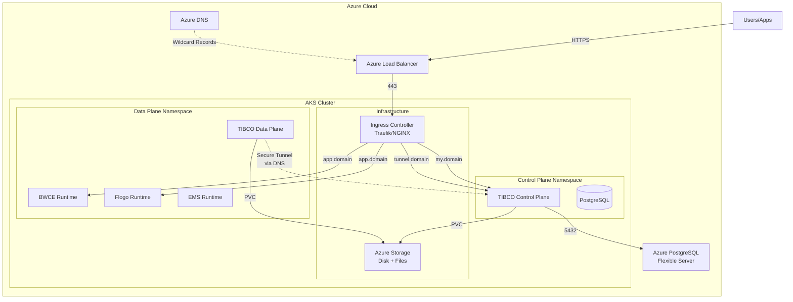

# TIBCO Platform Control Plane and Data Plane Setup on AKS

**Document Purpose**: Complete step-by-step guide for deploying TIBCO Platform Control Plane and Data Plane on the same Azure Kubernetes Service (AKS) cluster.

**Target Audience**: DevOps engineers, Platform administrators

**Prerequisites**: Review [prerequisites-checklist-for-customer.md](prerequisites-checklist-for-customer.md) before starting

**Estimated Time**: 4-6 hours (first-time installation)

**Last Updated**: January 22, 2026

---

## Table of Contents

- [Overview](#overview)
- [Architecture](#architecture)
- [Part 1: Environment Preparation](#part-1-environment-preparation)
- [Part 2: AKS Cluster Setup](#part-2-aks-cluster-setup)
- [Part 3: Storage Configuration](#part-3-storage-configuration)
- [Part 4: Ingress Controller Setup](#part-4-ingress-controller-setup)
- [Part 5: PostgreSQL Database Setup](#part-5-postgresql-database-setup)
- [Part 6: DNS Configuration](#part-6-dns-configuration)
- [Part 7: Certificate Management](#part-7-certificate-management)
- [Part 8: Control Plane Deployment](#part-8-control-plane-deployment)
- [Part 9: Data Plane Deployment](#part-9-data-plane-deployment)
- [Part 10: Post-Deployment Verification](#part-10-post-deployment-verification)
- [Part 11: Troubleshooting](#part-11-troubleshooting)

---

## Overview

This guide walks through deploying both TIBCO Platform Control Plane and Data Plane on a single AKS cluster. This is the recommended approach for development, testing, and single-region production deployments.

### What You Will Deploy

- **Azure Kubernetes Service (AKS)** cluster with 3+ nodes
- **Storage Classes** for Azure Disk and Azure Files
- **Ingress Controller** (Traefik recommended)
- **Azure Database for PostgreSQL Flexible Server** (or in-cluster PostgreSQL for dev/test)
- **TIBCO Platform Control Plane** (v1.14.0+)
- **TIBCO Platform Data Plane** with capabilities (BWCE, Flogo, EMS)

### Communication Architecture

**Important**: Control Plane and Data Plane communicate via **secure tunnels over DNS entries**, NOT VNet peering:
- Data Plane connects to Control Plane's `my` domain (API endpoint)
- Data Plane establishes secure tunnel via Control Plane's `tunnel` domain
- BWCE and Flogo applications use ingress controllers registered in DNS for external access
- VNet peering is **OPTIONAL** and only needed for private/internal-only scenarios

---

## Architecture



---

## Part 1: Environment Preparation

### Step 1.1: Install Required Tools

Ensure all required tools are installed:

```bash
# Check Azure CLI
az --version
# Required: 2.50.0+

# Check kubectl
kubectl version --client
# Required: Latest stable

# Check Helm
helm version
# Required: 3.17.0+

# Check openssl
openssl version
# Required: 1.1+
```

### Step 1.2: Set Environment Variables

Source the environment variables script:

```bash
# Navigate to the workshop directory
cd /path/to/workshop-tp-aks

# Source the environment variables
source scripts/aks-env-variables.sh

# Verify variables are set
echo "Azure Region: $AZURE_REGION"
echo "AKS Cluster: $AKS_CLUSTER_NAME"
echo "Control Plane Domain: $TP_CP_MY_DOMAIN"
```

**Important Variables to Configure**:

```bash
# Azure Configuration
export AZURE_SUBSCRIPTION_ID="your-subscription-id"
export AZURE_REGION="eastus"
export AZURE_RESOURCE_GROUP="tibco-platform-rg"

# AKS Configuration
export AKS_CLUSTER_NAME="tibco-platform-aks"
export AKS_NODE_COUNT=3
export AKS_NODE_SIZE="Standard_D8s_v3"

# Control Plane Configuration
export TP_CP_INSTANCE_ID="cp1"
export TP_CP_NAMESPACE="tibco-cp"
export TP_CP_MY_DOMAIN="cp1-my.platform.azure.example.com"
export TP_CP_TUNNEL_DOMAIN="cp1-tunnel.platform.azure.example.com"

# Data Plane Configuration
export TP_DP_INSTANCE_ID="dp1"
export TP_DP_NAMESPACE="tibco-dp"
export TP_DP_DOMAIN="dp1.platform.azure.example.com"

# Storage Configuration
export AZURE_STORAGE_ACCOUNT="tibcoplatformsa"
export AZURE_STORAGE_RESOURCE_GROUP="$AZURE_RESOURCE_GROUP"

# Database Configuration (Azure PostgreSQL)
export POSTGRES_HOST="tibco-platform-db.postgres.database.azure.com"
export POSTGRES_PORT="5432"
export POSTGRES_DB="tibcoDB"
export POSTGRES_USER="tibcoadmin"
export POSTGRES_PASSWORD="YourSecurePassword123!"

# Container Registry
export CONTAINER_REGISTRY_USERNAME="your-username"
export CONTAINER_REGISTRY_PASSWORD="your-password"
export CONTAINER_REGISTRY_SERVER="csgprduswrepoedge.jfrog.io"
```

### Step 1.3: Login to Azure

```bash
# Login to Azure
az login

# Set the subscription
az account set --subscription "$AZURE_SUBSCRIPTION_ID"

# Verify the subscription
az account show --query "{Name:name, ID:id, State:state}" -o table
```

---

## Part 2: AKS Cluster Setup

### Step 2.1: Create Resource Group

```bash
# Create resource group
az group create \
  --name "$AZURE_RESOURCE_GROUP" \
  --location "$AZURE_REGION"
```

### Step 2.2: Create Virtual Network (Optional)

If you want explicit VNet control:

```bash
# Create VNet
az network vnet create \
  --resource-group "$AZURE_RESOURCE_GROUP" \
  --name "tibco-platform-vnet" \
  --address-prefixes 10.4.0.0/16 \
  --subnet-name "aks-subnet" \
  --subnet-prefixes 10.4.0.0/20

# Get subnet ID
SUBNET_ID=$(az network vnet subnet show \
  --resource-group "$AZURE_RESOURCE_GROUP" \
  --vnet-name "tibco-platform-vnet" \
  --name "aks-subnet" \
  --query id -o tsv)

echo "Subnet ID: $SUBNET_ID"
```

### Step 2.3: Create AKS Cluster

**Option A: AKS with Azure CNI (Recommended)**

```bash
az aks create \
  --resource-group "$AZURE_RESOURCE_GROUP" \
  --name "$AKS_CLUSTER_NAME" \
  --location "$AZURE_REGION" \
  --kubernetes-version 1.32 \
  --node-count $AKS_NODE_COUNT \
  --node-vm-size "$AKS_NODE_SIZE" \
  --network-plugin azure \
  --vnet-subnet-id "$SUBNET_ID" \
  --service-cidr 10.0.0.0/16 \
  --dns-service-ip 10.0.0.10 \
  --enable-managed-identity \
  --generate-ssh-keys \
  --enable-cluster-autoscaler \
  --min-count 3 \
  --max-count 10 \
  --tags "Environment=Production" "Application=TIBCOPlatform"
```

**Option B: AKS with Kubenet (Simpler networking)**

```bash
az aks create \
  --resource-group "$AZURE_RESOURCE_GROUP" \
  --name "$AKS_CLUSTER_NAME" \
  --location "$AZURE_REGION" \
  --kubernetes-version 1.32 \
  --node-count $AKS_NODE_COUNT \
  --node-vm-size "$AKS_NODE_SIZE" \
  --network-plugin kubenet \
  --enable-managed-identity \
  --generate-ssh-keys \
  --enable-cluster-autoscaler \
  --min-count 3 \
  --max-count 10
```

**Note**: Cluster creation takes 5-10 minutes.

### Step 2.4: Get AKS Credentials

```bash
# Get credentials
az aks get-credentials \
  --resource-group "$AZURE_RESOURCE_GROUP" \
  --name "$AKS_CLUSTER_NAME" \
  --overwrite-existing

# Verify connection
kubectl get nodes

# Expected output:
# NAME                                STATUS   ROLES   AGE   VERSION
# aks-nodepool1-12345678-vmss000000   Ready    agent   5m    v1.32.0
# aks-nodepool1-12345678-vmss000001   Ready    agent   5m    v1.32.0
# aks-nodepool1-12345678-vmss000002   Ready    agent   5m    v1.32.0
```

### Step 2.5: Install Cluster Essentials

**Install Cert-Manager** (for certificate management):

```bash
# Add Jetstack Helm repository
helm repo add jetstack https://charts.jetstack.io
helm repo update

# Install cert-manager
kubectl create namespace cert-manager
helm install cert-manager jetstack/cert-manager \
  --namespace cert-manager \
  --version v1.13.3 \
  --set installCRDs=true

# Verify installation
kubectl get pods -n cert-manager
```

**Install Metrics Server** (if not already installed):

```bash
kubectl apply -f https://github.com/kubernetes-sigs/metrics-server/releases/latest/download/components.yaml

# Verify
kubectl get deployment metrics-server -n kube-system
```

---

## Part 3: Storage Configuration

### Step 3.1: Create Azure Storage Account

```bash
# Create storage account
az storage account create \
  --name "$AZURE_STORAGE_ACCOUNT" \
  --resource-group "$AZURE_STORAGE_RESOURCE_GROUP" \
  --location "$AZURE_REGION" \
  --sku Premium_LRS \
  --kind FileStorage \
  --https-only true

# Get storage account key
AZURE_STORAGE_KEY=$(az storage account keys list \
  --account-name "$AZURE_STORAGE_ACCOUNT" \
  --resource-group "$AZURE_STORAGE_RESOURCE_GROUP" \
  --query "[0].value" -o tsv)

echo "Storage Account: $AZURE_STORAGE_ACCOUNT"
echo "Storage Key: $AZURE_STORAGE_KEY"

# Save for later use
export AZURE_STORAGE_KEY
```

### Step 3.2: Deploy Storage Classes

**Add TIBCO Helm Chart Repository**:

```bash
# Add TIBCO helm repo
helm repo add tibco-platform https://tibcosoftware.github.io/tp-helm-charts
helm repo update
```

**Deploy Azure Disk Storage Class** (for PostgreSQL, EMS):

```bash
# Create values file for Azure Disk
cat > azure-disk-values.yaml <<EOF
storageClass:
  name: azure-disk-sc
  provisioner: disk.csi.azure.com
  parameters:
    storageaccounttype: Premium_LRS
    kind: Managed
  reclaimPolicy: Retain
  volumeBindingMode: WaitForFirstConsumer
  allowVolumeExpansion: true
EOF

# Install Azure Disk storage class chart
helm install azure-disk-sc tibco-platform/dp-config-aks \
  --namespace kube-system \
  --values azure-disk-values.yaml \
  --set storageClass.enabled=true \
  --set ingressClass.enabled=false

# Verify
kubectl get storageclass azure-disk-sc
```

**Deploy Azure Files Storage Class** (for BWCE, shared storage):

```bash
# Create Kubernetes secret for Azure Files
kubectl create secret generic azure-storage-secret \
  --from-literal=azurestorageaccountname="$AZURE_STORAGE_ACCOUNT" \
  --from-literal=azurestorageaccountkey="$AZURE_STORAGE_KEY" \
  --namespace kube-system

# Create values file for Azure Files
cat > azure-files-values.yaml <<EOF
storageClass:
  name: azure-files-sc
  provisioner: file.csi.azure.com
  parameters:
    storageAccount: $AZURE_STORAGE_ACCOUNT
    resourceGroup: $AZURE_STORAGE_RESOURCE_GROUP
    skuName: Premium_LRS
  reclaimPolicy: Retain
  volumeBindingMode: Immediate
  allowVolumeExpansion: true
  mountOptions:
    - dir_mode=0777
    - file_mode=0777
    - uid=0
    - gid=0
    - mfsymlinks
    - cache=strict
    - actimeo=30
EOF

# Install Azure Files storage class
helm install azure-files-sc tibco-platform/dp-config-aks \
  --namespace kube-system \
  --values azure-files-values.yaml \
  --set storageClass.enabled=true \
  --set ingressClass.enabled=false

# Verify
kubectl get storageclass azure-files-sc
```

### Step 3.3: Verify Storage Classes

```bash
# List all storage classes
kubectl get storageclass

# Expected output:
# NAME                    PROVISIONER          RECLAIMPOLICY   VOLUMEBINDINGMODE      ALLOWVOLUMEEXPANSION
# azure-disk-sc           disk.csi.azure.com   Retain          WaitForFirstConsumer   true
# azure-files-sc          file.csi.azure.com   Retain          Immediate              true
# default (default)       disk.csi.azure.com   Delete          WaitForFirstConsumer   true
# managed                 disk.csi.azure.com   Delete          WaitForFirstConsumer   true
# managed-csi             disk.csi.azure.com   Delete          WaitForFirstConsumer   true
# managed-csi-premium     disk.csi.azure.com   Delete          WaitForFirstConsumer   true

# Test Azure Files storage class
cat <<EOF | kubectl apply -f -
apiVersion: v1
kind: PersistentVolumeClaim
metadata:
  name: test-azure-files-pvc
  namespace: default
spec:
  accessModes:
    - ReadWriteMany
  storageClassName: azure-files-sc
  resources:
    requests:
      storage: 1Gi
EOF

# Check PVC status
kubectl get pvc test-azure-files-pvc

# Clean up test PVC
kubectl delete pvc test-azure-files-pvc
```

---

## Part 4: Ingress Controller Setup

TIBCO Platform supports multiple ingress controllers. Choose **Traefik 3.3.4** (recommended) or **NGINX 4.12.1**.

**Official Method**: Use the `dp-config-aks` Helm chart with proper layer labels for dependency management.

> [!NOTE]
> Helm label `--labels layer=1` is used for dependency tracking. Layer numbers help identify installation order for proper uninstallation sequence.

### Option A: Traefik Ingress Controller (Recommended)

**Step 4.1: Install Traefik using dp-config-aks**

```bash
# Set ingress variables
export TP_INGRESS_CLASS="traefik"

# Install Traefik Ingress Controller with Azure Load Balancer
helm upgrade --install --wait --timeout 1h --create-namespace \
  -n ingress-system dp-config-aks-ingress dp-config-aks \
  --labels layer=1 \
  --repo "${TP_TIBCO_HELM_CHART_REPO}" --version "^1.0.0" -f - <<EOF
clusterIssuer:
  create: false
httpIngress:
  enabled: false
traefik:
  enabled: true
  service:
    type: LoadBalancer
    annotations:
      external-dns.alpha.kubernetes.io/hostname: "*.${TP_DOMAIN}"
      service.beta.kubernetes.io/azure-load-balancer-health-probe-request-path: /healthz
  ingressRoute:
    dashboard:
      enabled: true
      matchRule: Host(\`traefik.${TP_DOMAIN}\`)
      entryPoints: ["websecure"]
  ports:
    web:
      redirectTo:
        port: websecure
    websecure:
      tls:
        enabled: true
  additionalArguments:
    - '--providers.kubernetesingress.ingressendpoint.publishedservice=ingress-system/dp-config-aks-ingress-traefik'
  tlsStore:
    default:
      defaultCertificate:
        # Set certificate created in Part 7
        secretName: tp-certificate-main-ingress
EOF
    tls:
      enabled: true
    http3:
      enabled: false

ingressClass:
  enabled: true
  isDefaultClass: true

providers:
  kubernetesCRD:
    enabled: true
    allowCrossNamespace: true
  kubernetesIngress:
    enabled: true
    allowExternalNameServices: true

logs:
  general:
    level: INFO
  access:
    enabled: true

resources:
  requests:
    cpu: "500m"
    memory: "512Mi"
  limits:
    cpu: "2000m"
    memory: "2Gi"
EOF

# Create namespace
kubectl create namespace traefik

# Install Traefik
helm install traefik traefik/traefik \
  --namespace traefik \
  --values traefik-values.yaml \
  --version 33.4.0

# Verify installation
kubectl get pods -n traefik
kubectl get svc -n traefik
```

**Step 4.2: Get Load Balancer IP**

```bash
# Get the external IP (may take a few minutes)
kubectl get svc traefik -n traefik --watch

# Save the external IP
export INGRESS_LOAD_BALANCER_IP=$(kubectl get svc traefik -n traefik -o jsonpath='{.status.loadBalancer.ingress[0].ip}')

echo "Ingress Load Balancer IP: $INGRESS_LOAD_BALANCER_IP"
```

```

**Step 4.2: Verify Traefik Deployment**

```bash
# Check Traefik pods
kubectl get pods -n ingress-system

# Check Traefik service and external IP
kubectl get svc -n ingress-system

# Expected output includes LoadBalancer service with EXTERNAL-IP
# NAME                               TYPE           EXTERNAL-IP
# dp-config-aks-ingress-traefik     LoadBalancer   20.x.x.x

# Get ingress class
kubectl get ingressclass
# NAME      CONTROLLER                      PARAMETERS   AGE
# traefik   traefik.io/ingress-controller   <none>       2m
```

### Option B: NGINX Ingress Controller (Alternative) (Deprecated from TP v1.10.0)

> **Warning**: NGINX ingress is deprecated from TIBCO Platform v1.10.0. Use Traefik instead.

```bash
# Add NGINX Helm repository
helm repo add ingress-nginx https://kubernetes.github.io/ingress-nginx
helm repo update

# Install NGINX
helm install nginx-ingress ingress-nginx/ingress-nginx \
  --namespace ingress-nginx \
  --create-namespace \
  --version 4.12.1 \
  --set controller.service.annotations."service\.beta\.kubernetes\.io/azure-load-balancer-health-probe-request-path"=/healthz

# Get Load Balancer IP
export INGRESS_LOAD_BALANCER_IP=$(kubectl get svc nginx-ingress-ingress-nginx-controller -n ingress-nginx -o jsonpath='{.status.loadBalancer.ingress[0].ip}')
```

---

## Part 5: PostgreSQL Database Setup

### Option A: Azure Database for PostgreSQL Flexible Server (Recommended for Production)

**Step 5.1: Create PostgreSQL Flexible Server**

```bash
# Create PostgreSQL Flexible Server
az postgres flexible-server create \
  --resource-group "$AZURE_RESOURCE_GROUP" \
  --name "tibco-platform-db" \
  --location "$AZURE_REGION" \
  --admin-user "$POSTGRES_USER" \
  --admin-password "$POSTGRES_PASSWORD" \
  --sku-name Standard_D4s_v3 \
  --tier GeneralPurpose \
  --version 16 \
  --storage-size 128 \
  --backup-retention 7 \
  --high-availability Disabled \
  --public-access 0.0.0.0-255.255.255.255

# Note: For production, restrict public-access to specific IPs or use private link
```

**Step 5.2: Configure Firewall Rules**

```bash
# Allow Azure services
az postgres flexible-server firewall-rule create \
  --resource-group "$AZURE_RESOURCE_GROUP" \
  --name "tibco-platform-db" \
  --rule-name "AllowAzureServices" \
  --start-ip-address 0.0.0.0 \
  --end-ip-address 0.0.0.0

# Allow AKS subnet (if using VNet integration)
# az postgres flexible-server firewall-rule create \
#   --resource-group "$AZURE_RESOURCE_GROUP" \
#   --name "tibco-platform-db" \
#   --rule-name "AllowAKSSubnet" \
#   --start-ip-address 10.4.0.0 \
#   --end-ip-address 10.4.15.255
```

**Step 5.3: Create Database and Extensions**

```bash
# Create database
az postgres flexible-server db create \
  --resource-group "$AZURE_RESOURCE_GROUP" \
  --server-name "tibco-platform-db" \
  --database-name "$POSTGRES_DB"

# Connect to PostgreSQL and create extensions
# Install psql client if not available: brew install postgresql (Mac) or apt-get install postgresql-client (Linux)

# Get fully qualified server name
export POSTGRES_HOST=$(az postgres flexible-server show \
  --resource-group "$AZURE_RESOURCE_GROUP" \
  --name "tibco-platform-db" \
  --query fullyQualifiedDomainName -o tsv)

echo "PostgreSQL Host: $POSTGRES_HOST"

# Connect and create extensions
psql "host=$POSTGRES_HOST port=5432 dbname=$POSTGRES_DB user=$POSTGRES_USER password=$POSTGRES_PASSWORD sslmode=require" <<EOF
CREATE EXTENSION IF NOT EXISTS "uuid-ossp";
CREATE EXTENSION IF NOT EXISTS "pgcrypto";
SELECT * FROM pg_extension;
\q
EOF
```

**Step 5.4: Test Connection from AKS**

```bash
# Create a test pod
kubectl run postgres-test --image=postgres:16 --rm -it --restart=Never -- \
  psql "host=$POSTGRES_HOST port=5432 dbname=$POSTGRES_DB user=$POSTGRES_USER password=$POSTGRES_PASSWORD sslmode=require" \
  -c "SELECT version();"

# Expected output: PostgreSQL 16.x ...
```

### Option B: In-Cluster PostgreSQL using dp-config-aks (Development/Testing Only)

> **Warning**: Not recommended for production. Use Azure managed PostgreSQL instead.

**Official Method**: Use `dp-config-aks` chart to deploy PostgreSQL 16 in the Control Plane namespace.

```bash
# Set PostgreSQL variables
export CP_INSTANCE_ID="cp1"  # Control Plane instance ID (alphanumeric, max 5 chars)
export POSTGRES_PASSWORD="postgres"  # Change for production

# Install PostgreSQL using dp-config-aks
helm upgrade --install --wait --timeout 1h --create-namespace \
  -n ${CP_INSTANCE_ID}-ns postgres-${CP_INSTANCE_ID} dp-config-aks \
  --labels layer=3 \
  --repo "${TP_TIBCO_HELM_CHART_REPO}" --version "^1.0.0" -f - <<EOF
global:
  tibco:
    containerRegistry:
      url: "csgprduswrepoedge.jfrog.io"
      username: "${TP_CONTAINER_REGISTRY_USER}"
      password: "${TP_CONTAINER_REGISTRY_PASSWORD}"
      repository: "tibco-platform-docker-prod"
  storageClass: ${TP_DISK_STORAGE_CLASS}
postgresql:
  enabled: true
  auth:
    postgresPassword: ${POSTGRES_PASSWORD}
    username: postgres
    password: ${POSTGRES_PASSWORD}
    database: "postgres"
  image:
    registry: "csgprduswrepoedge.jfrog.io"
    repository: tibco-platform-docker-prod/common-postgresql
    tag: 16.4.0-debian-12-r14
    pullSecrets:
    - tibco-container-registry-credentials
  primary:
    resources:
      requests:
        cpu: "250m"
        memory: "512Mi"
      limits:
        cpu: "1"
        memory: "1Gi"
    persistence:
      size: 2Gi
EOF

# Get PostgreSQL connection details
export POSTGRES_HOST="postgres-${CP_INSTANCE_ID}-postgresql.${CP_INSTANCE_ID}-ns.svc.cluster.local"
export POSTGRES_PORT=5432
export POSTGRES_DB="postgres"
export POSTGRES_USER="postgres"

echo "PostgreSQL Host: $POSTGRES_HOST"

# Set host for in-cluster
export POSTGRES_HOST="postgresql.tibco-cp.svc.cluster.local"
```

---

## Part 6: DNS Configuration

DNS is **REQUIRED** for Control Plane and Data Plane communication via secure tunnels.

### Step 6.1: Create Azure DNS Zone (if needed)

```bash
# Create DNS zone
az network dns zone create \
  --resource-group "$AZURE_RESOURCE_GROUP" \
  --name "platform.azure.example.com"

# List name servers (delegate these in your parent domain)
az network dns zone show \
  --resource-group "$AZURE_RESOURCE_GROUP" \
  --name "platform.azure.example.com" \
  --query nameServers -o table
```

### Step 6.2: Create Wildcard DNS Records

**Option A: Using Azure CLI**

```bash
# Get Load Balancer IP (if not already set)
export INGRESS_LOAD_BALANCER_IP=$(kubectl get svc traefik -n traefik -o jsonpath='{.status.loadBalancer.ingress[0].ip}')

# Create wildcard A record for Control Plane MY domain
az network dns record-set a add-record \
  --resource-group "$AZURE_RESOURCE_GROUP" \
  --zone-name "platform.azure.example.com" \
  --record-set-name "*.cp1-my" \
  --ipv4-address "$INGRESS_LOAD_BALANCER_IP"

# Create wildcard A record for Control Plane TUNNEL domain
az network dns record-set a add-record \
  --resource-group "$AZURE_RESOURCE_GROUP" \
  --zone-name "platform.azure.example.com" \
  --record-set-name "*.cp1-tunnel" \
  --ipv4-address "$INGRESS_LOAD_BALANCER_IP"

# Create wildcard A record for Data Plane domain (for BWCE/Flogo apps)
az network dns record-set a add-record \
  --resource-group "$AZURE_RESOURCE_GROUP" \
  --zone-name "platform.azure.example.com" \
  --record-set-name "*.dp1" \
  --ipv4-address "$INGRESS_LOAD_BALANCER_IP"

# Verify DNS records
az network dns record-set a list \
  --resource-group "$AZURE_RESOURCE_GROUP" \
  --zone-name "platform.azure.example.com" \
  --query "[].{Name:name, IP:aRecords[0].ipv4Address}" -o table
```

**Option B: Using External DNS (Recommended for Production)**

See [how-to-add-dns-records-aks-azure.md](how-to-add-dns-records-aks-azure.md) for detailed External DNS setup.

### Step 6.3: Verify DNS Resolution

```bash
# Test DNS resolution (wait 1-2 minutes for propagation)
nslookup account.cp1-my.platform.azure.example.com
nslookup tunnel.cp1-tunnel.platform.azure.example.com
nslookup myapp.dp1.platform.azure.example.com

# All should resolve to: $INGRESS_LOAD_BALANCER_IP
```

---

## Part 7: Certificate Management

### Option A: Self-Signed Certificates (Development/Testing)

**Step 7.1: Generate Certificates**

```bash
# Use the provided certificate generation script
cd /path/to/workshop-tp-aks

# Source environment variables (if not already done)
source scripts/aks-env-variables.sh

# Generate certificates
./scripts/generate-certificates.sh

# Certificates will be created in ./certs/ directory
ls -la certs/
```

**Step 7.2: Create Kubernetes TLS Secrets**

```bash
# Create Control Plane namespace
kubectl create namespace $TP_CP_NAMESPACE

# Create TLS secret for MY domain
kubectl create secret tls cp-my-tls-cert \
  --cert=certs/cp-my-cert.crt \
  --key=certs/cp-my-key.pem \
  --namespace $TP_CP_NAMESPACE

# Create TLS secret for TUNNEL domain
kubectl create secret tls cp-tunnel-tls-cert \
  --cert=certs/cp-tunnel-cert.crt \
  --key=certs/cp-tunnel-key.pem \
  --namespace $TP_CP_NAMESPACE

# Verify secrets
kubectl get secrets -n $TP_CP_NAMESPACE | grep tls
```

### Option B: Let's Encrypt Certificates (Production)

**Step 7.1: Create ClusterIssuer for Let's Encrypt**

```bash
cat <<EOF | kubectl apply -f -
apiVersion: cert-manager.io/v1
kind: ClusterIssuer
metadata:
  name: letsencrypt-prod
spec:
  acme:
    server: https://acme-v02.api.letsencrypt.org/directory
    email: admin@example.com
    privateKeySecretRef:
      name: letsencrypt-prod
    solvers:
    - http01:
        ingress:
          class: traefik
EOF

# Verify ClusterIssuer
kubectl get clusterissuer letsencrypt-prod
```

**Step 7.2: Certificate Annotations**

When using Let's Encrypt, add these annotations to your ingress resources:

```yaml
annotations:
  cert-manager.io/cluster-issuer: "letsencrypt-prod"
```

Certificates will be automatically provisioned when ingress resources are created.

---

## Part 8: Control Plane Deployment

### Step 8.1: Pre-requisites - Create Namespace and Service Account

**First**, create the Control Plane namespace with proper labels:

```bash
# Set Control Plane Instance ID
export CP_INSTANCE_ID="cp1"  # Unique ID (alphanumeric, max 5 chars)

# Create namespace with labels
kubectl apply -f <(envsubst '${CP_INSTANCE_ID}' <<'EOF'
apiVersion: v1
kind: Namespace
metadata:
  name: ${CP_INSTANCE_ID}-ns
  labels:
    platform.tibco.com/controlplane-instance-id: ${CP_INSTANCE_ID}
EOF
)

# Create service account for Control Plane
kubectl create serviceaccount ${CP_INSTANCE_ID}-sa -n ${CP_INSTANCE_ID}-ns
```

### Step 8.2: Configure DNS Records and Certificates

**Step 8.2.1: Label ingress-system namespace** (required for network policies)

```bash
kubectl label namespace ingress-system networking.platform.tibco.com/non-cp-ns=enable --overwrite=true
```

**Step 8.2.2: Create Certificate using cert-manager**

```bash
# Set domain variables
export CP_MY_DNS_DOMAIN="${TP_MAIN_INGRESS_SANDBOX_SUBDOMAIN}.${TP_SANDBOX}.${TP_TOP_LEVEL_DOMAIN}"
export CP_TUNNEL_DNS_DOMAIN="tunnel.${TP_SANDBOX}.${TP_TOP_LEVEL_DOMAIN}"

# Create certificate in CP namespace
kubectl apply -f - <<EOF
apiVersion: cert-manager.io/v1
kind: Certificate
metadata:
  name: tp-certificate-${CP_INSTANCE_ID}
  namespace: ${CP_INSTANCE_ID}-ns
spec:
  dnsNames:
  - '*.${CP_MY_DNS_DOMAIN}'
  - '*.${CP_TUNNEL_DNS_DOMAIN}'
  issuerRef:
    kind: ClusterIssuer
    name: cic-cert-subscription-scope-production-main
  secretName: tp-certificate-${CP_INSTANCE_ID}
EOF

# Wait for certificate to be ready
kubectl wait --for=condition=Ready certificate/tp-certificate-${CP_INSTANCE_ID} -n ${CP_INSTANCE_ID}-ns --timeout=300s

# Verify certificate
kubectl get certificate -n ${CP_INSTANCE_ID}-ns
kubectl describe certificate tp-certificate-${CP_INSTANCE_ID} -n ${CP_INSTANCE_ID}-ns
```

> **Note**: If you haven't set up cert-manager ClusterIssuer yet, refer to [AKS cluster-setup documentation](https://github.com/TIBCOSoftware/tp-helm-charts/tree/main/docs/workshop/aks/cluster-setup#install-cluster-issuer).

### Step 8.3: Create Required Kubernetes Secrets

**1. Session Keys Secret (REQUIRED)**

This secret is mandatory for router pods to start correctly.

```bash
# Generate session keys
export TSC_SESSION_KEY=$(openssl rand -base64 48 | tr -dc A-Za-z0-9 | head -c32)
export DOMAIN_SESSION_KEY=$(openssl rand -base64 48 | tr -dc A-Za-z0-9 | head -c32)

# Create Kubernetes secret
kubectl create secret generic session-keys -n ${CP_INSTANCE_ID}-ns \
  --from-literal=TSC_SESSION_KEY=${TSC_SESSION_KEY} \
  --from-literal=DOMAIN_SESSION_KEY=${DOMAIN_SESSION_KEY}

# Verify
kubectl get secret session-keys -n ${CP_INSTANCE_ID}-ns
```

**2. CP Orchestration Encryption Secret (REQUIRED)**

```bash
# Generate encryption secret
export CP_ENCRYPTION_SECRET=$(openssl rand -base64 48 | tr -dc A-Za-z0-9 | head -c44)

# Create secret in Control Plane namespace
kubectl create secret -n ${CP_INSTANCE_ID}-ns generic cporch-encryption-secret \
  --from-literal=CP_ENCRYPTION_SECRET=${CP_ENCRYPTION_SECRET}

# Verify
kubectl get secret cporch-encryption-secret -n ${CP_INSTANCE_ID}-ns
```

**3. Container Registry Secret (REQUIRED)**

```bash
# Set TIBCO container registry credentials
export TP_CONTAINER_REGISTRY_URL="csgprduswrepoedge.jfrog.io"
export TP_CONTAINER_REGISTRY_USER="<your-jfrog-username>"
export TP_CONTAINER_REGISTRY_PASSWORD="<your-jfrog-password>"
export TP_CONTAINER_REGISTRY_REPOSITORY="tibco-platform-docker-prod"

kubectl create secret docker-registry tibco-container-registry-credentials \
  --namespace ${CP_INSTANCE_ID}-ns \
  --docker-server=${TP_CONTAINER_REGISTRY_URL} \
  --docker-username=${TP_CONTAINER_REGISTRY_USER} \
  --docker-password=${TP_CONTAINER_REGISTRY_PASSWORD}

# Verify
kubectl get secret tibco-container-registry-credentials -n ${CP_INSTANCE_ID}-ns
```

**4. PostgreSQL Database Secret (if using Azure PostgreSQL)**

```bash
kubectl create secret generic postgres-${CP_INSTANCE_ID}-postgresql \
  --from-literal=postgres-password="$POSTGRES_PASSWORD" \
  --namespace ${CP_INSTANCE_ID}-ns
```

> **Note**: If using in-cluster PostgreSQL from dp-config-aks, this secret is created automatically.

### Step 8.4: Export Additional Variables Required for Chart Values

```bash
# Network and ingress variables
export TP_VNET_CIDR="10.4.0.0/16"
export TP_SERVICE_CIDR="10.0.0.0/16"
export TP_INGRESS_CLASS="traefik"  # or "nginx"
export TP_ENABLE_NETWORK_POLICY="false"  # Set to "true" for production

# PostgreSQL connection (for in-cluster PostgreSQL)
export POSTGRES_HOST="postgres-${CP_INSTANCE_ID}-postgresql.${CP_INSTANCE_ID}-ns.svc.cluster.local"
export POSTGRES_PORT=5432

# Or for Azure PostgreSQL Flexible Server
# export POSTGRES_HOST="tibco-platform-db.postgres.database.azure.com"
# export POSTGRES_PORT=5432
```

### Step 8.5: Configure Control Plane Helm Values

Create the official Control Plane values file using the **tibco-cp-base** chart structure:

```bash
cat > cp-values.yaml <<EOF
# TIBCO Platform Control Plane Values for AKS
# Based on: https://github.com/TIBCOSoftware/tp-helm-charts/tree/main/docs/workshop/aks/control-plane

tp-cp-core-finops:
  finops:
    enabled: true

tp-cp-integration-bwprovisioner:
  bwprovisioner:
    enabled: true

tp-cp-integration-bw5provisioner:
  bw5provisioner:
    enabled: true

tp-cp-integration-flogoprovisioner:
  flogoprovisioner:
    enabled: true

router:
  config:
    domainSessionKey:
      secretName: session-keys  # default secret name
      key: DOMAIN_SESSION_KEY
  ingress:
    enabled: true
    ingressClassName: "${TP_INGRESS_CLASS}"
    tls:
      - secretName: tp-certificate-${CP_INSTANCE_ID}
        hosts:
          - '*.${CP_MY_DNS_DOMAIN}'
    hosts:
      - host: '*.${CP_MY_DNS_DOMAIN}'
        paths:
          - path: /
            pathType: Prefix
            port: 100

tp-cp-bootstrap-cronjobs:
  cronjobs:
    setupJob:
      enable: true

router-operator:
  enabled: true
  # SecretNames for environment variables TSC_SESSION_KEY and DOMAIN_SESSION_KEY
  tscSessionKey:
    secretName: session-keys  # default secret name
    key: TSC_SESSION_KEY
  domainSessionKey:
    secretName: session-keys  # default secret name
    key: DOMAIN_SESSION_KEY

tunproxy:
  tunnelIngress:
    enabled: true
    ingressClassName: "${TP_INGRESS_CLASS}"
    tls:
      - secretName: tp-certificate-${CP_INSTANCE_ID}
        hosts:
          - '*.${CP_TUNNEL_DNS_DOMAIN}'
    hosts:
      - host: '*.${CP_TUNNEL_DNS_DOMAIN}'
        paths:
          - path: /
            pathType: Prefix
            port: 105

global:
  tibco:
    createNetworkPolicy: ${TP_ENABLE_NETWORK_POLICY}
    
    # Container Registry
    containerRegistry:
      url: "${TP_CONTAINER_REGISTRY_URL}"
      username: "${TP_CONTAINER_REGISTRY_USER}"
      password: "${TP_CONTAINER_REGISTRY_PASSWORD}"
      repository: "${TP_CONTAINER_REGISTRY_REPOSITORY}"
    
    # Control Plane Instance
    controlPlaneInstanceId: "${CP_INSTANCE_ID}"
    serviceAccount: "${CP_INSTANCE_ID}-sa"
  
  external:
    clusterInfo:
      nodeCIDR: "${TP_VNET_CIDR}"
    
    # Database Configuration
    db:
      vendor: "postgres"
      host: "${POSTGRES_HOST}"
      port: ${POSTGRES_PORT}
      sslMode: "disable"  # Use "require" for Azure PostgreSQL
      sslRootCert: ""
      secretName: "postgres-${CP_INSTANCE_ID}-postgresql"
      adminUsername: "postgres"
      adminPasswordKey: "postgres-password"
EOF
```

### Step 8.6: Deploy Control Plane

```bash
# Add TIBCO Helm repository
helm repo add tibco-platform ${TP_TIBCO_HELM_CHART_REPO}
helm repo update

# Install TIBCO Platform Control Plane
helm upgrade --install --wait --timeout 30m \
  -n ${CP_INSTANCE_ID}-ns tibco-platform-cp tibco-platform-cp \
  --labels layer=5 \
  --repo "${TP_TIBCO_HELM_CHART_REPO}" \
  --values cp-values.yaml

# Monitor deployment
kubectl get pods -n ${CP_INSTANCE_ID}-ns --watch
```

```

**Expected deployment time**: 10-20 minutes

### Step 8.7: Verify Control Plane Deployment

```bash
# Check all pods are running (may take 10-15 minutes)
kubectl get pods -n ${CP_INSTANCE_ID}-ns

# All pods should show STATUS: Running or Completed
# Example:
# NAME                                          READY   STATUS    RESTARTS
# cp-proxy-xxxxxxxxx-xxxxx                      1/1     Running   0
# idm-xxxxxxxxx-xxxxx                           1/1     Running   0
# ...

# Check ingress resources
kubectl get ingress -n ${CP_INSTANCE_ID}-ns

# Check services
kubectl get svc -n ${CP_INSTANCE_ID}-ns

# Check PVCs (if any)
kubectl get pvc -n ${CP_INSTANCE_ID}-ns

# View Control Plane proxy logs
kubectl logs -n ${CP_INSTANCE_ID}-ns -l app.kubernetes.io/component=cp-proxy -f
```

### Step 8.8: Access Control Plane UI

```bash
# Get Control Plane URL
export CP_UI_URL="https://account.${CP_MY_DNS_DOMAIN}"

echo "==============================================="
echo "TIBCO Platform Control Plane URL:"
echo "$CP_UI_URL"
echo "==============================================="
echo "Username: admin"
echo "Password: (configured during initial setup)"
echo "==============================================="
```

Open your browser and navigate to the Control Plane URL.

**Initial Login**: On first access, you'll be prompted to:
1. Accept the license agreement
2. Set admin password
3. Configure email settings (optional)
4. Upload TIBCO Platform license

---

## Part 9: Data Plane Deployment

> [!NOTE]
> Data Plane deployment on the same cluster as Control Plane follows official TIBCO procedures. The Data Plane will communicate with the Control Plane via DNS and secure tunnels, not requiring VNet peering.

### Step 9.1: Pre-requisites - Namespace and Service Account

**Create Data Plane Namespace with Required Labels**

```bash
# Export DP variables (if not already set)
export DP_INSTANCE_ID="dp1"
export DP_NAMESPACE="ns"  # Primary namespace name for Data Plane

# Create namespace with required labels
kubectl create namespace ${DP_NAMESPACE}
kubectl label namespace ${DP_NAMESPACE} \
  platform.tibco.com/dataplane-id=${DP_INSTANCE_ID} \
  platform.tibco.com/workload-type=infra \
  networking.platform.tibco.com/non-cp-ns=enable

# Create service account for Data Plane
kubectl create serviceaccount ${DP_INSTANCE_ID}-sa -n ${DP_NAMESPACE}
```

**Verify namespace and service account creation**:
```bash
kubectl get namespace ${DP_NAMESPACE} --show-labels
kubectl get sa ${DP_INSTANCE_ID}-sa -n ${DP_NAMESPACE}
```

### Step 9.2: Install Observability Stack (Optional but Recommended)

Before deploying the Data Plane, install the observability stack for monitoring and logging.

**Install Elastic ECK Operator**

```bash
# Install eck-operator
helm upgrade --install --wait --timeout 1h --labels layer=1 \
  --create-namespace -n elastic-system eck-operator eck-operator \
  --repo "https://helm.elastic.co" --version "2.16.0"

# Verify operator installation
kubectl logs -n elastic-system sts/elastic-operator
```

**Deploy Elastic Stack (Elasticsearch, Kibana, APM)**

```bash
export TP_ES_RELEASE_NAME="dp-config-es"  # Elastic stack release name

helm upgrade --install --wait --timeout 1h --create-namespace --reuse-values \
  -n elastic-system ${TP_ES_RELEASE_NAME} dp-config-es \
  --labels layer=2 \
  --repo "${TP_TIBCO_HELM_CHART_REPO}" --version "^1.0.0" -f - <<EOF
domain: ${TP_DOMAIN}
es:
  version: "8.17.3"
  ingress:
    ingressClassName: ${TP_INGRESS_CLASS}
    service: ${TP_ES_RELEASE_NAME}-es-http
  storage:
    name: ${TP_DISK_STORAGE_CLASS}
kibana:
  version: "8.17.3"
  ingress:
    ingressClassName: ${TP_INGRESS_CLASS}
    service: ${TP_ES_RELEASE_NAME}-kb-http
apm:
  enabled: true
  version: "8.17.3"
  ingress:
    ingressClassName: ${TP_INGRESS_CLASS}
    service: ${TP_ES_RELEASE_NAME}-apm-http
EOF
```

**Verify Elastic Stack Installation**

```bash
# Check index templates
kubectl get -n elastic-system IndexTemplates

# Expected output:
# dp-config-es-jaeger-service-index-template
# dp-config-es-jaeger-span-index-template
# dp-config-es-user-apps-index-template

# Check indices
kubectl get -n elastic-system Indices

# Get Kibana URL
kubectl get ingress -n elastic-system dp-config-es-kibana -o jsonpath='{.spec.rules[0].host}'

# Get Elasticsearch password
kubectl get secret dp-config-es-es-elastic-user -n elastic-system -o jsonpath="{.data.elastic}" | base64 --decode; echo
```

**Install Prometheus and Grafana**

```bash
helm upgrade --install --wait --timeout 1h --create-namespace --reuse-values \
  -n prometheus-system kube-prometheus-stack kube-prometheus-stack \
  --labels layer=2 \
  --repo "https://prometheus-community.github.io/helm-charts" --version "48.3.4" -f - <<EOF
grafana:
  plugins:
    - grafana-piechart-panel
  ingress:
    enabled: true
    ingressClassName: ${TP_INGRESS_CLASS}
    hosts:
    - grafana.${TP_DOMAIN}
prometheus:
  prometheusSpec:
    enableRemoteWriteReceiver: true
    externalLabels:
      cluster: ${TP_CLUSTER_NAME}
    remoteWrite:
    - url: http://otel-userapp-metrics.${DP_NAMESPACE}.svc.cluster.local:8889/api/v1/write
EOF
```

**Verify Prometheus Installation**

```bash
# Get Grafana URL
kubectl get ingress -n prometheus-system kube-prometheus-stack-grafana -o jsonpath='{.spec.rules[0].host}'

# Default Grafana credentials: admin / prom-operator
```

### Step 9.3: Deploy Data Plane - Configure Namespace

The `dp-configure-namespace` chart sets up the Data Plane namespace with network policies, service accounts, and observability configurations.

```bash
export TP_DNS_DOMAIN="${TP_DOMAIN}"  # Main DNS domain for DP
export TP_SANDBOX="${DP_INSTANCE_ID}"  # Sandbox subdomain
export TP_INGRESS_CLASS="nginx"  # or "traefik"
export TP_SERVICE_CIDR="10.0.0.0/16"  # AKS service CIDR
export TP_POD_CIDR="10.244.0.0/16"  # AKS pod CIDR (adjust based on your cluster)

helm upgrade --install --wait --timeout 1h \
  -n ${DP_NAMESPACE} dp-configure-namespace dp-configure-namespace \
  --labels layer=3 \
  --repo "${TP_TIBCO_HELM_CHART_REPO}" --version "^1.3.0" -f - <<EOF
global:
  tibco:
    dataPlaneId: "${DP_INSTANCE_ID}"
    subscriptionId: "sub1"  # Subscription identifier
    serviceAccount: "${DP_INSTANCE_ID}-sa"
    primaryNamespaceName: "${DP_NAMESPACE}"
    containerRegistry:
      url: "${TP_CONTAINER_REGISTRY_URL}"
      username: "${TP_CONTAINER_REGISTRY_USER}"
      password: "${TP_CONTAINER_REGISTRY_PASSWORD}"
      repository: "${TP_CONTAINER_REGISTRY_REPOSITORY}"

dns:
  domain: "${TP_DNS_DOMAIN}"

# Observability configuration
otel:
  services:
    traces:
      grpc:
        enabled: true
      http:
        enabled: true
    metrics:
      grpc:
        enabled: true
      http:
        enabled: true

# Elastic observability backend
eso:
  enabled: true
  elasticsearch:
    endpoint: "https://dp-config-es-es-http.elastic-system.svc.cluster.local:9200"
    protocol: "https"
    secretName: "dp-config-es-es-elastic-user"

# Prometheus observability backend
prom:
  enabled: true
  remoteWriteEndpoint: "http://kube-prometheus-stack-prometheus.prometheus-system.svc.cluster.local:9090/api/v1/write"
  queryEndpoint: "http://kube-prometheus-stack-prometheus.prometheus-system.svc.cluster.local:9090"

# Network configuration
ingress:
  ingressClassName: "${TP_INGRESS_CLASS}"
  fqdn:
    kind: "shared"

networkPolicy:
  create: ${TP_ENABLE_NETWORK_POLICY}
  ingress:
    podCidr: "${TP_POD_CIDR}"
    serviceCidr: "${TP_SERVICE_CIDR}"
EOF
```

**Verify dp-configure-namespace deployment**

```bash
# Check all resources
kubectl get all -n ${DP_NAMESPACE}

# Check OTEL collectors
kubectl get pods -n ${DP_NAMESPACE} -l app.kubernetes.io/name=opentelemetry-collector

# Check service monitors (if Prometheus is installed)
kubectl get servicemonitor -n ${DP_NAMESPACE}
```

### Step 9.4: Deploy Data Plane - Core Infrastructure

The `dp-core-infrastructure` chart deploys the core Data Plane components including tibtunnel and provisioner agent.

**Get Data Plane Registration Information from Control Plane UI**:

1. Login to Control Plane UI: `https://account.${CP_MY_DNS_DOMAIN}`
2. Navigate to **Settings** → **Clusters**
3. Click **Add Cluster**
4. Select **AKS** as cluster type
5. Copy the following values:
   - **Data Plane ID**: Should match `${DP_INSTANCE_ID}`
   - **Subscription ID**: Your subscription identifier
   - **Access Key**: Required for tibtunnel configuration

```bash
# Set the access key from Control Plane UI
export TP_DP_ACCESS_KEY="your-access-key-from-cp-ui"

# Deploy dp-core-infrastructure
helm upgrade --install --wait --timeout 1h \
  -n ${DP_NAMESPACE} dp-core-infrastructure dp-core-infrastructure \
  --labels layer=4 \
  --repo "${TP_TIBCO_HELM_CHART_REPO}" --version "^1.3.0" -f - <<EOF
global:
  tibco:
    dataPlaneId: "${DP_INSTANCE_ID}"
    subscriptionId: "sub1"
    serviceAccount: "${DP_INSTANCE_ID}-sa"
    controlPlaneUrl: "https://${CP_MY_DNS_DOMAIN}"
    containerRegistry:
      url: "${TP_CONTAINER_REGISTRY_URL}"
      username: "${TP_CONTAINER_REGISTRY_USER}"
      password: "${TP_CONTAINER_REGISTRY_PASSWORD}"
      repository: "${TP_CONTAINER_REGISTRY_REPOSITORY}"

tp-tibtunnel:
  enabled: true
  configure:
    accessKey: "${TP_DP_ACCESS_KEY}"

tp-provisioner-agent:
  enabled: true

# HAProxy ingress for internal routing (optional)
haproxy:
  enabled: false
EOF
```

**Monitor Data Plane deployment**:

```bash
# Watch pods
kubectl get pods -n ${DP_NAMESPACE} --watch

# Check tibtunnel logs
kubectl logs -n ${DP_NAMESPACE} -l app.kubernetes.io/name=tp-tibtunnel -f

# Check provisioner-agent logs
kubectl logs -n ${DP_NAMESPACE} -l app.kubernetes.io/name=tp-provisioner-agent -f
```

### Step 9.5: Verify Data Plane Deployment

**Check all Data Plane pods are running**:

```bash
kubectl get pods -n ${DP_NAMESPACE}

# Expected pods:
# dp-configure-namespace-otel-userapp-metrics-xxx
# dp-configure-namespace-otel-userapp-traces-xxx
# dp-core-infrastructure-tp-tibtunnel-xxx
# dp-core-infrastructure-tp-provisioner-agent-xxx
```

**Verify Data Plane connection to Control Plane**:

```bash
# Check tibtunnel connection status
kubectl logs -n ${DP_NAMESPACE} -l app.kubernetes.io/name=tp-tibtunnel --tail=50

# Look for messages like:
# "tunnel established successfully"
# "connected to control plane"

# Check provisioner-agent registration
kubectl logs -n ${DP_NAMESPACE} -l app.kubernetes.io/name=tp-provisioner-agent --tail=50

# Look for messages like:
# "registered with control plane"
# "agent started successfully"
```

**Verify Data Plane in Control Plane UI**:

1. Login to Control Plane UI: `https://account.${CP_MY_DNS_DOMAIN}`
2. Navigate to **Settings** → **Clusters**
3. Your Data Plane cluster should appear with:
   - **Name**: Based on ${DP_INSTANCE_ID}
   - **Status**: Connected (green indicator)
   - **Health**: All health checks passing

### Step 9.6: Provision Capabilities via Control Plane UI

With the Data Plane deployed and connected, you now provision capabilities (BWCE, Flogo, etc.) through the Control Plane UI, **NOT** via Helm charts.

**Steps to provision capabilities**:

1. Login to Control Plane UI
2. Navigate to **Clusters** → Select your Data Plane cluster
3. Click **Capabilities** tab
4. Click **Add Capability**
5. Select capabilities to install:
   - **BusinessWorks Container Edition (BWCE)**
   - **Flogo® Enterprise**
   - **TIBCO Enterprise Message Service™ (EMS)**
6. Configure each capability:
   - **Storage Class**: `azure-files-sc` (for BWCE/Flogo)
   - **Storage Class**: `azure-disk-sc` (for EMS)
   - **Ingress Class**: `nginx` or `traefik`
   - **Domain**: Subdomain for app routing (e.g., `apps.${TP_DOMAIN}`)
7. Click **Provision**

The Control Plane will automatically deploy the required Helm charts to the Data Plane cluster.

**Monitor capability provisioning**:

```bash
# Watch for new pods being created
kubectl get pods -n ${DP_NAMESPACE} --watch

# Check for capability-specific deployments
kubectl get deployments -n ${DP_NAMESPACE}
kubectl get statefulsets -n ${DP_NAMESPACE}
```

**Verify capabilities in Control Plane UI**:

1. Navigate to **Clusters** → Select your Data Plane
2. Click **Capabilities** tab
3. All provisioned capabilities should show **Status: Ready**

---

## Part 10: Post-Deployment Verification

### Step 10.1: Test Control Plane Access

```bash
# Test Control Plane MY domain
curl -k -I https://account.$TP_CP_MY_DOMAIN

# Expected: HTTP/2 200 or 302 (redirect to login)

# Test Control Plane TUNNEL domain
curl -k -I https://tunnel.$TP_CP_TUNNEL_DOMAIN

# Expected: HTTP/2 200 or similar
```

### Step 10.2: Test Data Plane Connectivity

```bash
# From within the Data Plane namespace, test CP connectivity
kubectl run test-dp-cp-connection --image=curlimages/curl --rm -it --restart=Never -n $TP_DP_NAMESPACE -- \
  curl -k -I https://account.$TP_CP_MY_DOMAIN

# Expected: HTTP/2 200 or 302
```

### Step 10.3: Deploy Test BWCE Application

1. Login to Control Plane UI
2. Navigate to **Applications** → **BWCE Apps**
3. Click **Deploy New Application**
4. Select Data Plane: `dp1`
5. Upload a sample BWCE app or use a test app
6. Configure application domain: `myapp.dp1.platform.azure.example.com`
7. Deploy

**Verify Application**:

```bash
# Check application pods
kubectl get pods -n $TP_DP_NAMESPACE | grep bwce

# Test application endpoint
curl -k https://myapp.dp1.platform.azure.example.com/health

# Expected: Application health response
```

### Step 10.4: Check Resource Usage

```bash
# Control Plane resource usage
kubectl top nodes
kubectl top pods -n $TP_CP_NAMESPACE

# Data Plane resource usage
kubectl top pods -n $TP_DP_NAMESPACE

# Check PVC usage
kubectl get pvc -n $TP_CP_NAMESPACE
kubectl get pvc -n $TP_DP_NAMESPACE
```

### Step 10.5: Verify DNS Resolution from Data Plane

```bash
# Test DNS resolution from Data Plane pods
kubectl run dns-test --image=busybox --rm -it --restart=Never -n $TP_DP_NAMESPACE -- \
  nslookup account.$TP_CP_MY_DOMAIN

# Expected: Should resolve to Load Balancer IP

kubectl run dns-test --image=busybox --rm -it --restart=Never -n $TP_DP_NAMESPACE -- \
  nslookup tunnel.$TP_CP_TUNNEL_DOMAIN

# Expected: Should resolve to Load Balancer IP
```

---

## Part 11: Troubleshooting

### Common Issues and Solutions

#### 1. Pods Not Starting

**Symptoms**: Pods stuck in `Pending`, `ImagePullBackOff`, or `CrashLoopBackOff`

**Solutions**:

```bash
# Check pod status
kubectl describe pod <pod-name> -n <namespace>

# Check events
kubectl get events -n <namespace> --sort-by='.lastTimestamp'

# Check container logs
kubectl logs <pod-name> -n <namespace> -c <container-name>

# Common fixes:
# - Image pull issues: Verify container registry credentials
# - Resource issues: Check node resources (kubectl describe nodes)
# - Storage issues: Verify storage classes and PVC status
```

#### 2. Ingress Not Working

**Symptoms**: Cannot access Control Plane UI, 404 or connection timeout

**Solutions**:

```bash
# Check ingress resources
kubectl get ingress -n $TP_CP_NAMESPACE

# Check ingress controller logs
kubectl logs -n traefik -l app.kubernetes.io/name=traefik -f

# Verify Load Balancer IP
kubectl get svc traefik -n traefik

# Test DNS resolution
nslookup account.$TP_CP_MY_DOMAIN

# Common fixes:
# - DNS not configured: Add DNS records pointing to Load Balancer IP
# - TLS certificate issues: Verify TLS secrets
# - Ingress class mismatch: Ensure ingressClassName matches controller
```

#### 3. Data Plane Not Connecting to Control Plane

**Symptoms**: Data Plane shows as **Disconnected** in Control Plane UI

**Solutions**:

```bash
# Check Data Plane logs
kubectl logs -n $TP_DP_NAMESPACE -l app.kubernetes.io/component=dp-core-ops -f

# Verify DNS resolution from Data Plane
kubectl run dns-test --image=busybox --rm -it --restart=Never -n $TP_DP_NAMESPACE -- \
  nslookup account.$TP_CP_MY_DOMAIN

# Check Data Plane token secret
kubectl get secret tibco-dp-token -n $TP_DP_NAMESPACE

# Verify network connectivity
kubectl run netshoot --image=nicolaka/netshoot --rm -it --restart=Never -n $TP_DP_NAMESPACE -- \
  curl -k -v https://account.$TP_CP_MY_DOMAIN

# Common fixes:
# - Invalid token: Re-generate token from Control Plane UI
# - DNS not resolving: Verify DNS records are correct
# - Certificate issues: Check TLS certificate configuration
# - Network policy blocking: Review NetworkPolicies if Calico is enabled
```

#### 4. PostgreSQL Connection Issues

**Symptoms**: Control Plane pods failing with database connection errors

**Solutions**:

```bash
# Test PostgreSQL connection from AKS
kubectl run postgres-test --image=postgres:16 --rm -it --restart=Never -- \
  psql "host=$POSTGRES_HOST port=$POSTGRES_PORT dbname=$POSTGRES_DB user=$POSTGRES_USER password=$POSTGRES_PASSWORD sslmode=require" \
  -c "SELECT version();"

# Check PostgreSQL firewall rules (Azure)
az postgres flexible-server firewall-rule list \
  --resource-group "$AZURE_RESOURCE_GROUP" \
  --name "tibco-platform-db" \
  -o table

# Check PostgreSQL server status
az postgres flexible-server show \
  --resource-group "$AZURE_RESOURCE_GROUP" \
  --name "tibco-platform-db" \
  --query "{Name:name, State:state, Version:version}" -o table

# Common fixes:
# - Firewall blocking: Add AKS subnet to PostgreSQL firewall rules
# - Wrong credentials: Verify POSTGRES_USER and POSTGRES_PASSWORD
# - SSL mode: Ensure sslMode is set to "require" in helm values
```

#### 5. Storage Issues (PVC Not Binding)

**Symptoms**: PVCs stuck in `Pending` state

**Solutions**:

```bash
# Check PVC status
kubectl get pvc -n <namespace>

# Describe PVC for events
kubectl describe pvc <pvc-name> -n <namespace>

# Check storage classes
kubectl get storageclass

# Check Azure Storage Account
az storage account show \
  --name "$AZURE_STORAGE_ACCOUNT" \
  --resource-group "$AZURE_STORAGE_RESOURCE_GROUP"

# Common fixes:
# - Storage class not found: Verify storage class exists
# - Azure Files secret missing: Create azure-storage-secret
# - Insufficient quota: Check Azure subscription quotas
# - VolumeBindingMode: Check if WaitForFirstConsumer (needs pod to be scheduled)
```

#### 6. Certificate Errors

**Symptoms**: Browser shows certificate errors, ingress TLS not working

**Solutions**:

```bash
# Check TLS secrets
kubectl get secret -n $TP_CP_NAMESPACE | grep tls

# Verify certificate contents
kubectl get secret cp-my-tls-cert -n $TP_CP_NAMESPACE -o jsonpath='{.data.tls\.crt}' | base64 -d | openssl x509 -text -noout

# Check certificate expiration
kubectl get secret cp-my-tls-cert -n $TP_CP_NAMESPACE -o jsonpath='{.data.tls\.crt}' | base64 -d | openssl x509 -enddate -noout

# For Let's Encrypt certificates
kubectl get certificate -n $TP_CP_NAMESPACE
kubectl describe certificate <cert-name> -n $TP_CP_NAMESPACE

# Common fixes:
# - Expired certificates: Regenerate certificates
# - Wrong domain: Verify certificate CN/SAN matches domain
# - Let's Encrypt challenge failed: Check ingress is accessible from internet
```

### Collecting Diagnostic Information

```bash
# Collect all logs for Control Plane
kubectl logs -n $TP_CP_NAMESPACE --all-containers --prefix > cp-logs.txt

# Collect all logs for Data Plane
kubectl logs -n $TP_DP_NAMESPACE --all-containers --prefix > dp-logs.txt

# Collect pod descriptions
kubectl describe pods -n $TP_CP_NAMESPACE > cp-pods-describe.txt
kubectl describe pods -n $TP_DP_NAMESPACE > dp-pods-describe.txt

# Collect events
kubectl get events -n $TP_CP_NAMESPACE --sort-by='.lastTimestamp' > cp-events.txt
kubectl get events -n $TP_DP_NAMESPACE --sort-by='.lastTimestamp' > dp-events.txt

# Collect cluster info
kubectl cluster-info dump > cluster-info.txt

# Package for support
tar -czf tibco-platform-diagnostics.tar.gz *-logs.txt *-describe.txt *-events.txt cluster-info.txt
```

---

## Summary

You have successfully deployed TIBCO Platform Control Plane and Data Plane on Azure Kubernetes Service!

### What You Deployed

- ✅ AKS cluster with 3+ nodes
- ✅ Azure Disk and Azure Files storage classes
- ✅ Traefik ingress controller with Azure Load Balancer
- ✅ Azure Database for PostgreSQL Flexible Server
- ✅ DNS records for CP and DP domains
- ✅ TLS certificates (self-signed or Let's Encrypt)
- ✅ TIBCO Platform Control Plane
- ✅ TIBCO Platform Data Plane with BWCE, Flogo, and EMS capabilities

### Access Information

- **Control Plane UI**: https://account.${TP_CP_MY_DOMAIN}
- **Admin Username**: admin
- **Admin Password**: ${TP_CP_ADMIN_PASSWORD}

### Next Steps

1. **License Configuration**: Upload TIBCO Platform license in Control Plane UI
2. **User Management**: Create additional users and assign roles
3. **Deploy Applications**: Deploy BWCE and Flogo applications via Control Plane
4. **Observability**: Set up monitoring with Elastic ECK and Prometheus (see [how-to-dp-aks-observability.md](how-to-dp-aks-observability.md))
5. **Production Hardening**:
   - Replace self-signed certificates with Let's Encrypt or corporate CA
   - Configure backup and disaster recovery
   - Set up network policies for enhanced security
   - Enable Azure Monitor for AKS
   - Configure autoscaling

### Useful Commands

```bash
# View Control Plane status
kubectl get pods -n $TP_CP_NAMESPACE

# View Data Plane status
kubectl get pods -n $TP_DP_NAMESPACE

# View ingress
kubectl get ingress -A

# View all resources
kubectl get all -n $TP_CP_NAMESPACE
kubectl get all -n $TP_DP_NAMESPACE

# Upgrade Control Plane
helm upgrade tibco-cp tibco-platform/tibco-platform-cp \
  --namespace $TP_CP_NAMESPACE \
  --values cp-values.yaml

# Upgrade Data Plane
helm upgrade tibco-dp tibco-platform/tibco-platform-dp \
  --namespace $TP_DP_NAMESPACE \
  --values dp-values.yaml
```

---

## References

- [TIBCO Platform Documentation](https://docs.tibco.com/pub/platform-cp/latest/doc/html/Default.htm)
- [TIBCO Helm Charts GitHub](https://github.com/TIBCOSoftware/tp-helm-charts)
- [Azure Kubernetes Service Documentation](https://learn.microsoft.com/en-us/azure/aks/)
- [Prerequisites Checklist](prerequisites-checklist-for-customer.md)
- [DNS Configuration Guide](how-to-add-dns-records-aks-azure.md)
- [Observability Setup Guide](how-to-dp-aks-observability.md)

---

**Document Version**: 1.0  
**Last Updated**: January 22, 2026  
**Maintained By**: TIBCO Platform Team
