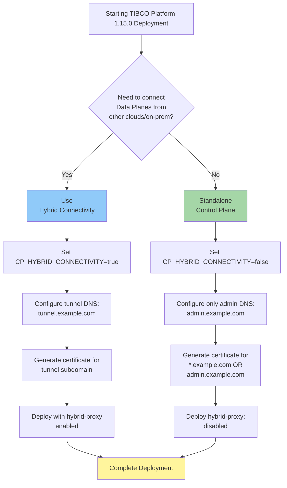

# TIBCO Platform 1.15.0 DNS Configuration Quick Reference (AKS)

## Decision Flowchart



## Quick Decision Matrix

| Scenario | Hybrid Connectivity | DNS Records Needed | Certificates Needed | Estimated Resource | Deployment Time |
|----------|---------------------|-------------------|---------------------|-------------------|-----------------|
| **Standalone CP** | Disabled | `admin.example.com` only | Single wildcard | 2 vCPU, 4Gi RAM | ~15 mins |
| **Workshop/Demo** | Disabled | `admin.example.com`, `dev.example.com` | Single wildcard | 2 vCPU, 4Gi RAM | ~15 mins |
| **Hybrid Cloud** | Enabled | `admin`, `dev`, `tunnel` | Wildcard or separate certs | 4 vCPU, 8Gi RAM | ~20 mins |
| **Multi-Region** | Enabled | All subdomains | Wildcard recommended | 4 vCPU, 8Gi RAM | ~20 mins |

## Configuration Comparison

### Option 1: Simplified DNS (Recommended for New Deployments)

#### Environment Variables
```bash
export TP_BASE_DNS_DOMAIN="example.com"
export CP_ADMIN_HOST_PREFIX="admin"
export CP_SUBSCRIPTION="dev"
export CP_HYBRID_CONNECTIVITY="false"  # Set to "true" if needed
```

#### DNS Records
```bash
# Azure DNS Zone: example.com
admin.example.com    A    <INGRESS_IP>
dev.example.com      A    <INGRESS_IP>

# If hybrid connectivity enabled, also add:
tunnel.example.com   A    <INGRESS_IP>
```

#### Certificate Generation (Self-Signed)
```bash
# Single wildcard certificate
openssl req -x509 -newkey rsa:4096 -keyout star.example.com.key \
  -out star.example.com.crt -days 365 -nodes \
  -subj "/CN=*.example.com" \
  -addext "subjectAltName=DNS:*.example.com,DNS:example.com"
```

#### Helm Values
```yaml
global:
  tibco:
    serviceAccount: ${CP_SERVICE_ACCOUNT}
    logging:
      fluentbit:
        enabled: true
    hybridConnectivity:
      enabled: ${CP_HYBRID_CONNECTIVITY}

hybrid-proxy:
  enabled: ${CP_HYBRID_CONNECTIVITY}
  ingress:
    enabled: true
    ingressClassName: traefik
    hosts:
      - host: "tunnel.${TP_BASE_DNS_DOMAIN}"
        paths:
          - path: /
            pathType: Prefix
            port: 105

router-operator:
  ingress:
    enabled: true
    ingressClassName: traefik
    hosts:
      - host: "${CP_ADMIN_HOST_PREFIX}.${TP_BASE_DNS_DOMAIN}"
        paths:
          - path: /
            pathType: Prefix
            port: 100
      - host: "${CP_SUBSCRIPTION}.${TP_BASE_DNS_DOMAIN}"
        paths:
          - path: /
            pathType: Prefix
            port: 100
```

### Option 2: Legacy DNS (For Backward Compatibility)

#### Environment Variables
```bash
export CP_INSTANCE_ID="cp1"
export TP_DOMAIN="example.com"
export MY_DOMAIN="my.${CP_INSTANCE_ID}.${TP_DOMAIN}"
export TUNNEL_DOMAIN="tunnel.${CP_INSTANCE_ID}.${TP_DOMAIN}"
export CP_HYBRID_CONNECTIVITY="true"
```

#### DNS Records
```bash
# Azure DNS Zone: example.com
*.my.cp1.example.com      A    <INGRESS_IP>
*.tunnel.cp1.example.com  A    <INGRESS_IP>
```

#### Certificate Generation (Self-Signed)
```bash
# MY domain certificate
openssl req -x509 -newkey rsa:4096 -keyout my-domain.key \
  -out my-domain.crt -days 365 -nodes \
  -subj "/CN=*.my.cp1.example.com"

# TUNNEL domain certificate
openssl req -x509 -newkey rsa:4096 -keyout tunnel-domain.key \
  -out tunnel-domain.crt -days 365 -nodes \
  -subj "/CN=*.tunnel.cp1.example.com"
```

#### Helm Values
```yaml
global:
  tibco:
    serviceAccount: ${CP_SERVICE_ACCOUNT}
    logging:
      fluentbit:
        enabled: true
    hybridConnectivity:
      enabled: true

hybrid-proxy:
  enabled: true
  ingress:
    enabled: true
    ingressClassName: traefik
    tls:
      - secretName: tunnel-domain-cert
        hosts:
          - '*.${TUNNEL_DOMAIN}'
    hosts:
      - host: '*.${TUNNEL_DOMAIN}'
        paths:
          - path: /
            pathType: Prefix
            port: 105

router-operator:
  ingress:
    enabled: true
    ingressClassName: traefik
    tls:
      - secretName: my-domain-cert
        hosts:
          - '*.${MY_DOMAIN}'
    hosts:
      - host: '*.${MY_DOMAIN}'
        paths:
          - path: /
            pathType: Prefix
            port: 100
```

## Quick Start Commands

### Standalone Control Plane (No Hybrid Connectivity)
```bash
# Set environment variables
export TP_BASE_DNS_DOMAIN="example.com"
export CP_ADMIN_HOST_PREFIX="admin"
export CP_SUBSCRIPTION="dev"
export CP_HYBRID_CONNECTIVITY="false"

# Create certificate secret
kubectl create secret tls base-domain-cert \
  --cert=star.example.com.crt \
  --key=star.example.com.key \
  -n ${CP_NAMESPACE}

# Deploy Control Plane
helm install ${CP_INSTANCE_ID} tibco-platform-local-charts/tibco-platform-cp-core \
  -n ${CP_NAMESPACE} \
  --values cp-core-values.yaml \
  --timeout 10m \
  --wait
```

### Control Plane with Hybrid Connectivity
```bash
# Set environment variables
export TP_BASE_DNS_DOMAIN="example.com"
export CP_ADMIN_HOST_PREFIX="admin"
export CP_SUBSCRIPTION="dev"
export CP_HYBRID_CONNECTIVITY="true"

# Create certificate secret (same certificate for all subdomains)
kubectl create secret tls base-domain-cert \
  --cert=star.example.com.crt \
  --key=star.example.com.key \
  -n ${CP_NAMESPACE}

# Deploy Control Plane  
helm install ${CP_INSTANCE_ID} tibco-platform-local-charts/tibco-platform-cp-core \
  -n ${CP_NAMESPACE} \
  --values cp-core-values-with-tunnel.yaml \
  --timeout 10m \
  --wait
```

## Certificate Generation Options

### Option A: Single Wildcard Certificate (Recommended)
**Use when:** All subdomains under same base domain

```bash
openssl req -x509 -newkey rsa:4096 -keyout star.example.com.key \
  -out star.example.com.crt -days 365 -nodes \
  -subj "/CN=*.example.com" \
  -addext "subjectAltName=DNS:*.example.com,DNS:example.com"
```

**Covers:**
- `admin.example.com`
- `dev.example.com`
- `tunnel.example.com`
- Any other subdomain

### Option B: Specific Subdomain Certificates
**Use when:** Need separate certificates for compliance or security

```bash
# Admin certificate
openssl req -x509 -newkey rsa:4096 -keyout admin.example.com.key \
  -out admin.example.com.crt -days 365 -nodes \
  -subj "/CN=admin.example.com"

# Subscription certificate
openssl req -x509 -newkey rsa:4096 -keyout dev.example.com.key \
  -out dev.example.com.crt -days 365 -nodes \
  -subj "/CN=dev.example.com"

# Tunnel certificate (if needed)
openssl req -x509 -newkey rsa:4096 -keyout tunnel.example.com.key \
  -out tunnel.example.com.crt -days 365 -nodes \
  -subj "/CN=tunnel.example.com"
```

### Option C: Let's Encrypt (Production)
**Use when:** Need trusted public certificates

```bash
# Install certbot-dns-azure plugin
pip3 install certbot certbot-dns-azure

# Generate wildcard certificate
certbot certonly \
  --dns-azure \
  --dns-azure-credentials ~/.azure/certbot.ini \
  -d "*.example.com" \
  -d "example.com"
```

## DNS Zone Configuration

### Azure DNS Zone Creation
```bash
# Create DNS Zone
az network dns zone create \
  --resource-group ${RESOURCE_GROUP} \
  --name ${TP_BASE_DNS_DOMAIN}

# Get ingress IP
export INGRESS_IP=$(kubectl get svc -n ingress-traefik traefik -o jsonpath='{.status.loadBalancer.ingress[0].ip}')

# Create A records for simplified DNS
az network dns record-set a add-record \
  --resource-group ${RESOURCE_GROUP} \
  --zone-name ${TP_BASE_DNS_DOMAIN} \
  --record-set-name admin \
  --ipv4-address ${INGRESS_IP}

az network dns record-set a add-record \
  --resource-group ${RESOURCE_GROUP} \
  --zone-name ${TP_BASE_DNS_DOMAIN} \
  --record-set-name dev \
  --ipv4-address ${INGRESS_IP}

# Add tunnel record if hybrid connectivity enabled
if [ "${CP_HYBRID_CONNECTIVITY}" = "true" ]; then
  az network dns record-set a add-record \
    --resource-group ${RESOURCE_GROUP} \
    --zone-name ${TP_BASE_DNS_DOMAIN} \
    --record-set-name tunnel \
    --ipv4-address ${INGRESS_IP}
fi
```

### Wildcard DNS Record (Alternative)
```bash
# Single wildcard record covers all subdomains
az network dns record-set a add-record \
  --resource-group ${RESOURCE_GROUP} \
  --zone-name ${TP_BASE_DNS_DOMAIN} \
  --record-set-name '*' \
  --ipv4-address ${INGRESS_IP}
```

## Verification Commands

### Verify DNS Resolution
```bash
nslookup admin.${TP_BASE_DNS_DOMAIN}
nslookup dev.${TP_BASE_DNS_DOMAIN}

# If hybrid connectivity enabled
nslookup tunnel.${TP_BASE_DNS_DOMAIN}
```

### Verify Certificate
```bash
kubectl get secret -n ${CP_NAMESPACE} base-domain-cert -o jsonpath='{.data.tls\.crt}' | base64 -d | openssl x509 -text -noout
```

### Verify Ingress
```bash
kubectl get ingress -n ${CP_NAMESPACE}
```

### Verify Control Plane Pods
```bash
kubectl get pods -n ${CP_NAMESPACE}
```

### Access Control Plane UI
```bash
# Simplified DNS
echo "https://admin.${TP_BASE_DNS_DOMAIN}"

# Legacy DNS
echo "https://$(kubectl get cm ${CP_INSTANCE_ID}-cp-web-server -n ${CP_NAMESPACE} -o jsonpath='{.data.ADMIN_WEBSERVER_FQDN}')"
```

## Troubleshooting

### DNS Issues
```bash
# Check if DNS record exists
dig admin.${TP_BASE_DNS_DOMAIN}

# Check ingress IP
kubectl get svc -n ingress-traefik

# Check if certificate is loaded
kubectl describe secret base-domain-cert -n ${CP_NAMESPACE}
```

### Certificate Issues
```bash
# Test certificate from outside cluster
openssl s_client -connect admin.${TP_BASE_DNS_DOMAIN}:443 -servername admin.${TP_BASE_DNS_DOMAIN}

# Check certificate expiration
kubectl get secret base-domain-cert -n ${CP_NAMESPACE} -o jsonpath='{.data.tls\.crt}' | \
  base64 -d | openssl x509 -noout -enddate
```

### Ingress Issues
```bash
# Check ingress controller logs
kubectl logs -n ingress-traefik -l app.kubernetes.io/name=traefik

# Check ingress configuration
kubectl describe ingress -n ${CP_NAMESPACE}

# Test ingress from pod
kubectl run -it --rm debug --image=curlimages/curl --restart=Never -- \
  curl -k https://admin.${TP_BASE_DNS_DOMAIN}
```

### Hybrid-Proxy Issues
```bash
# Check if hybrid-proxy is running (when enabled)
kubectl get pods -n ${CP_NAMESPACE} -l app.kubernetes.io/name=hybrid-proxy

# Check hybrid-proxy logs
kubectl logs -n ${CP_NAMESPACE} -l app.kubernetes.io/name=hybrid-proxy

# Verify tunnel ingress
kubectl get ingress -n ${CP_NAMESPACE} -l app.kubernetes.io/name=hybrid-proxy
```

## Common Patterns

### Pattern 1: Multi-Subscription Setup
```bash
# Create separate A records for each subscription
admin.example.com     -> CP Admin UI
dev.example.com       -> Dev Subscription  
staging.example.com   -> Staging Subscription
prod.example.com      -> Production Subscription

# Single wildcard certificate covers all
*.example.com
```

### Pattern 2: Multi-Region Setup
```bash
# Different base domains per region
admin.us.example.com      -> US Control Plane
admin.eu.example.com      -> EU Control Plane
admin.apac.example.com    -> APAC Control Plane

# Separate certificates per region
*.us.example.com
*.eu.example.com
*.apac.example.com
```

### Pattern 3: Environment Isolation
```bash
# Separate domains for environments
admin.dev.example.com     -> Development
admin.staging.example.com -> Staging
admin.prod.example.com    -> Production

# OR use subdomains under same base
dev-admin.example.com     -> Development
staging-admin.example.com -> Staging
prod-admin.example.com    -> Production
```

## Resource Requirements Comparison

| Configuration | Hybrid-Proxy | CPU (Request) | Memory (Request) | CPU (Limit) | Memory (Limit) | Pods Count |
|--------------|--------------|---------------|------------------|-------------|----------------|------------|
| **Standalone** | Disabled | 2 vCPU | 4 Gi | 4 vCPU | 8 Gi | ~15 pods |
| **With Hybrid** | Enabled | 4 vCPU | 8 Gi | 8 vCPU | 16 Gi | ~18 pods |

## Migration Path

### From 1.14.x → 1.15.0 (Legacy DNS)
```bash
# No changes required - continues to work
# Keep existing MY_DOMAIN and TUNNEL_DOMAIN variables
# Upgrade Control Plane in place
helm upgrade ${CP_INSTANCE_ID} tibco-platform-local-charts/tibco-platform-cp-core \
  -n ${CP_NAMESPACE} \
  --values cp-core-values-legacy.yaml
```

### From 1.14.x → 1.15.0 (Migrate to Simplified DNS)
```bash
# Plan DNS migration during certificate renewal
# 1. Update DNS records to new structure
# 2. Generate new certificates
# 3. Update Helm values to use TP_BASE_DNS_DOMAIN
# 4. Helm upgrade with new configuration
```

## Reference Links

- [TIBCO Platform CP Documentation](https://docs.tibco.com/pub/platform-cp/latest/)
- [Traefik Ingress Controller](https://doc.traefik.io/traefik/providers/kubernetes-ingress/)
- [Azure DNS Documentation](https://docs.microsoft.com/en-us/azure/dns/)
- [Let's Encrypt Documentation](https://letsencrypt.org/docs/)

---

**Document Version:** 1.0  
**Last Updated:** March 17, 2026  
**Applies To:** TIBCO Platform Control Plane 1.15.0+ on Azure Kubernetes Service (AKS)
