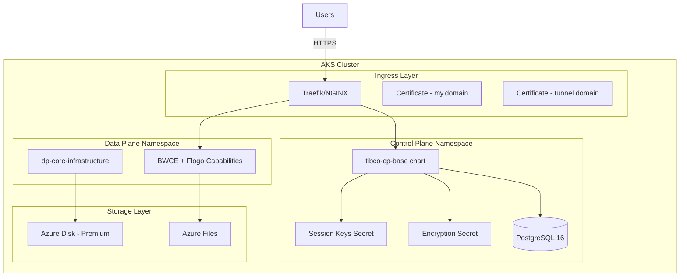

# How to Set Up AKS Cluster with Control Plane and Data Plane (v1.15.0)

> **Version:** 1.15.0 | **Platform:** Azure Kubernetes Service (AKS) | **Last Updated:** March 10, 2026

**📌 Important Version Information**
- This guide is for TIBCO Platform Control Plane **version 1.15.0**
- For version 1.14.0 documentation, see [v1.14 guide](../v1.14/how-to-cp-and-dp-aks-setup-guide.md)
- For upgrade instructions from 1.14.0 to 1.15.0, see [Release Notes](../../releases/v1.15.0.md#upgrade-path)

## Table of Contents
- [Overview](#overview)
- [What's New in v1.15.0](#whats-new-in-v150)
- [Prerequisites](#prerequisites)
- [Architecture](#architecture)
- [Step 1: Prepare Azure Environment](#step-1-prepare-azure-environment)
- [Step 2: Create AKS Cluster](#step-2-create-aks-cluster)
- [Step 3: Configure Storage Classes](#step-3-configure-storage-classes)
- [Step 4: Install Ingress Controller](#step-4-install-ingress-controller)
- [Step 5: Install PostgreSQL](#step-5-install-postgresql)
- [Step 6: Generate Session Keys Secret](#step-6-generate-session-keys-secret)
- [Step 7: Generate Encryption Secret](#step-7-generate-encryption-secret)
- [Step 8: Create Certificates](#step-8-create-certificates)
- [Step 9: Deploy Control Plane](#step-9-deploy-control-plane)
- [Step 10: Retrieve Admin Credentials](#step-10-retrieve-admin-credentials)
- [Step 11: Deploy Data Plane Infrastructure](#step-11-deploy-data-plane-infrastructure)
- [Step 12: Deploy Data Plane Capabilities](#step-12-deploy-data-plane-capabilities)
- [Troubleshooting](#troubleshooting)
- [Next Steps](#next-steps)

---

## Overview

This guide provides comprehensive instructions for deploying **TIBCO Platform Control Plane version 1.15.0** along with Data Plane on the same Azure Kubernetes Service (AKS) cluster.

### What You'll Deploy
- **AKS Kubernetes Cluster** with appropriate node sizing
- **TIBCO Platform Control Plane 1.15.0** with enhanced security features
- **TIBCO Platform Data Plane 1.15.0** for running BWCE and Flogo applications
- **PostgreSQL 16** database for Control Plane metadata
- **Observability Stack** (optional) - Prometheus and Elastic ECK
- **Ingress Controller** - Traefik (recommended) or NGINX
- **Azure Storage** - Azure Disk and Azure Files storage classes

### Deployment Time
- **Total Duration:** 3-4 hours
- **AKS Setup:** 30-45 minutes
- **Control Plane:** 1-1.5 hours
- **Data Plane:** 1-1.5 hours

---

## What's New in v1.15.0

### Breaking Changes
- ⚠️ **Helm 3.13+ Required**: New label-based deployment tracking
- ⚠️ **New Secret Requirements**: Session keys and encryption secrets now mandatory
- ⚠️ **Certificate Structure Changed**: Separate certificates for `my` and `tunnel` domains recommended
- ⚠️ **Network Policy Updates**: Enhanced namespace labeling requirements
- ⚠️ **Environment Variable Changes**: New naming conventions (TP_ and CP_ prefixes)

### New Features
- ✅ **Unified Chart Deployment**: Simplified `tibco-cp-base` chart structure
- ✅ **Enhanced Security**: Improved secrets management and encryption
- ✅ **Better Network Policies**: Improved isolation with label-based policies
- ✅ **Developer Hub 1.15.14**: Updated with new capabilities
- ✅ **Observability Service 1.15.19**: Enhanced monitoring integration
- ✅ **Event Processing**: New addon for event-driven architectures

### Compatibility
- **Kubernetes:** 1.32+ (CNCF certified)
- **Helm:** 3.13+
- **PostgreSQL:** 16.x
- **Azure:** AKS with Kubernetes 1.32+

---

## Prerequisites

### 1. Azure Requirements
- ✅ **Azure Subscription** with appropriate permissions (Contributor or Owner role)
- ✅ **Resource Group** or permissions to create one
- ✅ **Azure CLI** installed and configured (version 2.50+)
- ✅ **kubectl** installed (version 1.32+)
- ✅ **Helm 3.13+** installed (required for label support)

### 2. AKS Cluster Specifications
- **Kubernetes Version:** 1.32 or higher
- **Node Count:** Minimum 3 worker nodes
- **Node Size:** Standard_D8s_v3 or higher (8 vCPUs, 32GB RAM per node)
- **Total Resources:** 24+ CPU cores, 96+ GB RAM minimum
- **Network Plugin:** Azure CNI recommended (kubenet also supported)
- **Storage:** Azure Disk (Premium_LRS) + Azure Files

### 3. Tools and Software
```bash
# Verify Helm version (must be 3.13+)
helm version --short

# Verify kubectl version
kubectl version --client --short

# Verify Azure CLI version
az version
```

### 4. DNS and Networking
- **Domain Name:** Access to manage DNS records (Azure DNS, Route53, or other)
- **Azure DNS Zone** (optional): For automated DNS management
- **Wildcard DNS:** Ability to create wildcard DNS entries for `*.your-domain.com`

### 5. Container Registry Access
- **TIBCO JFrog:** Access credentials (username/password or token)
- **Container Pull Secret:** For pulling TIBCO images

### 6. Knowledge Requirements
- Basic understanding of Kubernetes concepts
- Familiarity with Helm charts
- Azure AKS knowledge
- DNS and certificate management

For a complete checklist, see [Prerequisites Checklist](../prerequisites-checklist-for-customer.md).

---

## Architecture



---

## Step 1: Prepare Azure Environment

### 1.1 Login to Azure
```bash
# Login to Azure
az login

# Set the subscription (if you have multiple)
az account set --subscription "YOUR_SUBSCRIPTION_ID"

# Verify current subscription
az account show
```

### 1.2 Set Environment Variables

Create a file to store all environment variables for this deployment:

```bash
# Save to: ~/aks-tp-v15-env.sh

# Azure Configuration
export AZURE_SUBSCRIPTION_ID="your-subscription-id"
export AZURE_RESOURCE_GROUP="rg-tibco-platform-v15"
export AZURE_LOCATION="eastus"

# AKS Cluster Configuration
export AKS_CLUSTER_NAME="aks-tp-cp-dp-v15"
export AKS_NODE_COUNT=3
export AKS_NODE_SIZE="Standard_D8s_v3"
export K8S_VERSION="1.32"

# TIBCO Platform Configuration
export TP_VERSION="1.15.0"
export TP_CLUSTER_NAME="tp-workshop"
export TP_DOMAIN="example.com"  # Replace with your domain
export TP_CP_NS="tibco-cp"
export TP_DP_NS="tibco-dp"

# Storage Configuration
export AZURE_STORAGE_CLASS_DISK="azure-disk-sc"
export AZURE_STORAGE_CLASS_FILES="azure-files-sc"

# PostgreSQL Configuration
export PG_NAMESPACE="postgres"
export PG_RELEASE_NAME="tp-postgres"
export PG_DATABASE="tpcp"
export PG_USER="postgres"
export PG_PASSWORD="$(openssl rand -base64 32)"  # Auto-generate

# DNS Configuration
export DNS_ZONE_NAME="${TP_DOMAIN}"
export DNS_RESOURCE_GROUP="${AZURE_RESOURCE_GROUP}"

# Helm Repository
export TIBCO_HELM_REPO="https://tibcosoftware.github.io/tp-helm-charts"

# Container Registry (TIBCO JFrog)
export TIBCO_REGISTRY="tibco-jfrog-docker.jfrog.io"
export TIBCO_REGISTRY_USER="your-jfrog-username"
export TIBCO_REGISTRY_PASSWORD="your-jfrog-password"
```

Load the environment variables:
```bash
source ~/aks-tp-v15-env.sh
```

### 1.3 Create Resource Group
```bash
# Create resource group
az group create \
  --name ${AZURE_RESOURCE_GROUP} \
  --location ${AZURE_LOCATION}

# Verify
az group show --name ${AZURE_RESOURCE_GROUP}
```

---

## Step 2: Create AKS Cluster

### 2.1 Create AKS Cluster with Azure CNI
```bash
# Create AKS cluster
az aks create \
  --resource-group ${AZURE_RESOURCE_GROUP} \
  --name ${AKS_CLUSTER_NAME} \
  --node-count ${AKS_NODE_COUNT} \
  --node-vm-size ${AKS_NODE_SIZE} \
  --kubernetes-version ${K8S_VERSION} \
  --network-plugin azure \
  --enable-managed-identity \
  --generate-ssh-keys \
  --enable-addons monitoring \
  --no-wait

# Wait for cluster creation (takes ~10-15 minutes)
az aks wait --created \
  --resource-group ${AZURE_RESOURCE_GROUP} \
  --name ${AKS_CLUSTER_NAME}
```

### 2.2 Get Cluster Credentials
```bash
# Get credentials
az aks get-credentials \
  --resource-group ${AZURE_RESOURCE_GROUP} \
  --name ${AKS_CLUSTER_NAME} \
  --overwrite-existing

# Verify connection
kubectl get nodes
kubectl cluster-info
```

### 2.3 Verify Cluster Resources
```bash
# Check node resources
kubectl top nodes

# Expected output: Each node should have ~8 CPUs and ~32GB RAM
```

---

## Step 3: Configure Storage Classes

### 3.1 Create Azure Disk Storage Class
```bash
# Create azure-disk-sc storage class
cat <<EOF | kubectl apply -f -
apiVersion: storage.k8s.io/v1
kind: StorageClass
metadata:
  name: ${AZURE_STORAGE_CLASS_DISK}
provisioner: disk.csi.azure.com
parameters:
  storageaccounttype: Premium_LRS
  kind: Managed
allowVolumeExpansion: true
reclaimPolicy: Delete
volumeBindingMode: WaitForFirstConsumer
EOF
```

### 3.2 Create Azure Files Storage Class
```bash
# Create azure-files-sc storage class
cat <<EOF | kubectl apply -f -
apiVersion: storage.k8s.io/v1
kind: StorageClass
metadata:
  name: ${AZURE_STORAGE_CLASS_FILES}
provisioner: file.csi.azure.com
parameters:
  skuName: Premium_LRS
allowVolumeExpansion: true
reclaimPolicy: Delete
volumeBindingMode: Immediate
mountOptions:
  - dir_mode=0777
  - file_mode=0777
  - uid=0
  - gid=0
  - mfsymlinks
  - cache=strict
  - actimeo=30
EOF
```

### 3.3 Verify Storage Classes
```bash
kubectl get storageclass

# Should show:
# azure-disk-sc     disk.csi.azure.com
# azure-files-sc    file.csi.azure.com
```

---

## Step 4: Install Ingress Controller

TIBCO Platform 1.15.0 supports both **Traefik** (recommended) and **NGINX** ingress controllers.

### Option A: Install Traefik (Recommended)

```bash
# Add Traefik Helm repository
helm repo add traefik https://traefik.github.io/charts
helm repo update

# Create namespace
kubectl create namespace traefik

# Install Traefik
helm install traefik traefik/traefik \
  --namespace traefik \
  --version 32.2.0 \
  --set ingressRoute.dashboard.enabled=true \
  --set ports.web.redirectTo.port=websecure \
  --set ports.websecure.tls.enabled=true
```

### Option B: Install NGINX (Alternative)

```bash
# Add NGINX Ingress Helm repository
helm repo add ingress-nginx https://kubernetes.github.io/ingress-nginx
helm repo update

# Create namespace
kubectl create namespace ingress-nginx

# Install NGINX Ingress
helm install ingress-nginx ingress-nginx/ingress-nginx \
  --namespace ingress-nginx \
  --version 4.11.3 \
  --set controller.service.annotations."service\.beta\.kubernetes\.io/azure-load-balancer-health-probe-request-path"=/healthz
```

### 4.3 Get Ingress External IP
```bash
# For Traefik
kubectl get svc -n traefik traefik -o jsonpath='{.status.loadBalancer.ingress[0].ip}'

# For NGINX
kubectl get svc -n ingress-nginx ingress-nginx-controller -o jsonpath='{.status.loadBalancer.ingress[0].ip}'

# Save the IP for DNS configuration
export INGRESS_IP="<external-ip-from-above>"
```

---

## Step 5: Install PostgreSQL

TIBCO Platform Control Plane requires PostgreSQL 16 for metadata storage.

### 5.1 Create PostgreSQL Namespace
```bash
kubectl create namespace ${PG_NAMESPACE}
```

### 5.2 Add TIBCO Helm Repository
```bash
helm repo add tibco-platform ${TIBCO_HELM_REPO}
helm repo update
```

### 5.3 Install PostgreSQL Using TIBCO Chart
```bash
# Install PostgreSQL
helm install ${PG_RELEASE_NAME} tibco-platform/on-premises-third-party \
  --namespace ${PG_NAMESPACE} \
  --set database.enabled=true \
  --set database.postgresql.image.tag=16.7 \
  --set database.postgresql.auth.username=${PG_USER} \
  --set database.postgresql.auth.password=${PG_PASSWORD} \
  --set database.postgresql.auth.database=${PG_DATABASE} \
  --set database.postgresql.primary.persistence.storageClass=${AZURE_STORAGE_CLASS_DISK} \
  --set database.postgresql.primary.persistence.size=50Gi
```

### 5.4 Wait for PostgreSQL to be Ready
```bash
kubectl wait --for=condition=ready pod \
  -l app.kubernetes.io/name=postgresql \
  -n ${PG_NAMESPACE} \
  --timeout=300s
```

### 5.5 Verify PostgreSQL Connection
```bash
# Test connection
kubectl run -it --rm postgresql-client \
  --image=postgres:16 \
  --restart=Never \
  --namespace=${PG_NAMESPACE} \
  -- psql -h ${PG_RELEASE_NAME}-postgresql.${PG_NAMESPACE}.svc.cluster.local -U ${PG_USER} -d ${PG_DATABASE} -c '\l'
```

---

## Step 6: Generate Session Keys Secret

**New in v1.15.0:** Session keys secret is now **mandatory** for Control Plane deployment.

### 6.1 Create Control Plane Namespace
```bash
kubectl create namespace ${TP_CP_NS}

# Label namespace for network policies (required in v1.15.0)
kubectl label namespace ${TP_CP_NS} \
  platform.tibco.com/dataplane-id=${TP_CLUSTER_NAME} \
  platform.tibco.com/controlplane-instance-id=${TP_CLUSTER_NAME}
```

### 6.2 Generate Session Keys Secret
```bash
# Generate random session keys
SESSION_KEY=$(openssl rand -hex 32)
SESSION_IV=$(openssl rand -hex 16)

# Create secret
kubectl create secret generic session-keys \
  --namespace ${TP_CP_NS} \
  --from-literal=SESSION_KEY=${SESSION_KEY} \
  --from-literal=SESSION_IV=${SESSION_IV}

# Verify
kubectl get secret session-keys -n ${TP_CP_NS}
```

---

## Step 7: Generate Encryption Secret

**New in v1.15.0:** Control Plane orchestrator encryption secret is **mandatory**.

### 7.1 Generate Encryption Secret
```bash
# Generate encryption key (32 bytes = 64 hex characters)
CPORCH_ENCRYPTION_KEY=$(openssl rand -hex 32)

# Create secret
kubectl create secret generic cporch-encryption-secret \
  --namespace ${TP_CP_NS} \
  --from-literal=CPORCH_ENCRYPTION_KEY=${CPORCH_ENCRYPTION_KEY}

# Verify
kubectl get secret cporch-encryption-secret -n ${TP_CP_NS}
```

---

## Step 8: Create Certificates

**Changed in v1.15.0:** Separate certificates for `my` and `tunnel` domains are recommended.

### 8.1 Generate Self-Signed Certificates

```bash
# Set subdomain variables
export CP_INSTANCE_ID="${TP_CLUSTER_NAME}"
export MY_DOMAIN="my.${CP_INSTANCE_ID}.${TP_DOMAIN}"
export TUNNEL_DOMAIN="tunnel.${CP_INSTANCE_ID}.${TP_DOMAIN}"

# Create temporary certificate directory
mkdir -p ~/tp-certs
cd ~/tp-certs

# Generate certificate for "my" domain
openssl req -x509 -nodes -days 365 -newkey rsa:2048 \
  -keyout my-tls.key \
  -out my-tls.crt \
  -subj "/CN=*.${MY_DOMAIN}"

# Generate certificate for "tunnel" domain
openssl req -x509 -nodes -days 365 -newkey rsa:2048 \
  -keyout tunnel-tls.key \
  -out tunnel-tls.crt \
  -subj "/CN=*.${TUNNEL_DOMAIN}"
```

### 8.2 Create Kubernetes Secrets for Certificates
```bash
# Create secret for "my" domain certificate
kubectl create secret tls my-domain-cert \
  --namespace ${TP_CP_NS} \
  --cert=my-tls.crt \
  --key=my-tls.key

# Create secret for "tunnel" domain certificate
kubectl create secret tls tunnel-domain-cert \
  --namespace ${TP_CP_NS} \
  --cert=tunnel-tls.crt \
  --key=tunnel-tls.key

# Verify
kubectl get secrets -n ${TP_CP_NS} | grep -E 'my-domain-cert|tunnel-domain-cert'
```

---

## Step 9: Deploy Control Plane

### 9.1 Create Container Registry Pull Secret
```bash
kubectl create secret docker-registry tibco-jfrog-cred \
  --namespace ${TP_CP_NS} \
  --docker-server=${TIBCO_REGISTRY} \
  --docker-username=${TIBCO_REGISTRY_USER} \
  --docker-password=${TIBCO_REGISTRY_PASSWORD}
```

### 9.2 Create Control Plane Values File

Create `cp-values.yaml`:

```yaml
# cp-values.yaml for TIBCO Platform Control Plane v1.15.0

global:
  tibco:
    serviceAccount: control-plane-sa
    containerRegistry:
      url: tibco-jfrog-docker.jfrog.io
      username: ${TIBCO_REGISTRY_USER}  # Replace
      password: ${TIBCO_REGISTRY_PASSWORD}  # Replace
    
    controlPlaneInstanceId: ${CP_INSTANCE_ID}  # Replace
    
    createNetworkPolicy: true
    
    # Logging configuration
    logging:
      fluentbit:
        enabled: true
        image:
          tag: 3.1.9

# PostgreSQL external database configuration
postgreSQL:
  enabled: false
  
externalPostgreSQL:
  enabled: true
  host: tp-postgres-postgresql.postgres.svc.cluster.local
  port: 5432
  database: tpcp
  username: postgres
  password: ${PG_PASSWORD}  # Replace with actual password

# Storage for EMS
emsserver:
  persistence:
    storageClassName: azure-disk-sc

# Ingress configuration (Traefik)
ingress:
  enabled: true
  ingressClassName: traefik
  annotations:
    traefik.ingress.kubernetes.io/router.entrypoints: websecure
    traefik.ingress.kubernetes.io/router.tls: "true"
  
  # Certificate for "my" domain
  tls:
    - secretName: my-domain-cert
      hosts:
        - "*.my.${CP_INSTANCE_ID}.${TP_DOMAIN}"  # Replace
  
  # Tunnel certificate (separate)
  tunnelTls:
    secretName: tunnel-domain-cert
    hosts:
      - "*.tunnel.${CP_INSTANCE_ID}.${TP_DOMAIN}"  # Replace

# MailDev for email notifications (embedded)
maildev:
  enabled: true

# Developer Hub
developer-hub:
  enabled: true

# Identity Management
identity-management:
  enabled: true

# Compute services
compute-services:
  enabled: true
```

### 9.3 Deploy Control Plane
```bash
# Deploy Control Plane using tibco-cp-base chart
helm install tp-cp tibco-platform/tibco-cp-base \
  --namespace ${TP_CP_NS} \
  --values cp-values.yaml \
  --labels "layer=1" \
  --wait \
  --timeout=30m

# Check deployment status
kubectl get pods -n ${TP_CP_NS}
```

### 9.4 Wait for Control Plane Pods to be Ready
```bash
# Wait for all pods to be running (may take 10-15 minutes)
kubectl wait --for=condition=ready pod --all -n ${TP_CP_NS} --timeout=900s
```

---

## Step 10: Retrieve Admin Credentials

### 10.1 Get Initial Admin Password
```bash
# Retrieve auto-generated admin password
export TP_ADMIN_PASSWORD=$(kubectl get secret tp-cp-web-server \
  -n ${TP_CP_NS} \
  -o jsonpath='{.data.TSC_ADMIN_PASSWORD}' | base64 --decode)

echo "Control Plane Admin Password: ${TP_ADMIN_PASSWORD}"
```

### 10.2 Access Control Plane UI
```bash
# Control Plane URL (update with your domain)
echo "Control Plane URL: https://my.${CP_INSTANCE_ID}.${TP_DOMAIN}"
echo "Username: admin"
echo "Password: ${TP_ADMIN_PASSWORD}"
```

### 10.3 Configure DNS Records
Create wildcard DNS A records pointing to your ingress IP:

```txt
*.my.${CP_INSTANCE_ID}.${TP_DOMAIN}      -> ${INGRESS_IP}
*.tunnel.${CP_INSTANCE_ID}.${TP_DOMAIN}  -> ${INGRESS_IP}
```

For detailed DNS configuration, see [How to Add DNS Records](../how-to-add-dns-records-aks-azure.md).

---

## Step 11: Deploy Data Plane Infrastructure

### 11.1 Create Data Plane Namespace
```bash
kubectl create namespace ${TP_DP_NS}

# Label namespace for network policies
kubectl label namespace ${TP_DP_NS} \
  platform.tibco.com/dataplane-id=${TP_CLUSTER_NAME} \
  platform.tibco.com/controlplane-instance-id=${CP_INSTANCE_ID}
```

### 11.2 Create Container Registry Pull Secret for Data Plane
```bash
kubectl create secret docker-registry tibco-jfrog-cred \
  --namespace ${TP_DP_NS} \
  --docker-server=${TIBCO_REGISTRY} \
  --docker-username=${TIBCO_REGISTRY_USER} \
  --docker-password=${TIBCO_REGISTRY_PASSWORD}
```

### 11.3 Deploy Data Plane Core Infrastructure

Create `dp-infrastructure-values.yaml`:

```yaml
# dp-infrastructure-values.yaml for TIBCO Platform Data Plane v1.15.0

global:
  tibco:
    dataPlaneId: ${TP_CLUSTER_NAME}  # Replace
    controlPlaneInstanceId: ${CP_INSTANCE_ID}  # Replace
    containerRegistry:
      url: tibco-jfrog-docker.jfrog.io
      username: ${TIBCO_REGISTRY_USER}  # Replace
      password: ${TIBCO_REGISTRY_PASSWORD}  # Replace

# Storage configuration
storage:
  azureFiles:
    enabled: true
    storageClassName: azure-files-sc
  
  azureDisk:
    enabled: true
    storageClassName: azure-disk-sc

# o11y service (observability)
o11y-service:
  enabled: true

# DP core components
dpcore:
  enabled: true
```

Deploy data plane infrastructure:

```bash
helm install dp-infra tibco-platform/dp-core-infrastructure \
  --namespace ${TP_DP_NS} \
  --values dp-infrastructure-values.yaml \
  --labels "layer=2" \
  --wait \
  --timeout=20m
```

---

## Step 12: Deploy Data Plane Capabilities

### 12.1 Log into Control Plane UI
1. Open browser to `https://my.${CP_INSTANCE_ID}.${TP_DOMAIN}`
2. Login with username `admin` and password from Step 10.1
3. Accept security warnings (if using self-signed certificates)

### 12.2 Register Data Plane Cluster
1. Navigate to **Administration** → **Clusters** in Control Plane UI
2. Click **Add Cluster**
3. Enter cluster name: `${TP_CLUSTER_NAME}`
4. Select cluster type: **On-Premises**
5. Download cluster configuration YAML

### 12.3 Apply Cluster Configuration
```bash
# Apply the downloaded cluster configuration
kubectl apply -f cluster-config.yaml -n ${TP_DP_NS}
```

### 12.4 ProvisionCapabilities (BWCE, Flogo)

In the Control Plane UI:
1. Navigate to **Administration** → **Capabilities**
2. Click **Provision Capability**
3. Select capabilities:
   - ☑️ **TIBCO BusinessWorks Container Edition (BWCE)**
   - ☑️ **TIBCO Flogo Enterprise**
4. Select cluster: `${TP_CLUSTER_NAME}`
5. Click **Provision**
6. Wait for capabilities to be deployed (~10-15 minutes)

Verify capability deployment:
```bash
kubectl get pods -n ${TP_DP_NS}

# Should see bwce-provisioner and flogo-provisioner pods running
```

---

## Troubleshooting

### Issue: Pods Not Starting
**Symptom:** Pods stuck in `Pending` or `CrashLoopBackOff`

**Solution:**
```bash
# Check pod details
kubectl describe pod <pod-name> -n ${TP_CP_NS}

# Check pod logs
kubectl logs <pod-name> -n ${TP_CP_NS}

# Common issues:
# - Insufficient node resources → Scale up AKS cluster
# - Image pull errors → Verify container registry credentials
# - Storage provisioning issues → Verify storage classes
```

### Issue: Cannot Access Control Plane UI
**Symptom:** Browser cannot connect to `https://my.${CP_INSTANCE_ID}.${TP_DOMAIN}`

**Solution:**
```bash
# Verify ingress external IP
kubectl get svc -n traefik

# Verify DNS resolution
nslookup my.${CP_INSTANCE_ID}.${TP_DOMAIN}

# Verify certificate secret
kubectl get secret my-domain-cert -n ${TP_CP_NS}

# Check ingress configuration
kubectl get ingress -n ${TP_CP_NS}
```

### Issue: PostgreSQL Connection Problems
**Symptom:** Control Plane logs show database connection errors

**Solution:**
```bash
# Verify PostgreSQL is running
kubectl get pods -n ${PG_NAMESPACE}

# Test connection from Control Plane namespace
kubectl run -it --rm postgresql-test \
  --image=postgres:16 \
  --restart=Never \
  --namespace=${TP_CP_NS} \
  -- psql -h tp-postgres-postgresql.postgres.svc.cluster.local -U postgres -d tpcp -c '\l'
```

### Issue: Helm 3.13+ Label Support Errors
**Symptom:** `Error: unknown flag --labels`

**Solution:**
```bash
# Verify Helm version
helm version --short

# Must be 3.13.0 or higher
# Upgrade Helm if needed
curl https://raw.githubusercontent.com/helm/helm/main/scripts/get-helm-3 | bash
```

For more troubleshooting, see:
- [TIBCO Platform Documentation](https://docs.tibco.com/pub/platform-cp/1.15.0/doc/html/Default.htm)
- [tp-helm-charts Issues](https://github.com/TIBCOSoftware/tp-helm-charts/issues)

---

## Next Steps

### ✅ Deployment Complete!

Your TIBCO Platform Control Plane and Data Plane v1.15.0 are now deployed on AKS.

### Recommended Next Actions

1. **📊 Set Up Observability**
   - Deploy Prometheus and Elastic Stack for monitoring
   - See [Observability Setup Guide](../how-to-dp-aks-observability.md)

2. **🔒 Configure Production Security**
   - Replace self-signed certificates with CA-signed certificates
   - Configure Azure AD authentication
   - Implement RBAC policies

3. **📦 Deploy BW6 Driver Supplements**
   - Upload Oracle and EMS drivers to BWCE capability
   - See [BW6 Driver Upload Guide](../how-to-upload-bw6-driver-supplements.md)

4. **🚀 Deploy Your First Application**
   - Use Developer Hub to create and deploy BWCE or Flogo applications
   - Test application deployment on Data Plane

5. **📈 Configure Auto-Scaling**
   - Set up Horizontal Pod Autoscaler (HPA) for application workloads
   - Configure cluster autoscaling for AKS nodes

6. **💾 Set Up Backup and Disaster Recovery**
   - Configure PostgreSQL backups
   - Implement cluster backup strategy with Velero

---

## Additional Resources

- [TIBCO Platform 1.15.0 Documentation](https://docs.tibco.com/pub/platform-cp/1.15.0/doc/html/Default.htm)
- [Release Notes v1.15.0](../../releases/v1.15.0.md)
- [Upgrade from v1.14.0 to v1.15.0](../../releases/v1.15.0.md#upgrade-path)
- [Prerequisites Checklist](../prerequisites-checklist-for-customer.md)
- [Observability Setup](../how-to-dp-aks-observability.md)
- [DNS Configuration](../how-to-add-dns-records-aks-azure.md)
- [BW6 Driver Supplements](../how-to-upload-bw6-driver-supplements.md)

---

## Support

**This documentation is provided by TIBCO Support, TIBCO SI Partners, or your TIBCO ATS.**

For official support:
- **TIBCO Documentation:** [https://docs.tibco.com/pub/platform-cp/1.15.0/doc/html/Default.htm](https://docs.tibco.com/pub/platform-cp/1.15.0/doc/html/Default.htm)
- **TIBCO Support Portal:** [https://support.tibco.com](https://support.tibco.com)
- **Helm Charts Repository:** [https://github.com/TIBCOSoftware/tp-helm-charts](https://github.com/TIBCOSoftware/tp-helm-charts)
