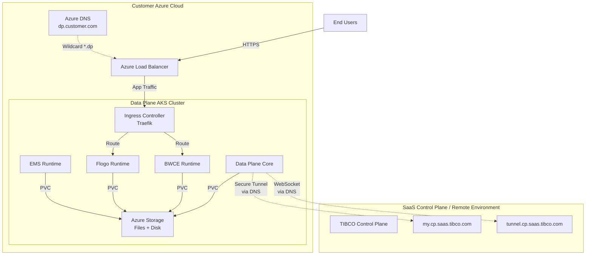

# TIBCO Platform Data Plane Only Setup on AKS (v1.15.0)

**Document Purpose**: Step-by-step guide for deploying **TIBCO Platform Data Plane v1.15.0** on Azure Kubernetes Service (AKS) connecting to a SaaS Control Plane or existing remote Control Plane.

**Target Audience**: DevOps engineers, Platform administrators

**Use Case**: Hybrid cloud deployments where Control Plane runs in SaaS or different environment, and Data Plane runs on customer's AKS cluster

**Estimated Time**: 2-3 hours

**Version**: 1.15.0 | **Last Updated**: March 18, 2026

> [!IMPORTANT]
> **What's New in v1.15.0**
> - 🎯 **DNS Simplification**: Single-level subdomain structure (`apps.dp.example.com` vs `apps.dp1-my.example.com`)
> - 🎯 **Enhanced Ingress**: Azure Load Balancer health probes and private LB support
> - 🎯 **Custom Certificates**: Improved certificate handling for Data Plane applications
> - 🎯 **Storage Management**: Helm-based storage class configuration
> - For version 1.14.x guide, see [v1.14 documentation](../how-to-dp-aks-setup-guide.md)

---

## Table of Contents

- [Overview](#overview)
- [Architecture](#architecture)
- [Prerequisites](#prerequisites)
- [Part 1: Environment Preparation](#part-1-environment-preparation)
- [Part 2: AKS Cluster Setup](#part-2-aks-cluster-setup)
- [Part 3: Storage Configuration](#part-3-storage-configuration)
- [Part 4: Ingress Controller Setup](#part-4-ingress-controller-setup)
- [Part 5: DNS Configuration](#part-5-dns-configuration)
- [Part 6: Data Plane Registration](#part-6-data-plane-registration)
- [Part 7: Data Plane Deployment](#part-7-data-plane-deployment)
- [Part 8: Custom Certificate Configuration (Optional)](#part-8-custom-certificate-configuration-optional)
- [Part 9: Capability Provisioning](#part-9-capability-provisioning)
- [Part 10: Observability Stack Installation (Optional)](#part-10-observability-stack-installation-optional)
- [Part 11: Verification](#part-11-verification)
- [Part 12: Troubleshooting](#part-12-troubleshooting)
- [Part 13: Migration from v1.14.x](#part-13-migration-from-v114x)

---

## Overview

This guide covers deploying **TIBCO Platform Data Plane only** on AKS, connecting to an existing Control Plane (either SaaS or self-hosted in a different environment).

### Key Differences from Full Deployment

- ✅ **No Control Plane deployment** on AKS
- ✅ **No PostgreSQL** required (managed by Control Plane)
- ✅ **Simplified networking** - only Data Plane domains needed
- ✅ **DNS resolution required** - Data Plane communicates with Control Plane via secure tunnels over DNS
- ✅ **Smaller cluster** - 3-5 nodes with Standard_D4s_v3 (vs Standard_D8s_v3 for CP)

### Communication Architecture

**Critical**: Data Plane and Control Plane communicate via **secure tunnels over DNS**, NOT VNet peering:
- Data Plane connects to Control Plane's `my` domain (HTTPS API endpoint)
- Data Plane establishes secure WebSocket tunnel via Control Plane's `tunnel` domain
- BWCE and Flogo applications use ingress controllers registered in DNS for external access
- No VNet peering needed between Data Plane AKS and Control Plane environment

---

## Architecture



**Key Points**:
- Data Plane initiates **outbound HTTPS connections** to Control Plane
- Control Plane domains must be **resolvable via DNS** from Data Plane cluster
- Applications deployed on Data Plane use **local ingress** registered in customer's DNS
- No inbound connections from Control Plane to Data Plane required

---

## Prerequisites

### 1. Control Plane Information

You need the following information from your Control Plane:

| Information | Example | Where to Get It |
|-------------|---------|-----------------|
| **Control Plane MY Domain** | `my.cp.saas.tibco.com` | Control Plane administrator |
| **Control Plane TUNNEL Domain** | `tunnel.cp.saas.tibco.com` | Control Plane administrator |
| **Data Plane Registration Token** | `eyJhbGc...` | Generated from Control Plane UI |
| **Container Registry Credentials** | Username + Password | TIBCO account team |

### 2. Azure Resources

- Azure subscription with Owner or Contributor role
- Ability to create AKS clusters
- Azure DNS zone (or external DNS provider)
- Azure Storage Account (or ability to create one)

### 3. Network Requirements

**Critical**: Data Plane must have **outbound HTTPS (443) access** to Control Plane domains:

```bash
# Test connectivity from your network
curl -I https://my.cp.saas.tibco.com
curl -I https://tunnel.cp.saas.tibco.com

# Both should return HTTP 200 or 302
```

**DNS Resolution**:
- Data Plane cluster must resolve Control Plane domains
- No VNet peering required
- No inbound connectivity required

### 4. Tools Required

| Tool | Version | Purpose |
|------|---------|---------|
| `az` (Azure CLI) | 2.50.0+ | Azure resource management |
| `kubectl` | Latest stable | Kubernetes cluster management |
| `helm` | 3.17.0+ | Chart deployment |
| `curl` | Latest | Testing connectivity |

---

## Part 1: Environment Preparation

### Step 1.1: Set Environment Variables

> [!NOTE]
> **v1.15.0 DNS Simplification**: This version uses `TP_BASE_DNS_DOMAIN` for simplified single-level subdomain structure instead of the multi-level `TP_DOMAIN` used in v1.14.x.

```bash
# Navigate to workshop directory
cd /path/to/workshop-tp-aks

# Create Data Plane specific environment file for v1.15.0
cat > dp-env-v1.15.sh <<'EOF'
#!/bin/bash

# Azure Configuration
export AZURE_SUBSCRIPTION_ID="your-subscription-id"
export AZURE_REGION="eastus"
export AZURE_RESOURCE_GROUP="tibco-dp-rg"

# AKS Configuration (Data Plane Only)
export AKS_CLUSTER_NAME="tibco-dp-aks"
export AKS_NODE_COUNT=3
export AKS_NODE_SIZE="Standard_D4s_v3"  # Smaller than CP

# Control Plane Information (SaaS or Remote)
export TP_CP_MY_DOMAIN="my.cp.saas.tibco.com"
export TP_CP_TUNNEL_DOMAIN="tunnel.cp.saas.tibco.com"

# Data Plane Configuration (v1.15.0 simplified DNS)
export TP_DP_INSTANCE_ID="dp-customer1"
export TP_DP_NAMESPACE="tibco-dp"
export TP_BASE_DNS_DOMAIN="apps.dp.example.com"  # NEW in v1.15.0: Base domain for apps
export TP_DP_BASE_DNS_DOMAIN="${TP_BASE_DNS_DOMAIN}"  # Data Plane apps DNS

# Storage Configuration
export AZURE_STORAGE_ACCOUNT="tibcodpsa"
export AZURE_STORAGE_RESOURCE_GROUP="$AZURE_RESOURCE_GROUP"
export RWO_STORAGE_CLASS="azure-disk-sc"  # Disk Storage Class
export RWO_STORAGE_SKU="StandardSSD_LRS"  # Disk Storage SKU
export STORAGE_RECLAIM_POLICY="Retain"  # Storage Reclaim Policy

# Container Registry (from TIBCO)
export CONTAINER_REGISTRY_SERVER="csgprduswrepoedge.jfrog.io"
export CONTAINER_REGISTRY_USERNAME="your-username"
export CONTAINER_REGISTRY_PASSWORD="your-password"

# Data Plane Token (get from Control Plane UI)
export TP_DP_TOKEN=""  # Will be filled after registration

# Ingress Configuration (v1.15.0 enhancements)
export TP_INGRESS_NAMESPACE="ingress-system"
export TP_INGRESS_CLASS="traefik"  # traefik | nginx | haproxy
export TP_INGRESS_SERVICE_TYPE="LoadBalancer"  # LoadBalancer or ClusterIP
export DEFAULT_INGRESS_TLS_SECRET="ingress-cert-secret"
# export AKS_SUBNET="aks-subnet"  # Uncomment for Private Load Balancer
# export TP_AUTHORIZED_IP_RANGE="x.x.x.x/32"  # Uncomment for IP whitelisting

# Observability (Optional)
export ELASTIC_NAMESPACE="elastic-system"
export PROMETHEUS_NAMESPACE="prometheus-system"

echo "Environment variables loaded for Data Plane v1.15.0: $TP_DP_INSTANCE_ID"
echo "Base DNS Domain: $TP_BASE_DNS_DOMAIN"
EOF

# Source the environment
source dp-env-v1.15.sh
```

> [!TIP]
> **Migrating from v1.14.x?** If you have an existing `TP_DOMAIN` variable:  
> `export TP_BASE_DNS_DOMAIN="${TP_DOMAIN}"`  
> This maintains your existing DNS while using the new variable naming.

### Step 1.2: Login to Azure

```bash
# Login to Azure
az login

# Set subscription
az account set --subscription "$AZURE_SUBSCRIPTION_ID"

# Verify
az account show --query "{Name:name, ID:id}" -o table
```

### Step 1.3: Verify Control Plane Connectivity

**Critical Step**: Ensure you can reach Control Plane domains:

```bash
# Test MY domain
echo "Testing Control Plane MY domain..."
curl -I https://$TP_CP_MY_DOMAIN

# Test TUNNEL domain
echo "Testing Control Plane TUNNEL domain..."
curl -I https://$TP_CP_TUNNEL_DOMAIN

# Expected: HTTP/2 200 or 302 for both
```

If these fail, check:
- DNS resolution: `nslookup $TP_CP_MY_DOMAIN`
- Firewall rules allowing outbound HTTPS (443)
- Proxy configuration if applicable

---

## Part 2: AKS Cluster Setup

### Step 2.1: Create Resource Group

```bash
# Create resource group
az group create \
  --name "$AZURE_RESOURCE_GROUP" \
  --location "$AZURE_REGION"
```

### Step 2.2: Create AKS Cluster

**Data Plane Optimized Configuration**:

```bash
# Create AKS cluster with Kubenet (simpler for DP-only)
az aks create \
  --resource-group "$AZURE_RESOURCE_GROUP" \
  --name "$AKS_CLUSTER_NAME" \
  --location "$AZURE_REGION" \
  --kubernetes-version 1.32 \
  --node-count $AKS_NODE_COUNT \
  --node-vm-size "$AKS_NODE_SIZE" \
  --network-plugin kubenet \
  --enable-managed-identity \
  --generate-ssh-keys \
  --enable-cluster-autoscaler \
  --min-count 3 \
  --max-count 8 \
  --tags "Environment=Production" "Component=DataPlane" "Application=TIBCOPlatform"

# Note: Cluster creation takes 5-10 minutes
```

**Optional: Use Azure CNI for advanced networking**:

```bash
# Create VNet first
az network vnet create \
  --resource-group "$AZURE_RESOURCE_GROUP" \
  --name "tibco-dp-vnet" \
  --address-prefixes 10.5.0.0/16 \
  --subnet-name "aks-subnet" \
  --subnet-prefixes 10.5.0.0/20

# Get subnet ID
SUBNET_ID=$(az network vnet subnet show \
  --resource-group "$AZURE_RESOURCE_GROUP" \
  --vnet-name "tibco-dp-vnet" \
  --name "aks-subnet" \
  --query id -o tsv)

# Create AKS with Azure CNI
az aks create \
  --resource-group "$AZURE_RESOURCE_GROUP" \
  --name "$AKS_CLUSTER_NAME" \
  --location "$AZURE_REGION" \
  --kubernetes-version 1.32 \
  --node-count $AKS_NODE_COUNT \
  --node-vm-size "$AKS_NODE_SIZE" \
  --network-plugin azure \
  --vnet-subnet-id "$SUBNET_ID" \
  --service-cidr 10.0.0.0/16 \
  --dns-service-ip 10.0.0.10 \
  --enable-managed-identity \
  --generate-ssh-keys \
  --enable-cluster-autoscaler \
  --min-count 3 \
  --max-count 8
```

### Step 2.3: Get AKS Credentials

```bash
# Get credentials
az aks get-credentials \
  --resource-group "$AZURE_RESOURCE_GROUP" \
  --name "$AKS_CLUSTER_NAME" \
  --overwrite-existing

# Verify connection
kubectl get nodes

# Expected: 3 nodes in Ready state
```

---

## Part 3: Storage Configuration

### Step 3.1: Create Azure Storage Account

```bash
# Create storage account for Azure Files (BWCE/Flogo)
az storage account create \
  --name "$AZURE_STORAGE_ACCOUNT" \
  --resource-group "$AZURE_STORAGE_RESOURCE_GROUP" \
  --location "$AZURE_REGION" \
  --sku Premium_LRS \
  --kind FileStorage \
  --https-only true

# Get storage key
AZURE_STORAGE_KEY=$(az storage account keys list \
  --account-name "$AZURE_STORAGE_ACCOUNT" \
  --resource-group "$AZURE_STORAGE_RESOURCE_GROUP" \
  --query "[0].value" -o tsv)

export AZURE_STORAGE_KEY
```

### Step 3.2: Deploy Storage Classes

**Add TIBCO Helm Repo**:

```bash
helm repo add tibco-platform https://tibcosoftware.github.io/tp-helm-charts
helm repo update
```

**Deploy Azure Disk Storage Class** (for EMS):

```bash
# Azure Disk for EMS persistent volumes
cat > azure-disk-values.yaml <<EOF
storageClass:
  name: azure-disk-sc
  provisioner: disk.csi.azure.com
  parameters:
    storageaccounttype: Premium_LRS
    kind: Managed
  reclaimPolicy: Retain
  volumeBindingMode: WaitForFirstConsumer
  allowVolumeExpansion: true
EOF

helm install azure-disk-sc tibco-platform/dp-config-aks \
  --namespace kube-system \
  --values azure-disk-values.yaml \
  --set storageClass.enabled=true \
  --set ingressClass.enabled=false
```

**Deploy Azure Files Storage Class** (for BWCE/Flogo):

```bash
# Create secret for Azure Files
kubectl create secret generic azure-storage-secret \
  --from-literal=azurestorageaccountname="$AZURE_STORAGE_ACCOUNT" \
  --from-literal=azurestorageaccountkey="$AZURE_STORAGE_KEY" \
  --namespace kube-system

# Azure Files for BWCE/Flogo shared storage
cat > azure-files-values.yaml <<EOF
storageClass:
  name: azure-files-sc
  provisioner: file.csi.azure.com
  parameters:
    storageAccount: $AZURE_STORAGE_ACCOUNT
    resourceGroup: $AZURE_STORAGE_RESOURCE_GROUP
    skuName: Premium_LRS
  reclaimPolicy: Retain
  volumeBindingMode: Immediate
  allowVolumeExpansion: true
  mountOptions:
    - dir_mode=0777
    - file_mode=0777
    - uid=0
    - gid=0
    - mfsymlinks
    - cache=strict
    - actimeo=30
EOF

helm install azure-files-sc tibco-platform/dp-config-aks \
  --namespace kube-system \
  --values azure-files-values.yaml \
  --set storageClass.enabled=true \
  --set ingressClass.enabled=false
```

### Step 3.3: Verify Storage Classes

```bash
kubectl get storageclass

# Expected:
# azure-disk-sc    disk.csi.azure.com   Retain   WaitForFirstConsumer   true
# azure-files-sc   file.csi.azure.com   Retain   Immediate              true
```

---

## Part 4: Ingress Controller Setup

### Step 4.1: Install Traefik Ingress Controller

**Data Plane uses ingress for BWCE/Flogo application traffic**:

```bash
# Add Traefik Helm repo
helm repo add traefik https://traefik.github.io/charts
helm repo update

# Create Traefik values with Azure LoadBalancer enhancements
cat > traefik-values.yaml <<'EOF'
deployment:
  replicas: 2

service:
  type: ${TP_INGRESS_SERVICE_TYPE}
  annotations:
    # Azure LoadBalancer health probe configuration
    service.beta.kubernetes.io/azure-load-balancer-health-probe-request-path: /ping
    # Optional: Internal LoadBalancer (requires AKS_SUBNET)
    # service.beta.kubernetes.io/azure-load-balancer-internal: "true"
    # service.beta.kubernetes.io/azure-load-balancer-internal-subnet: "${AKS_SUBNET}"
    # Optional: IP whitelisting (requires TP_AUTHORIZED_IP_RANGE)
    # service.beta.kubernetes.io/load-balancer-source-ranges: "${TP_AUTHORIZED_IP_RANGE}"

ports:
  web:
    redirectTo:
      port: websecure
    # Optional: Disable HTTP entirely for production
    # expose:
    #   default: false
  websecure:
    tls:
      enabled: true

ingressClass:
  enabled: true
  isDefaultClass: true

providers:
  kubernetesCRD:
    enabled: true
    allowCrossNamespace: true
  kubernetesIngress:
    enabled: true
    allowExternalNameServices: true

logs:
  general:
    level: INFO

resources:
  requests:
    cpu: "250m"
    memory: "256Mi"
  limits:
    cpu: "1000m"
    memory: "1Gi"
EOF

# Apply environment variables to values file
envsubst < traefik-values.yaml > traefik-values-final.yaml
mv traefik-values-final.yaml traefik-values.yaml

# Create namespace
kubectl create namespace traefik

# Install Traefik
helm install traefik traefik/traefik \
  --namespace traefik \
  --values traefik-values.yaml \
  --version 33.4.0

# Wait for Load Balancer IP
kubectl get svc traefik -n traefik --watch
```

### Step 4.2: Get Load Balancer IP

```bash
# Get external IP
export INGRESS_LOAD_BALANCER_IP=$(kubectl get svc traefik -n traefik -o jsonpath='{.status.loadBalancer.ingress[0].ip}')

echo "Ingress Load Balancer IP: $INGRESS_LOAD_BALANCER_IP"

# Save to environment file
echo "export INGRESS_LOAD_BALANCER_IP=$INGRESS_LOAD_BALANCER_IP" >> dp-env-v1.15.sh
```

---

## Part 5: DNS Configuration

### Step 5.1: Create DNS Zone (if needed)

```bash
# Create Azure DNS zone for Data Plane apps
az network dns zone create \
  --resource-group "$AZURE_RESOURCE_GROUP" \
  --name "$TP_DP_BASE_DNS_DOMAIN"

# Get name servers
az network dns zone show \
  --resource-group "$AZURE_RESOURCE_GROUP" \
  --name "$TP_DP_BASE_DNS_DOMAIN" \
  --query nameServers -o table

# Delegate these name servers in your parent domain
```

### Step 5.2: Create Wildcard DNS Record

**BWCE and Flogo apps use subdomains under Data Plane domain**:

```bash
# Create wildcard A record
az network dns record-set a add-record \
  --resource-group "$AZURE_RESOURCE_GROUP" \
  --zone-name "$TP_DP_BASE_DNS_DOMAIN" \
  --record-set-name "*" \
  --ipv4-address "$INGRESS_LOAD_BALANCER_IP"

# Verify
az network dns record-set a list \
  --resource-group "$AZURE_RESOURCE_GROUP" \
  --zone-name "$TP_DP_BASE_DNS_DOMAIN" \
  -o table
```

### Step 5.3: Verify DNS Resolution

```bash
# Test wildcard DNS (wait 1-2 minutes for propagation)
nslookup myapp.$TP_DP_BASE_DNS_DOMAIN

# Should resolve to: $INGRESS_LOAD_BALANCER_IP
```

### Step 5.4: Verify Control Plane DNS Resolution

**Critical**: Data Plane must resolve Control Plane domains:

```bash
# Test from your workstation
nslookup $TP_CP_MY_DOMAIN
nslookup $TP_CP_TUNNEL_DOMAIN

# Both should resolve successfully
```

---

## Part 6: Data Plane Registration

### Step 6.1: Access Control Plane UI

1. Navigate to your Control Plane URL (SaaS or self-hosted)
2. Login with your credentials

### Step 6.2: Register Data Plane

**In Control Plane UI**:

1. Navigate to **Settings** → **Data Planes**
2. Click **Register Data Plane**
3. Fill in the registration form:
   - **Data Plane ID**: `dp-customer1` (use value from `$TP_DP_INSTANCE_ID`)
   - **Description**: "Customer AKS Data Plane"
   - **Location**: "Azure East US" (or your region)
   - **Environment**: Production or Development
4. Click **Generate Token**
5. Copy the generated token - **save it securely**

### Step 6.3: Save Data Plane Token

```bash
# Set the token (paste the value from Control Plane UI)
export TP_DP_TOKEN="eyJhbGciOiJSUzI1NiIsInR5cCI6IkpXVCJ9..."

# Save to environment file
echo "export TP_DP_TOKEN=\"$TP_DP_TOKEN\"" >> dp-env-v1.15.sh

# Verify token is set
echo "Token length: ${#TP_DP_TOKEN}"
# Should be 500+ characters
```

---

## Part 7: Data Plane Deployment

### Step 7.1: Create Data Plane Namespace

```bash
# Create namespace
kubectl create namespace $TP_DP_NAMESPACE

# Create service account
kubectl create serviceaccount tibco-dp-sa -n $TP_DP_NAMESPACE
```

### Step 7.2: Create Kubernetes Secrets

**1. Container Registry Secret**:

```bash
kubectl create secret docker-registry tibco-container-registry-credentials \
  --docker-server="$CONTAINER_REGISTRY_SERVER" \
  --docker-username="$CONTAINER_REGISTRY_USERNAME" \
  --docker-password="$CONTAINER_REGISTRY_PASSWORD" \
  --namespace $TP_DP_NAMESPACE
```

**2. Data Plane Token Secret**:

```bash
kubectl create secret generic tibco-dp-token \
  --from-literal=token="$TP_DP_TOKEN" \
  --namespace $TP_DP_NAMESPACE

# Verify
kubectl get secret tibco-dp-token -n $TP_DP_NAMESPACE
```

### Step 7.3: Configure Data Plane Helm Values

```bash
cat > dp-values.yaml <<EOF
global:
  tibco:
    # Data Plane Identity
    dataPlaneInstanceId: "$TP_DP_INSTANCE_ID"
    
    # Control Plane Connection (SaaS or Remote)
    controlPlaneUrl: "https://$TP_CP_MY_DOMAIN"
    
    # Container Registry
    containerRegistry:
      url: "$CONTAINER_REGISTRY_SERVER"
      username: "$CONTAINER_REGISTRY_USERNAME"
      password: "$CONTAINER_REGISTRY_PASSWORD"
    
    # Service Account
    serviceAccount: "tibco-dp-sa"
    
    # Logging
    logging:
      fluentbit:
        enabled: true

# Data Plane Configuration
dataPlane:
  # Control Plane Connection
  controlPlane:
    myDomain: "$TP_CP_MY_DOMAIN"
    tunnelDomain: "$TP_CP_TUNNEL_DOMAIN"
    tokenSecret: "tibco-dp-token"
    tokenSecretKey: "token"
  
  # Data Plane Domain (for BWCE/Flogo apps)
  domain: "$TP_DP_BASE_DNS_DOMAIN"
  ingressClassName: "$INGRESS_CLASS"
  
  # Capabilities to Enable
  capabilities:
    # BWCE (BusinessWorks Container Edition)
    bwce:
      enabled: true
      storageClassName: "azure-files-sc"
      resources:
        requests:
          cpu: "500m"
          memory: "1Gi"
        limits:
          cpu: "2000m"
          memory: "4Gi"
    
    # Flogo
    flogo:
      enabled: true
      storageClassName: "azure-files-sc"
      resources:
        requests:
          cpu: "500m"
          memory: "1Gi"
        limits:
          cpu: "2000m"
          memory: "4Gi"
    
    # EMS (Enterprise Messaging Service)
    ems:
      enabled: true
      storageClassName: "azure-disk-sc"
      resources:
        requests:
          cpu: "500m"
          memory: "2Gi"
        limits:
          cpu: "2000m"
          memory: "4Gi"

# Storage Configuration
storage:
  storageClassName: "azure-disk-sc"

# Ingress Configuration
ingress:
  enabled: true
  ingressClassName: "$INGRESS_CLASS"
  
  # Annotations for Azure Load Balancer
  annotations:
    kubernetes.io/ingress.class: "$INGRESS_CLASS"

# Network Policy (optional - for enhanced security)
networkPolicy:
  enabled: false
  # Enable if using Calico or Azure Network Policies

# Resource Limits for Data Plane Core
resources:
  requests:
    cpu: "1000m"
    memory: "2Gi"
  limits:
    cpu: "2000m"
    memory: "4Gi"

# High Availability
replicaCount: 2

# Pod Disruption Budget
podDisruptionBudget:
  enabled: true
  minAvailable: 1
EOF
```

### Step 7.4: Deploy Data Plane

```bash
# Update Helm repos
helm repo update

# Install Data Plane
helm install tibco-dp tibco-platform/tibco-platform-dp \
  --namespace $TP_DP_NAMESPACE \
  --values dp-values.yaml \
  --timeout 20m \
  --wait

# Monitor deployment
kubectl get pods -n $TP_DP_NAMESPACE --watch
```

**Expected deployment time**: 8-12 minutes

### Step 7.5: Monitor Deployment Progress

```bash
# Watch pods starting
kubectl get pods -n $TP_DP_NAMESPACE -w

# Check Data Plane logs
kubectl logs -n $TP_DP_NAMESPACE -l app.kubernetes.io/component=dp-core-ops -f

# Look for successful connection messages:
# - "Connected to Control Plane"
# - "Tunnel established"
# - "Capabilities registered"
```

---

## Part 8: Custom Certificate Configuration (Optional)

### Overview

By default, Traefik ingress uses self-signed certificates. For production deployments, you should use custom TLS certificates from a trusted Certificate Authority (CA) or Let's Encrypt.

### Step 8.1: Prepare Custom Certificate

**Option 1: Use existing certificate files**:

```bash
# Set certificate file paths
export DEFAULT_INGRESS_CERT_FILE="./apps-dp-example-com-cert.pem"
export DEFAULT_INGRESS_KEY_FILE="./apps-dp-example-com-key.pem"

# Combine certificate and key
cat ${DEFAULT_INGRESS_CERT_FILE} ${DEFAULT_INGRESS_KEY_FILE} > combined-cert.pem
```

**Option 2: Use Let's Encrypt with cert-manager** (Recommended for production):

See [how-to-use-letsencrypt-certificates](how-to-use-letsencrypt-certificates.md) for detailed setup.

### Step 8.2: Create Custom Certificate Secret

**Create secret in ingress namespace**:

```bash
# For Traefik ingress
kubectl create secret generic tp-custom-cert \
  -n ${TP_INGRESS_NAMESPACE} \
  --from-file=tls.crt=${DEFAULT_INGRESS_CERT_FILE} \
  --from-file=tls.key=${DEFAULT_INGRESS_KEY_FILE}

# Verify secret
kubectl get secret tp-custom-cert -n ${TP_INGRESS_NAMESPACE}
```

**Alternative: Create combined certificate secret**:

```bash
# If using combined PEM file
kubectl create secret generic tp-custom-cert \
  -n ${TP_INGRESS_NAMESPACE} \
  --from-file=combined-cert.pem

# Or from literal content
kubectl create secret generic tp-custom-cert \
  -n ${TP_INGRESS_NAMESPACE} \
  --from-literal=tls.crt="$(cat ${DEFAULT_INGRESS_CERT_FILE})" \
  --from-literal=tls.key="$(cat ${DEFAULT_INGRESS_KEY_FILE})"
```

### Step 8.3: Configure Traefik to Use Custom Certificate

**Update Traefik configuration to use the custom certificate as default**:

```bash
# Update Traefik Helm values
cat >> traefik-values.yaml <<'EOF'

# Add default certificate store
tlsStore:
  default:
    defaultCertificate:
      secretName: tp-custom-cert

# Enable TLS on websecure entrypoint
ports:
  websecure:
    tls:
      enabled: true
      # Use default certificate for SNI matches
      options: {}
EOF

# Upgrade Traefik with new configuration
helm upgrade traefik traefik/traefik \
  --namespace ${TP_INGRESS_NAMESPACE} \
  --values traefik-values.yaml \
  --reuse-values

# Wait for rollout
kubectl rollout status deployment/traefik -n ${TP_INGRESS_NAMESPACE}
```

### Step 8.4: Verify Certificate Configuration

```bash
# Test certificate from external client
openssl s_client -connect hello.${TP_DP_BASE_DNS_DOMAIN}:443 -servername hello.${TP_DP_BASE_DNS_DOMAIN} < /dev/null 2>/dev/null | openssl x509 -noout -text | grep -A2 "Subject:"

# Expected: Should show your custom certificate details

# Check certificate expiration
echo | openssl s_client -connect hello.${TP_DP_BASE_DNS_DOMAIN}:443 -servername hello.${TP_DP_BASE_DNS_DOMAIN} 2>/dev/null | openssl x509 -noout -dates
```

### Step 8.5: Certificate Renewal

**For Let's Encrypt certificates** (with cert-manager):
- Automatic renewal happens 30 days before expiration
- Monitor cert-manager logs: `kubectl logs -n cert-manager -l app=cert-manager`

**For custom CA certificates**:
```bash
# Set reminder for certificate renewal (typically 90 days)
# When renewing:

# 1. Update certificate files
# 2. Delete old secret
kubectl delete secret tp-custom-cert -n ${TP_INGRESS_NAMESPACE}

# 3. Create new secret with updated certificate
kubectl create secret generic tp-custom-cert \
  -n ${TP_INGRESS_NAMESPACE} \
  --from-file=tls.crt=NEW_CERT.pem \
  --from-file=tls.key=NEW_KEY.pem

# 4. Restart Traefik to pick up new certificate
kubectl rollout restart deployment/traefik -n ${TP_INGRESS_NAMESPACE}
```

---

## Part 9: Capability Provisioning

### Step 9.1: Verify Data Plane in Control Plane UI

1. Login to Control Plane UI
2. Navigate to **Settings** → **Data Planes**
3. Verify Data Plane status:
   - **Status**: Connected (green indicator)
   - **ID**: `dp-customer1`
   - **Capabilities**: BWCE, Flogo, EMS

### Step 9.2: Check Capability Status

**In Control Plane UI**:

1. Go to **Capabilities** section
2. Verify each capability shows as **Available**:
   - ✅ BWCE
   - ✅ Flogo
   - ✅ EMS

**Via kubectl**:

```bash
# Check Data Plane pods
kubectl get pods -n $TP_DP_NAMESPACE

# Expected pods:
# dp-core-ops-...           Running
# dp-bwce-provisioner-...   Running
# dp-flogo-provisioner-...  Running
# dp-ems-provisioner-...    Running

# Check capability services
kubectl get svc -n $TP_DP_NAMESPACE
```

### Step 9.3: Deploy Test Application

**Via Control Plane UI**:

1. Navigate to **Applications** → **BWCE Apps**
2. Click **Deploy New Application**
3. Select Data Plane: `dp-customer1`
4. Upload a sample BWCE app or select from catalog
5. Configure:
   - **App Name**: `hello-world`
   - **Domain**: `hello.apps.dp.example.com` (using simplified DNS)
   - **Replicas**: 1
6. Click **Deploy**

**Monitor Deployment**:

```bash
# Watch application pods starting
kubectl get pods -n $TP_DP_NAMESPACE | grep bwce

# Expected: 
# bwce-hello-world-...   Running
```

---

## Part 10: Verification

### Step 10.1: Test Data Plane Connectivity to Control Plane

```bash
# Test MY domain connectivity from within cluster
kubectl run test-cp-my --image=curlimages/curl --rm -it --restart=Never -n $TP_DP_NAMESPACE -- \
  curl -k -I https://$TP_CP_MY_DOMAIN

# Expected: HTTP/2 200 or 302

# Test TUNNEL domain connectivity
kubectl run test-cp-tunnel --image=curlimages/curl --rm -it --restart=Never -n $TP_DP_NAMESPACE -- \
  curl -k -I https://$TP_CP_TUNNEL_DOMAIN

# Expected: HTTP/2 200
```

### Step 10.2: Test DNS Resolution from Data Plane

```bash
# Test Control Plane DNS resolution
kubectl run dns-test --image=busybox --rm -it --restart=Never -n $TP_DP_NAMESPACE -- \
  nslookup $TP_CP_MY_DOMAIN

# Expected: Should resolve successfully

kubectl run dns-test --image=busybox --rm -it --restart=Never -n $TP_DP_NAMESPACE -- \
  nslookup $TP_CP_TUNNEL_DOMAIN

# Expected: Should resolve successfully
```

### Step 10.3: Test Application Access

```bash
# Test deployed BWCE application
curl -k https://hello.$TP_DP_BASE_DNS_DOMAIN/health

# Expected: Application health response

# Or use browser:
echo "Application URL: https://hello.$TP_DP_BASE_DNS_DOMAIN"
```

### Step 10.4: Check Resource Usage

```bash
# Node resource usage
kubectl top nodes

# Data Plane pod resource usage
kubectl top pods -n $TP_DP_NAMESPACE

# Check PVC usage
kubectl get pvc -n $TP_DP_NAMESPACE
```

### Step 10.5: Verify Logs in Control Plane

**In Control Plane UI**:

1. Navigate to **Observability** → **Logs**
2. Filter by Data Plane: `dp-customer1`
3. Verify logs are being collected from Data Plane

---

## Part 11: Troubleshooting

### Issue 1: Data Plane Not Connecting to Control Plane

**Symptoms**: Data Plane shows **Disconnected** in Control Plane UI

**Diagnosis**:

```bash
# Check Data Plane logs
kubectl logs -n $TP_DP_NAMESPACE -l app.kubernetes.io/component=dp-core-ops --tail=100

# Look for errors related to:
# - DNS resolution failures
# - Certificate errors
# - Authentication failures (invalid token)
# - Network connectivity issues
```

**Solutions**:

1. **DNS Resolution Issue**:
   ```bash
   # Test DNS from within cluster
   kubectl run dns-test --image=busybox --rm -it --restart=Never -n $TP_DP_NAMESPACE -- \
     nslookup $TP_CP_MY_DOMAIN
   
   # If fails: Check DNS server configuration in cluster
   kubectl get configmap coredns -n kube-system -o yaml
   ```

2. **Invalid Token**:
   ```bash
   # Regenerate token from Control Plane UI
   # Update secret
   kubectl delete secret tibco-dp-token -n $TP_DP_NAMESPACE
   kubectl create secret generic tibco-dp-token \
     --from-literal=token="NEW_TOKEN_HERE" \
     --namespace $TP_DP_NAMESPACE
   
   # Restart Data Plane pods
   kubectl rollout restart deployment -n $TP_DP_NAMESPACE
   ```

3. **Network Connectivity**:
   ```bash
   # Test HTTPS connectivity from pod
   kubectl run netshoot --image=nicolaka/netshoot --rm -it --restart=Never -n $TP_DP_NAMESPACE -- \
     curl -v https://$TP_CP_MY_DOMAIN
   
   # Check for:
   # - Firewall blocking outbound HTTPS
   # - Proxy configuration needed
   # - NSG rules blocking traffic
   ```

### Issue 2: Capabilities Not Showing as Available

**Symptoms**: BWCE, Flogo, or EMS showing as **Unavailable**

**Diagnosis**:

```bash
# Check capability provisioner pods
kubectl get pods -n $TP_DP_NAMESPACE | grep provisioner

# Check specific capability logs
kubectl logs -n $TP_DP_NAMESPACE -l app=dp-bwce-provisioner --tail=50
kubectl logs -n $TP_DP_NAMESPACE -l app=dp-flogo-provisioner --tail=50
kubectl logs -n $TP_DP_NAMESPACE -l app=dp-ems-provisioner --tail=50
```

**Solutions**:

1. **Storage Class Issues**:
   ```bash
   # Verify storage classes exist
   kubectl get storageclass azure-files-sc azure-disk-sc
   
   # If missing, redeploy storage classes (see Part 3)
   ```

2. **Resource Limits**:
   ```bash
   # Check node resources
   kubectl describe nodes | grep -A 5 "Allocated resources"
   
   # If insufficient: Add more nodes or increase node size
   az aks scale \
     --resource-group "$AZURE_RESOURCE_GROUP" \
     --name "$AKS_CLUSTER_NAME" \
     --node-count 5
   ```

### Issue 3: Application Not Accessible

**Symptoms**: Cannot access deployed BWCE/Flogo application

**Diagnosis**:

```bash
# Check application pod status
kubectl get pods -n $TP_DP_NAMESPACE | grep bwce

# Check ingress resources
kubectl get ingress -n $TP_DP_NAMESPACE

# Check ingress controller logs
kubectl logs -n traefik -l app.kubernetes.io/name=traefik --tail=100
```

**Solutions**:

1. **DNS Not Resolving**:
   ```bash
   # Test DNS resolution
   nslookup hello.$TP_DP_BASE_DNS_DOMAIN
   
   # If fails: Check DNS records
   az network dns record-set a list \
     --resource-group "$AZURE_RESOURCE_GROUP" \
     --zone-name "$TP_DP_BASE_DNS_DOMAIN" \
     -o table
   
   # Recreate wildcard record if needed
   az network dns record-set a add-record \
     --resource-group "$AZURE_RESOURCE_GROUP" \
     --zone-name "$TP_DP_BASE_DNS_DOMAIN" \
     --record-set-name "*" \
     --ipv4-address "$INGRESS_LOAD_BALANCER_IP"
   ```

2. **Ingress Not Created**:
   ```bash
   # Check if ingress exists
   kubectl get ingress -n $TP_DP_NAMESPACE
   
   # If missing: Check application deployment in Control Plane UI
   # Verify domain configuration matches $TP_DP_BASE_DNS_DOMAIN
   ```

### Issue 4: Pods in CrashLoopBackOff

**Diagnosis**:

```bash
# Describe pod to see events
kubectl describe pod <pod-name> -n $TP_DP_NAMESPACE

# Check pod logs
kubectl logs <pod-name> -n $TP_DP_NAMESPACE --previous
```

**Solutions**:

1. **Image Pull Errors**:
   ```bash
   # Verify container registry secret
   kubectl get secret tibco-container-registry-credentials -n $TP_DP_NAMESPACE
   
   # If missing or incorrect:
   kubectl delete secret tibco-container-registry-credentials -n $TP_DP_NAMESPACE
   kubectl create secret docker-registry tibco-container-registry-credentials \
     --docker-server="$CONTAINER_REGISTRY_SERVER" \
     --docker-username="$CONTAINER_REGISTRY_USERNAME" \
     --docker-password="$CONTAINER_REGISTRY_PASSWORD" \
     --namespace $TP_DP_NAMESPACE
   ```

2. **Insufficient Resources**:
   ```bash
   # Check node resources
   kubectl top nodes
   
   # If nodes are full: Scale cluster
   az aks scale \
     --resource-group "$AZURE_RESOURCE_GROUP" \
     --name "$AKS_CLUSTER_NAME" \
     --node-count 5
   ```

### Collecting Diagnostic Information

```bash
# Create diagnostics directory
mkdir -p tibco-dp-diagnostics

# Collect Data Plane logs
kubectl logs -n $TP_DP_NAMESPACE --all-containers --prefix > tibco-dp-diagnostics/dp-logs.txt

# Collect pod descriptions
kubectl describe pods -n $TP_DP_NAMESPACE > tibco-dp-diagnostics/dp-pods-describe.txt

# Collect events
kubectl get events -n $TP_DP_NAMESPACE --sort-by='.lastTimestamp' > tibco-dp-diagnostics/dp-events.txt

# Collect ingress info
kubectl get ingress -n $TP_DP_NAMESPACE -o yaml > tibco-dp-diagnostics/ingress.yaml

# Collect service info
kubectl get svc -n $TP_DP_NAMESPACE -o yaml > tibco-dp-diagnostics/services.yaml

# Package for support
tar -czf tibco-dp-diagnostics.tar.gz tibco-dp-diagnostics/

echo "Diagnostics package created: tibco-dp-diagnostics.tar.gz"
```

---

## Part 12: Observability Stack Installation (Optional)

### Overview

This section covers deploying Elasticsearch, Kibana, and Prometheus for comprehensive observability of Data Plane applications. This is optional but highly recommended for production deployments.

> **💡 Tip**: For detailed observability setup with complete OTEL collector configuration, see the dedicated [Data Plane Observability Guide](how-to-dp-aks-observability.md).

### Step 12.1: Install Elastic Cloud on Kubernetes (ECK) Operator

```bash
# Create namespace for Elastic stack
kubectl create namespace ${ELASTIC_NAMESPACE}

# Install ECK operator
kubectl create -f https://download.elastic.co/downloads/eck/2.16.0/crds.yaml
kubectl apply -f https://download.elastic.co/downloads/eck/2.16.0/operator.yaml

# Wait for operator to be ready
kubectl -n elastic-system wait --for=condition=available --timeout=300s deployment/elastic-operator

# Verify operator
kubectl -n elastic-system get pods
```

### Step 12.2: Deploy Elasticsearch and Kibana

```bash
# Create Elasticsearch cluster
cat <<EOF | kubectl apply -f -
apiVersion: elasticsearch.k8s.elastic.co/v1
kind: Elasticsearch
metadata:
  name: elasticsearch
  namespace: ${ELASTIC_NAMESPACE}
spec:
  version: 8.17.3
  nodeSets:
  - name: default
    count: 3
    config:
      node.store.allow_mmap: false
      xpack.security.enabled: true
      xpack.security.transport.ssl.enabled: true
      xpack.security.http.ssl.enabled: false
    podTemplate:
      spec:
        containers:
        - name: elasticsearch
          env:
          - name: ES_JAVA_OPTS
            value: "-Xms2g -Xmx2g"
          resources:
            requests:
              memory: 4Gi
              cpu: 2
            limits:
              memory: 4Gi
              cpu: 2
    volumeClaimTemplates:
    - metadata:
        name: elasticsearch-data
      spec:
        accessModes:
        - ReadWriteOnce
        resources:
          requests:
            storage: 100Gi
        storageClassName: ${RWO_STORAGE_CLASS}
EOF

# Deploy Kibana
cat <<EOF | kubectl apply -f -
apiVersion: kibana.k8s.elastic.co/v1
kind: Kibana
metadata:
  name: kibana
  namespace: ${ELASTIC_NAMESPACE}
spec:
  version: 8.17.3
  count: 1
  elasticsearchRef:
    name: elasticsearch
  http:
    tls:
      selfSignedCertificate:
        disabled: true
  config:
    server.publicBaseUrl: "https://kibana.${TP_BASE_DNS_DOMAIN}"
EOF

# Wait for Elasticsearch to be ready (may take 5-10 minutes)
kubectl wait --for=condition=ready --timeout=600s \
  elasticsearch/elasticsearch -n ${ELASTIC_NAMESPACE}

# Wait for Kibana to be ready
kubectl wait --for=condition=ready --timeout=300s \
  kibana/kibana -n ${ELASTIC_NAMESPACE}
```

### Step 12.3: Configure Kibana Ingress

```bash
# Create Kibana ingress
cat <<EOF | kubectl apply -f -
apiVersion: networking.k8s.io/v1
kind: Ingress
metadata:
  name: kibana
  namespace: ${ELASTIC_NAMESPACE}
  annotations:
    cert-manager.io/cluster-issuer: letsencrypt-prod
spec:
  ingressClassName: traefik
  tls:
  - hosts:
    - kibana.${TP_BASE_DNS_DOMAIN}
    secretName: kibana-tls
  rules:
  - host: kibana.${TP_BASE_DNS_DOMAIN}
    http:
      paths:
      - path: /
        pathType: Prefix
        backend:
          service:
            name: kibana-kb-http
            port:
              number: 5601
EOF

# Get Elasticsearch password
export ES_PASSWORD=$(kubectl get secret elasticsearch-es-elastic-user \
  -n ${ELASTIC_NAMESPACE} \
  -o go-template='{{.data.elastic | base64decode}}')

echo "Elasticsearch Password: $ES_PASSWORD"
echo "Kibana URL: https://kibana.${TP_BASE_DNS_DOMAIN}"
```

### Step 12.4: Install Prometheus Stack

```bash
# Create namespace for Prometheus
kubectl create namespace ${PROMETHEUS_NAMESPACE}

# Add Prometheus Helm repo
helm repo add prometheus-community https://prometheus-community.github.io/helm-charts
helm repo update

# Create Prometheus values
cat > prometheus-values.yaml <<EOF
prometheus:
  prometheusSpec:
    retention: 30d
    storageSpec:
      volumeClaimTemplate:
        spec:
          storageClassName: ${RWO_STORAGE_CLASS}
          accessModes: ["ReadWriteOnce"]
          resources:
            requests:
              storage: 100Gi
    resources:
      requests:
        cpu: 1000m
        memory: 4Gi
      limits:
        cpu: 2000m
        memory: 8Gi

grafana:
  enabled: true
  adminPassword: "admin123"
  persistence:
    enabled: true
    storageClassName: ${RWO_STORAGE_CLASS}
    size: 10Gi
  ingress:
    enabled: true
    ingressClassName: traefik
    hosts:
      - grafana.${TP_BASE_DNS_DOMAIN}
    tls:
      - secretName: grafana-tls
        hosts:
          - grafana.${TP_BASE_DNS_DOMAIN}
  datasources:
    datasources.yaml:
      apiVersion: 1
      datasources:
      - name: Prometheus
        type: prometheus
        url: http://prometheus-kube-prometheus-prometheus:9090
        access: proxy
        isDefault: true

alertmanager:
  enabled: true
  alertmanagerSpec:
    storage:
      volumeClaimTemplate:
        spec:
          storageClassName: ${RWO_STORAGE_CLASS}
          accessModes: ["ReadWriteOnce"]
          resources:
            requests:
              storage: 10Gi
EOF

# Install Prometheus stack
helm install prometheus prometheus-community/kube-prometheus-stack \
  --namespace ${PROMETHEUS_NAMESPACE} \
  --values prometheus-values.yaml \
  --version 69.3.3 \
  --wait

# Get Grafana URL
echo "Grafana URL: https://grafana.${TP_BASE_DNS_DOMAIN}"
echo "Grafana Default Username: admin"
echo "Grafana Default Password: admin123"
```

### Step 12.5: Verify Observability Stack

```bash
# Check Elasticsearch cluster health
kubectl get elasticsearch -n ${ELASTIC_NAMESPACE}

# Check Kibana status
kubectl get kibana -n ${ELASTIC_NAMESPACE}

# Check Prometheus pods
kubectl get pods -n ${PROMETHEUS_NAMESPACE} -l app.kubernetes.io/name=prometheus

# Check Grafana pods
kubectl get pods -n ${PROMETHEUS_NAMESPACE} -l app.kubernetes.io/name=grafana

# Access services
echo ""
echo "📊 Observability Services:"
echo "Kibana: https://kibana.${TP_BASE_DNS_DOMAIN} (user: elastic, password: ${ES_PASSWORD})"
echo "Grafana: https://grafana.${TP_BASE_DNS_DOMAIN} (user: admin, password: admin123)"
echo "Prometheus: http://prometheus-kube-prometheus-prometheus.${PROMETHEUS_NAMESPACE}:9090 (in-cluster)"
```

> **📚 For Complete Configuration**: See [how-to-dp-aks-observability.md](how-to-dp-aks-observability.md) for:
> - OTEL collector configuration for Data Plane applications
> - Custom Grafana dashboards for BWCE/Flogo metrics
> - Log forwarding configuration
> - Alert rules and notification setup

---

## Part 13: Migration from v1.14.x to v1.15.0

### Overview

This section guides you through migrating an existing v1.14.x Data Plane deployment to v1.15.0 with simplified DNS architecture.

### Migration Options

**Option 1: In-Place Update (Recommended)**
- Keep existing Data Plane
- Update DNS configuration
- Minimal downtime

**Option 2: New Deployment**
- Deploy fresh v1.15.0 Data Plane
- Migrate applications
- Decommission old Data Plane

### Step 13.1: Pre-Migration Assessment

```bash
# Check current version
helm list -n $TP_DP_NAMESPACE

# Review current DNS configuration
echo "Current TP_DOMAIN: $TP_DOMAIN"
echo "Current TP_DP_DOMAIN: $TP_DP_DOMAIN"

# List deployed applications
kubectl get pods -n $TP_DP_NAMESPACE | grep -E "bwce|flogo"

# Backup current configuration
helm get values tibco-dp -n $TP_DP_NAMESPACE > dp-values-v1.14.yaml
kubectl get ingress -n $TP_DP_NAMESPACE -o yaml > ingress-backup-v1.14.yaml
```

### Step 13.2: Update DNS Architecture

**Old v1.14.x DNS Structure**:
```bash
TP_DOMAIN="cp1-my.apps.example.com"
TP_DP_DOMAIN="dp.apps.example.com"
```

**New v1.15.0 DNS Structure**:
```bash
TP_BASE_DNS_DOMAIN="apps.example.com"
TP_DP_BASE_DNS_DOMAIN="apps.dp.example.com"
```

### Step 13.3: Create New DNS Records

```bash
# Set new DNS variables
export TP_BASE_DNS_DOMAIN="apps.example.com"
export TP_DP_BASE_DNS_DOMAIN="${TP_BASE_DNS_DOMAIN}"

# Create new wildcard DNS record for simplified domain
az network dns record-set a add-record \
  --resource-group "$AZURE_RESOURCE_GROUP" \
  --zone-name "$TP_BASE_DNS_DOMAIN" \
  --record-set-name "*" \
  --ipv4-address "$INGRESS_LOAD_BALANCER_IP"

# Verify new DNS resolution
nslookup hello.$TP_DP_BASE_DNS_DOMAIN
```

### Step 13.4: Update Data Plane Helm Values

```bash
# Create updated values file
cat > dp-values-v1.15.yaml <<EOF
global:
  tibco:
    dataPlaneInstanceId: "$TP_DP_INSTANCE_ID"
    controlPlaneUrl: "https://admin.${TP_BASE_DNS_DOMAIN}"  # Simplified URL
    containerRegistry:
      url: "$CONTAINER_REGISTRY_SERVER"
      username: "$CONTAINER_REGISTRY_USERNAME"
      password: "$CONTAINER_REGISTRY_PASSWORD"
    serviceAccount: "tibco-dp-sa"

dataPlane:
  controlPlane:
    myDomain: "admin.${TP_BASE_DNS_DOMAIN}"  # Simplified
    tunnelDomain: "tunnel.${TP_BASE_DNS_DOMAIN}"  # Simplified
    tokenSecret: "tibco-dp-token"
    tokenSecretKey: "token"
  
  domain: "$TP_DP_BASE_DNS_DOMAIN"  # Updated domain
  ingressClassName: "$INGRESS_CLASS"
  
  capabilities:
    bwce:
      enabled: true
      storageClassName: "${RWO_STORAGE_CLASS}"
    flogo:
      enabled: true
      storageClassName: "${RWO_STORAGE_CLASS}"
    ems:
      enabled: true
      storageClassName: "${RWO_STORAGE_CLASS}"

storage:
  storageClassName: "${RWO_STORAGE_CLASS}"

ingress:
  enabled: true
  ingressClassName: "$INGRESS_CLASS"

replicaCount: 2
EOF
```

### Step 13.5: Upgrade Data Plane

```bash
# Update Helm repos
helm repo update

# Perform rolling upgrade
helm upgrade tibco-dp tibco-platform/tibco-platform-dp \
  --namespace $TP_DP_NAMESPACE \
  --values dp-values-v1.15.yaml \
  --timeout 20m \
  --wait

# Monitor upgrade progress
kubectl rollout status deployment -n $TP_DP_NAMESPACE
kubectl get pods -n $TP_DP_NAMESPACE --watch
```

### Step 13.6: Update Application Ingress

**Applications will need DNS updates**:

```bash
# Option 1: Update via Control Plane UI
# - Navigate to each application
# - Update domain from old format to new simplified format
# - Example: my-app.dp.apps.example.com → my-app.apps.dp.example.com

# Option 2: Update ingress resources directly (if manually managed)
kubectl get ingress -n $TP_DP_NAMESPACE -o yaml | \
  sed "s/${TP_DP_DOMAIN}/${TP_DP_BASE_DNS_DOMAIN}/g" | \
  kubectl apply -f -
```

### Step 13.7: Update Certificates (If using custom certs)

```bash
# If using custom certificates, regenerate for new domain
# Generate new certificate for *.apps.dp.example.com

# Update certificate secret (see Part 8 for details)
kubectl delete secret tp-custom-cert -n ${TP_INGRESS_NAMESPACE}
kubectl create secret generic tp-custom-cert \
  -n ${TP_INGRESS_NAMESPACE} \
  --from-file=tls.crt=NEW_CERT_FOR_SIMPLIFIED_DOMAIN.pem \
  --from-file=tls.key=NEW_KEY.pem

# Restart Traefik
kubectl rollout restart deployment/traefik -n ${TP_INGRESS_NAMESPACE}
```

### Step 13.8: Verification

```bash
# 1. Check Data Plane connection status in Control Plane UI
# Expected: Connected with green indicator

# 2. Test application access with new DNS
curl -k https://hello.${TP_DP_BASE_DNS_DOMAIN}/health

# 3. Verify all capabilities are available
kubectl get pods -n $TP_DP_NAMESPACE

# 4. Test Control Plane connectivity
kubectl run test-cp --image=curlimages/curl --rm -it --restart=Never -n $TP_DP_NAMESPACE -- \
  curl -k -I https://admin.${TP_BASE_DNS_DOMAIN}
```

### Step 13.9: Clean Up Old DNS Records (Optional)

```bash
# After verifying everything works with new DNS
# Remove old DNS records if no longer needed

az network dns record-set a delete \
  --resource-group "$AZURE_RESOURCE_GROUP" \
  --zone-name "$TP_DOMAIN" \
  --name "*" \
  --yes

# Note: Keep old DNS active for transition period if needed
```

### Migration Checklist

- [ ] Backup current Data Plane configuration
- [ ] Create new DNS records for simplified domain structure
- [ ] Update Control Plane DNS (if self-hosted)
- [ ] Update environment variables (TP_BASE_DNS_DOMAIN)
- [ ] Upgrade Data Plane Helm chart to v1.15.0
- [ ] Verify Data Plane connection to Control Plane
- [ ] Update application DNS/ingress configurations
- [ ] Regenerate certificates if using custom CA
- [ ] Test application access with new URLs
- [ ] Update documentation and runbooks
- [ ] Monitor for 24-48 hours before removing old DNS
- [ ] Clean up old DNS records

### Rollback Plan

If issues occur:

```bash
# Rollback to v1.14.x
helm rollback tibco-dp -n $TP_DP_NAMESPACE

# Revert DNS records
az network dns record-set a add-record \
  --resource-group "$AZURE_RESOURCE_GROUP" \
  --zone-name "$TP_DOMAIN" \
  --record-set-name "*" \
  --ipv4-address "$INGRESS_LOAD_BALANCER_IP"

# Verify applications are accessible again
```

---

## Summary

You have successfully deployed TIBCO Platform Data Plane on AKS connected to a SaaS or remote Control Plane!

### What You Deployed

- ✅ AKS cluster optimized for Data Plane (3-5 nodes, Standard_D4s_v3)
- ✅ Azure Disk and Azure Files storage classes
- ✅ Traefik ingress controller
- ✅ DNS configuration for application domains
- ✅ TIBCO Platform Data Plane with secure tunnel to Control Plane
- ✅ BWCE, Flogo, and EMS capabilities

### Key Architecture Points

- **No VNet peering required** - Data Plane connects to Control Plane via secure HTTPS tunnels over DNS
- **Outbound connectivity only** - Data Plane initiates all connections to Control Plane
- **DNS is critical** - Both Control Plane domains and Data Plane app domains must be properly configured
- **Applications use local ingress** - BWCE/Flogo apps run on Data Plane with customer-managed DNS

### Access Information

- **Control Plane UI**: Your SaaS or remote Control Plane URL
- **Data Plane ID**: `dp-customer1`
- **Application Domain**: `*.apps.dp.example.com` (simplified v1.15.0 DNS)

### Next Steps

1. **Deploy Production Applications**: Use Control Plane UI to deploy BWCE and Flogo apps
2. **Configure TLS Certificates**: Replace with Let's Encrypt or corporate CA certificates
3. **Enable Observability**: Set up log forwarding and metrics collection (see [how-to-dp-aks-observability](how-to-dp-aks-observability.md))
4. **Production Hardening**:
   - Enable network policies for pod-to-pod security
   - Configure pod security policies
   - Set up backup for application PVCs
   - Enable Azure Monitor for AKS
5. **Scaling**:
   - Configure horizontal pod autoscaling for applications
   - Enable cluster autoscaler for nodes
   - Monitor resource usage and adjust node sizes

### Useful Commands

```bash
# Check Data Plane status
kubectl get pods -n $TP_DP_NAMESPACE

# View Data Plane logs
kubectl logs -n $TP_DP_NAMESPACE -l app.kubernetes.io/component=dp-core-ops -f

# View applications
kubectl get pods -n $TP_DP_NAMESPACE | grep -E "bwce|flogo"

# Check ingress
kubectl get ingress -n $TP_DP_NAMESPACE

# Upgrade Data Plane
helm upgrade tibco-dp tibco-platform/tibco-platform-dp \
  --namespace $TP_DP_NAMESPACE \
  --values dp-values.yaml

# Scale Data Plane replicas
kubectl scale deployment dp-core-ops -n $TP_DP_NAMESPACE --replicas=3
```

---

## References

- [TIBCO Platform Documentation](https://docs.tibco.com/pub/platform-cp/latest/doc/html/Default.htm)
- [Prerequisites Checklist](prerequisites-checklist-for-customer.md)
- [Complete CP+DP Setup Guide](how-to-cp-and-dp-aks-setup-guide.md)
- [DNS Configuration Guide](how-to-add-dns-records-aks-azure.md)
- [Observability Setup](how-to-dp-aks-observability.md)
- [Azure Kubernetes Service Documentation](https://learn.microsoft.com/en-us/azure/aks/)

---

**Document Version**: 1.0  
**Last Updated**: January 22, 2026  
**Maintained By**: TIBCO Platform Team
