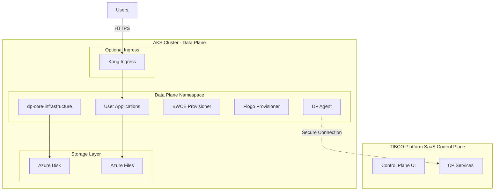

# How to Set Up AKS Cluster for Data Plane Only (v1.15.0)

> **Version:** 1.15.0 | **Platform:** Azure Kubernetes Service (AKS) | **Last Updated:** March 10, 2026

**📌 Important Version Information**
- This guide is for TIBCO Platform Data Plane **version 1.15.0** connecting to SaaS Control Plane
- For version 1.14.0 documentation, see [v1.14 guide](../v1.14/how-to-dp-aks-setup-guide.md)
- For Control Plane + Data Plane deployment, see [CP + DP guide (v1.15)](./how-to-cp-and-dp-aks-setup-guide.md)

## Table of Contents
- [Overview](#overview)
- [What's New in v1.15.0](#whats-new-in-v150)
- [Prerequisites](#prerequisites)
- [Architecture](#architecture)
- [Step 1: Prepare Azure Environment](#step-1-prepare-azure-environment)
- [Step 2: Create AKS Cluster](#step-2-create-aks-cluster)
- [Step 3: Configure Storage Classes](#step-3-configure-storage-classes)
- [Step 4: Install Ingress Controller (Optional)](#step-4-install-ingress-controller-optional)
- [Step 5: Obtain Data Plane Bootstrap Configuration](#step-5-obtain-data-plane-bootstrap-configuration)
- [Step 6: Deploy Data Plane Infrastructure](#step-6-deploy-data-plane-infrastructure)
- [Step 7: Register Cluster with Control Plane](#step-7-register-cluster-with-control-plane)
- [Step 8: Provision Capabilities](#step-8-provision-capabilities)
- [Troubleshooting](#troubleshooting)
- [Next Steps](#next-steps)

---

## Overview

This guide provides instructions for deploying **TIBCO Platform Data Plane version 1.15.0** on Azure Kubernetes Service (AKS) that connects to an existing **TIBCO Platform SaaS Control Plane**.

### What You'll Deploy
- **AKS Kubernetes Cluster** optimized for Data Plane workloads
- **TIBCO Platform Data Plane 1.15.0** connecting to SaaS Control Plane
- **Azure Storage** - Azure Disk and Azure Files for application persistence
- **Capabilities** - BWCE and Flogo provisioners for running applications  
- **(Optional)** Kong Ingress Controller for user-facing applications

### Deployment Time
- **Total Duration:** 1-2 hours
- **AKS Setup:** 30-45 minutes
- **Data Plane Infrastructure:** 20-30 minutes
- **Capability Provisioning:** 15-30 minutes

### Use Cases
- Hybrid cloud deployments with SaaS Control Plane
- Regional Data Planes for distributed architectures
- Edge computing scenarios
- Customer-managed Data Plane with TIBCO-managed Control Plane

---

## What's New in v1.15.0

### Breaking Changes
- ⚠️ **Helm 3.13+ Required**: New label-based deployment tracking
- ⚠️ **Network Policy Updates**: Enhanced namespace labeling requirements
- ⚠️ **Infrastructure Chart Changes**: New `dp-core-infrastructure` chart structure
- ⚠️ **Bootstrap Configuration**: New connection parameters for SaaS CP

### New Features
- ✅ **Simplified Infrastructure**: Unified `dp-core-infrastructure` chart
- ✅ **Kong Ingress Support**: Optional Kong ingress for user applications
- ✅ **Enhanced Observability**: Improved o11y-service integration
- ✅ **Better Storage Options**: Enhanced Azure Files and Disk configurations
- ✅ **Updated Provisioners**: BWCE 1.15.x and Flogo 1.15.x with new features

### Compatibility
- **Kubernetes:** 1.32+ (CNCF certified)
- **Helm:** 3.13+
- **SaaS Control Plane:** 1.15.0 or compatible
- **Azure:** AKS with Kubernetes 1.32+

---

## Prerequisites

### 1. TIBCO Platform SaaS Control Plane
- ✅ **Active SaaS Control Plane Subscription** (version 1.15.0 or compatible)
- ✅ **Access to Control Plane UI** (admin or cluster management permissions)
- ✅ **Data Plane Bootstrap Information** from Control Plane

### 2. Azure Requirements
- ✅ **Azure Subscription** with appropriate permissions
- ✅ **Resource Group** or permissions to create one
- ✅ **Azure CLI** installed (version 2.50+)
- ✅ **kubectl** installed (version 1.32+)
- ✅ **Helm 3.13+** installed

### 3. AKS Cluster Specifications
- **Kubernetes Version:** 1.32 or higher
- **Node Count:** Minimum 2 worker nodes (for production: 3+)
- **Node Size:** Standard_D4s_v3 or higher (4 vCPUs, 16GB RAM)
- **Network Plugin:** Azure CNI recommended
- **Storage:** Azure Disk (Premium_LRS) + Azure Files

### 4. Tools Verification
```bash
# Verify Helm version (must be 3.13+)
helm version --short

# Verify kubectl version
kubectl version --client --short

# Verify Azure CLI version
az version
```

### 5. Knowledge Requirements
- Basic understanding of Kubernetes
- Familiarity with Helm charts
- Azure AKS knowledge
- Access to TIBCO Platform SaaS Control Plane

For a complete checklist, see [Prerequisites Checklist](../prerequisites-checklist-for-customer.md).

---

## Architecture



---

## Step 1: Prepare Azure Environment

### 1.1 Login to Azure
```bash
# Login to Azure
az login

# Set the subscription
az account set --subscription "YOUR_SUBSCRIPTION_ID"

# Verify
az account show
```

### 1.2 Set Environment Variables

Create environment configuration file:

```bash
# Save to: ~/aks-tp-dp-v15-env.sh

# Azure Configuration
export AZURE_SUBSCRIPTION_ID="your-subscription-id"
export AZURE_RESOURCE_GROUP="rg-tibco-dp-v15"
export AZURE_LOCATION="eastus"

# AKS Cluster Configuration
export AKS_CLUSTER_NAME="aks-tp-dp-v15"
export AKS_NODE_COUNT=2  # For production: 3+
export AKS_NODE_SIZE="Standard_D4s_v3"
export K8S_VERSION="1.32"

# TIBCO Platform Configuration
export TP_VERSION="1.15.0"
export TP_DP_CLUSTER_NAME="aks-dp-east"  # Unique name for this DP
export TP_DP_NS="tibco-dp"

# Storage Configuration
export AZURE_STORAGE_CLASS_DISK="azure-disk-sc"
export AZURE_STORAGE_CLASS_FILES="azure-files-sc"

# Helm Repository
export TIBCO_HELM_REPO="https://tibcosoftware.github.io/tp-helm-charts"

# Container Registry (TIBCO JFrog)
export TIBCO_REGISTRY="tibco-jfrog-docker.jfrog.io"
export TIBCO_REGISTRY_USER="your-jfrog-username"
export TIBCO_REGISTRY_PASSWORD="your-jfrog-password"

# Will be obtained from SaaS Control Plane
export CP_INSTANCE_ID=""  # Set after Step 5
export DP_BOOTSTRAP_TOKEN=""  # Set after Step 5
```

Load environment variables:
```bash
source ~/aks-tp-dp-v15-env.sh
```

### 1.3 Create Resource Group
```bash
# Create resource group
az group create \
  --name ${AZURE_RESOURCE_GROUP} \
  --location ${AZURE_LOCATION}
```

---

## Step 2: Create AKS Cluster

### 2.1 Create AKS Cluster
```bash
# Create AKS cluster for Data Plane
az aks create \
  --resource-group ${AZURE_RESOURCE_GROUP} \
  --name ${AKS_CLUSTER_NAME} \
  --node-count ${AKS_NODE_COUNT} \
  --node-vm-size ${AKS_NODE_SIZE} \
  --kubernetes-version ${K8S_VERSION} \
  --network-plugin azure \
  --enable-managed-identity \
  --generate-ssh-keys \
  --enable-addons monitoring \
  --no-wait

# Wait for cluster creation
az aks wait --created \
  --resource-group ${AZURE_RESOURCE_GROUP} \
  --name ${AKS_CLUSTER_NAME}
```

### 2.2 Get Cluster Credentials
```bash
# Get credentials
az aks get-credentials \
  --resource-group ${AZURE_RESOURCE_GROUP} \
  --name ${AKS_CLUSTER_NAME} \
  --overwrite-existing

# Verify connection
kubectl get nodes
kubectl cluster-info
```

---

## Step 3: Configure Storage Classes

### 3.1 Create Azure Disk Storage Class
```bash
cat <<EOF | kubectl apply -f -
apiVersion: storage.k8s.io/v1
kind: StorageClass
metadata:
  name: ${AZURE_STORAGE_CLASS_DISK}
provisioner: disk.csi.azure.com
parameters:
  storageaccounttype: Premium_LRS
  kind: Managed
allowVolumeExpansion: true
reclaimPolicy: Delete
volumeBindingMode: WaitForFirstConsumer
EOF
```

### 3.2 Create Azure Files Storage Class
```bash
cat <<EOF | kubectl apply -f -
apiVersion: storage.k8s.io/v1
kind: StorageClass
metadata:
  name: ${AZURE_STORAGE_CLASS_FILES}
provisioner: file.csi.azure.com
parameters:
  skuName: Premium_LRS
allowVolumeExpansion: true
reclaimPolicy: Delete
volumeBindingMode: Immediate
mountOptions:
  - dir_mode=0777
  - file_mode=0777
  - uid=0
  - gid=0
  - mfsymlinks
  - cache=strict
  - actimeo=30
EOF
```

### 3.3 Verify Storage Classes
```bash
kubectl get storageclass

# Expected:
# azure-disk-sc     disk.csi.azure.com
# azure-files-sc    file.csi.azure.com
```

---

## Step 4: Install Ingress Controller (Optional)

**Note:** Ingress controller is **optional** for Data Plane. Required only if you plan to expose user applications directly from the Data Plane cluster.

### Option: Install Kong Ingress (Recommended for User Apps)

```bash
# Add Kong Helm repository
helm repo add kong https://charts.konghq.com
helm repo update

# Create namespace
kubectl create namespace kong

# Install Kong Ingress Controller
helm install kong kong/kong \
  --namespace kong \
  --version 2.46.0 \
  --set ingressController.enabled=true \
  --set ingressController.installCRDs=false \
  --set proxy.type=LoadBalancer
```

Verify installation:
```bash
kubectl get svc -n kong
kubectl get pods -n kong
```

---

## Step 5: Obtain Data Plane Bootstrap Configuration

### 5.1 Log into SaaS Control Plane

1. Open your browser to your TIBCO Platform SaaS Control Plane URL
2. Login with your credentials
3. You should see the Control Plane dashboard

### 5.2 Generate Data Plane Bootstrap Configuration

In the SaaS Control Plane UI:

1. Navigate to **Administration** → **Clusters**
2. Click **+ Add Cluster** button
3. Fill in cluster details:
   - **Cluster Name:** `aks-dp-east` (or your chosen name)
   - **Cluster Type:** Select **On-Premises** or **AKS**
   - **Description:** Azure AKS Data Plane in East US
4. Click **Generate Bootstrap Configuration**
5. Download or copy:
   - **Bootstrap Token** (long encoded string)
   - **Control Plane Instance ID** (e.g., `prod-cp`)
6. Save these values - you'll need them in the next step

### 5.3 Update Environment Variables

Update your environment file with the bootstrap information:

```bash
# Add to ~/aks-tp-dp-v15-env.sh

export CP_INSTANCE_ID="prod-cp"  # From SaaS CP
export DP_BOOTSTRAP_TOKEN="<long-bootstrap-token-from-saas-cp>"  # From SaaS CP

# Reload environment
source ~/aks-tp-dp-v15-env.sh
```

---

## Step 6: Deploy Data Plane Infrastructure

### 6.1 Create Data Plane Namespace
```bash
kubectl create namespace ${TP_DP_NS}

# Label namespace for network policies (required in v1.15.0)
kubectl label namespace ${TP_DP_NS} \
  platform.tibco.com/dataplane-id=${TP_DP_CLUSTER_NAME} \
  platform.tibco.com/controlplane-instance-id=${CP_INSTANCE_ID}
```

### 6.2 Create Container Registry Pull Secret
```bash
kubectl create secret docker-registry tibco-jfrog-cred \
  --namespace ${TP_DP_NS} \
  --docker-server=${TIBCO_REGISTRY} \
  --docker-username=${TIBCO_REGISTRY_USER} \
  --docker-password=${TIBCO_REGISTRY_PASSWORD}
```

### 6.3 Add TIBCO Helm Repository
```bash
helm repo add tibco-platform ${TIBCO_HELM_REPO}
helm repo update
```

### 6.4 Create Data Plane Values File

Create `dp-infrastructure-values.yaml`:

```yaml
# dp-infrastructure-values.yaml for TIBCO Platform Data Plane v1.15.0

global:
  tibco:
    # Data Plane identification
    dataPlaneId: ${TP_DP_CLUSTER_NAME}  # Replace with actual value
    controlPlaneInstanceId: ${CP_INSTANCE_ID}  # Replace with actual value from SaaS CP
    
    # Container registry configuration
    containerRegistry:
      url: tibco-jfrog-docker.jfrog.io
      username: ${TIBCO_REGISTRY_USER}  # Replace
      password: ${TIBCO_REGISTRY_PASSWORD}  # Replace
    
    # Network policies
    createNetworkPolicy: true
    
    # Logging
    logging:
      fluentbit:
        enabled: true

# Bootstrap configuration for SaaS Control Plane connection
controlPlane:
  bootstrapToken: ${DP_BOOTSTRAP_TOKEN}  # Replace with actual bootstrap token
  url: https://your-saas-cp-url.com  # Replace with your SaaS CP URL

# Storage configuration
storage:
  azureFiles:
    enabled: true
    storageClassName: azure-files-sc
  
  azureDisk:
    enabled: true
    storageClassName: azure-disk-sc

# Observability service (o11y-service)
o11y-service:
  enabled: true
  version: 1.15.19

# Data Plane core components
dpcore:
  enabled: true

# Kong ingress (optional - for user applications)
kong-ingress:
  enabled: false  # Set to true if you installed Kong in Step 4
```

### 6.5 Deploy Data Plane Infrastructure

```bash
# Deploy DP infrastructure using dp-core-infrastructure chart
helm install dp-infra tibco-platform/dp-core-infrastructure \
  --namespace ${TP_DP_NS} \
  --values dp-infrastructure-values.yaml \
  --labels "layer=1" \
  --wait \
  --timeout=20m
```

### 6.6 Verify Data Plane Deployment
```bash
# Check pods
kubectl get pods -n ${TP_DP_NS}

# Wait for all pods to be running
kubectl wait --for=condition=ready pod --all \
  -n ${TP_DP_NS} \
  --timeout=600s
```

---

## Step 7: Register Cluster with Control Plane

### 7.1 Verify Cluster Registration in SaaS Control Plane

1. Go back to SaaS Control Plane UI
2. Navigate to **Administration** → **Clusters**
3. You should see your cluster `aks-dp-east` with status **Connected** or **Online**
4. If status shows **Pending**, wait a few minutes and refresh

### 7.2 Troubleshoot Connection (if needed)

If cluster doesn't show as connected:

```bash
# Check DP agent logs
kubectl logs -n ${TP_DP_NS} -l app=dp-agent --tail=100

# Verify bootstrap token secret
kubectl get secret -n ${TP_DP_NS} | grep bootstrap

# Check network connectivity to SaaS CP
kubectl run -it --rm nettest \
  --image=curlimages/curl \
  --restart=Never \
  -- curl -v https://your-saas-cp-url.com/healthz
```

---

## Step 8: Provision Capabilities

### 8.1 Provision BWCE and Flogo Capabilities

In the SaaS Control Plane UI:

1. Navigate to **Administration** → **Capabilities**
2. Click **+ Provision Capability**
3. Select target cluster: **aks-dp-east**
4. Select capabilities to provision:
   - ☑️ **TIBCO BusinessWorks Container Edition (BWCE)** - version 1.15.x
   - ☑️ **TIBCO Flogo Enterprise** - version 1.15.x
5. Configure capability settings (or use defaults):
   - **BWCE Storage Class:** `azure-files-sc`
   - **Flogo Storage Class:** `azure-files-sc`
6. Click **Provision**
7. Wait for provisioning to complete (~10-15 minutes)

### 8.2 Verify Capability Deployment

```bash
# Check for capability provisioner pods
kubectl get pods -n ${TP_DP_NS} | grep provisioner

# Expected output:
# bwce-provisioner-xyz   Running
# flogo-provisioner-xyz  Running

# Check capability status
kubectl get deployments -n ${TP_DP_NS}
```

### 8.3 Verify in Control Plane UI

1. In SaaS Control Plane, go to **Administration** → **Capabilities**
2. Filter by cluster: **aks-dp-east**
3. Verify BWCE and Flogo show status **Ready**

---

## Troubleshooting

### Issue: Cluster Not Connecting to SaaS Control Plane
**Symptom:** Cluster shows as **Pending** or **Disconnected** in SaaS CP

**Solution:**
```bash
# Check DP agent logs
kubectl logs -n ${TP_DP_NS} -l app=dp-agent --tail=100

# Common issues:
# 1. Incorrect bootstrap token → Re-generate in SaaS CP
# 2. Firewall blocking outbound HTTPS → Check firewall rules
# 3. Network policy blocking egress → Verify network policies
# 4. DNS resolution issues → Test DNS from pod

# Test connectivity
kubectl run -it --rm nettest \
  --image=curlimages/curl \
  --restart=Never \
  -- curl -v https://your-saas-cp-url.com
```

### Issue: Storage Provisioning Failures
**Symptom:** PVCs stuck in **Pending** state

**Solution:**
```bash
# Check PVC status
kubectl get pvc -n ${TP_DP_NS}

# Describe PVC for details
kubectl describe pvc <pvc-name> -n ${TP_DP_NS}

# Verify storage classes exist
kubectl get storageclass

# Check Azure storage CSI driver
kubectl get pods -n kube-system | grep csi
```

### Issue: Capability Provisioning Fails
**Symptom:** Capability shows **Failed** status in SaaS CP

**Solution:**
```bash
# Check provisioner logs
kubectl logs -n ${TP_DP_NS} -l app=bwce-provisioner --tail=100
kubectl logs -n ${TP_DP_NS} -l app=flogo-provisioner --tail=100

# Common issues:
# - Image pull errors → Verify container registry credentials
# - Insufficient resources → Scale up AKS cluster
# - Storage issues → Check storage class configuration
```

### Issue: Helm 3.13+ Required
**Symptom:** `Error: unknown flag --labels` during helm install

**Solution:**
```bash
# Verify Helm version
helm version --short

# Upgrade Helm to 3.13+
curl https://raw.githubusercontent.com/helm/helm/main/scripts/get-helm-3 | bash
```

For more troubleshooting, see:
- [TIBCO Platform Documentation](https://docs.tibco.com/pub/platform-cp/1.15.0/doc/html/Default.htm)
- [Prerequisites Checklist](../prerequisites-checklist-for-customer.md)

---

## Next Steps

### ✅ Data Plane Deployment Complete!

Your TIBCO Platform Data Plane v1.15.0 is now connected to SaaS Control Plane.

### Recommended Next Actions

1. **🚀 Deploy Your First Application**
   - Use Developer Hub in SaaS Control Plane to create BWCE or Flogo app
   - Deploy application to your AKS Data Plane cluster
   - Monitor application performance

2. **📊 Set Up Observability (Optional)**
   - Deploy Prometheus and Elastic Stack for enhanced monitoring
   - See [Observability Setup Guide](../how-to-dp-aks-observability.md)

3. **📦 Upload BW6 Driver Supplements**
   - Add Oracle and EMS drivers to BWCE capability
   - See [BW6 Driver Upload Guide](../how-to-upload-bw6-driver-supplements.md)

4. **🔒 Configure Additional Security**
   - Implement network policies for application isolation
   - Configure Azure AD pod identity for applications
   - Set up Azure Key Vault integration

5. **📈 Configure Auto-Scaling**
   - Set up Horizontal Pod Autoscaler (HPA) for applications
   - Enable cluster autoscaling on AKS

6. **🌍 Deploy Additional Regional Data Planes**
   - Repeat this guide for other Azure regions
   - Connect multiple Data Planes to same SaaS Control Plane

---

## Additional Resources

- [TIBCO Platform 1.15.0 Documentation](https://docs.tibco.com/pub/platform-cp/1.15.0/doc/html/Default.htm)
- [Release Notes v1.15.0](../../releases/v1.15.0.md)
- [Control Plane + Data Plane Setup (v1.15)](./how-to-cp-and-dp-aks-setup-guide.md)
- [Prerequisites Checklist](../prerequisites-checklist-for-customer.md)
- [Observability Setup](../how-to-dp-aks-observability.md)
- [BW6 Driver Supplements](../how-to-upload-bw6-driver-supplements.md)
- [DNS Configuration](../how-to-add-dns-records-aks-azure.md)

---

## Support

**This documentation is provided by TIBCO Support, TIBCO SI Partners, or your TIBCO ATS.**

For official support:
- **TIBCO Documentation:** [https://docs.tibco.com/pub/platform-cp/1.15.0/doc/html/Default.htm](https://docs.tibco.com/pub/platform-cp/1.15.0/doc/html/Default.htm)
- **TIBCO Support Portal:** [https://support.tibco.com](https://support.tibco.com)
- **Helm Charts Repository:** [https://github.com/TIBCOSoftware/tp-helm-charts](https://github.com/TIBCOSoftware/tp-helm-charts)
